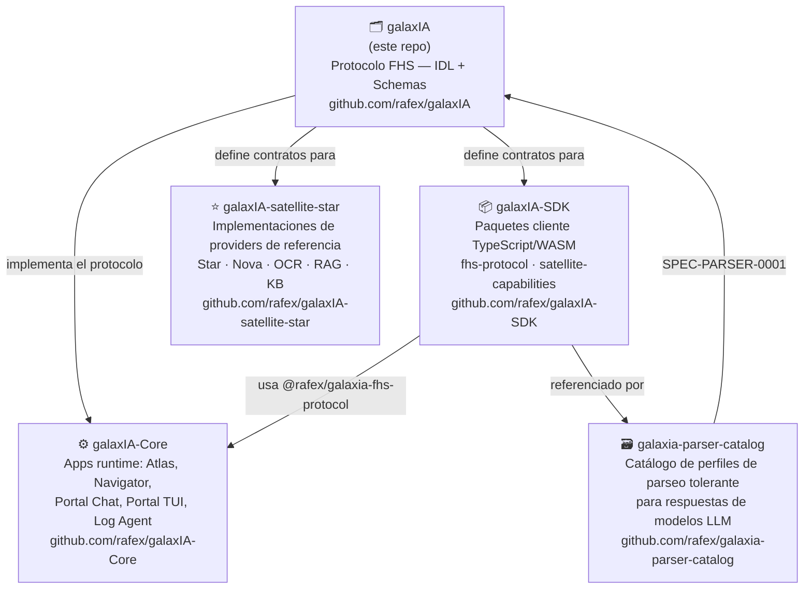
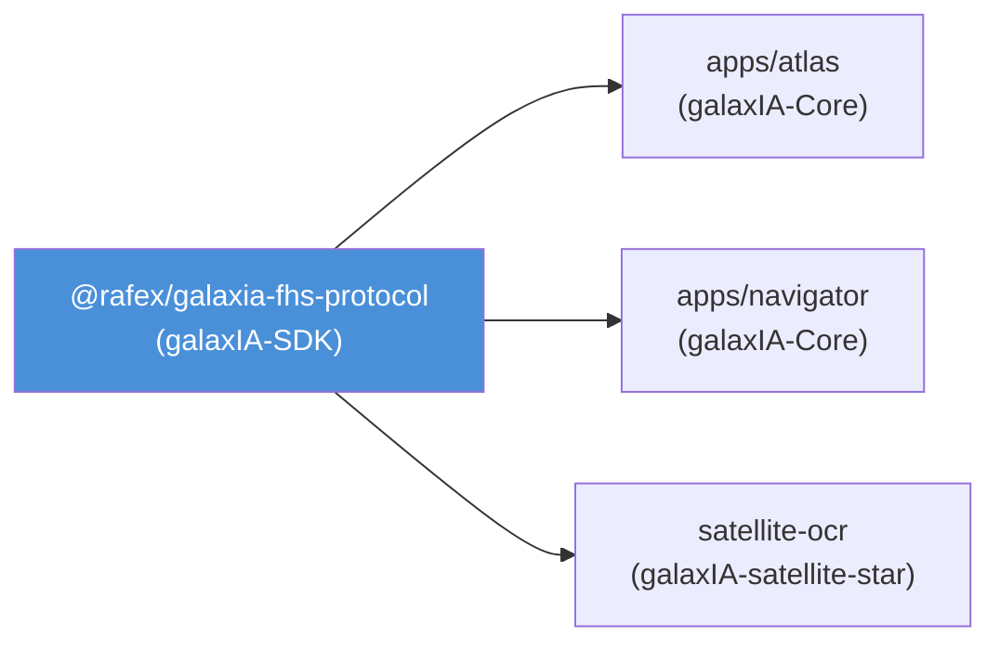

# galaxIA — Mapa del Ecosistema

Este repositorio es el **punto central de la definición del protocolo FHS**
(Federation of Sovereign Horizons). No contiene código ejecutable; solo
especificación, IDL y esquemas.

## Topología de repositorios

## Descripción de cada repositorio

### 🗂️ [galaxIA](https://github.com/rafex/galaxIA) — este repo

**Rol:** Definición del protocolo FHS.

**Contiene:**
- `idl/` — Definiciones IDL del protocolo
  - `asyncapi.yaml` — Canales libp2p y mensajes del wire protocol FHS
  - `fhs-protocol.proto` — Definiciones Protobuf
- `schemas/` — Artefactos de validación documental; el wire canónico es Protobuf
- `docs/` — Documentación del protocolo (Markdown + diagramas Mermaid)
- `spec-native/` — Especificaciones, decisiones (DECISIONS.md), arquitectura

**No contiene:** código ejecutable, apps, scripts de build.

---

### ⚙️ [galaxIA-Core](https://github.com/rafex/galaxIA-Core)

**Rol:** Runtime del sistema FHS — los procesos que corren en los nodos reales.

**Contiene:**
- `apps/atlas` — Registro federado de nodos (Hub/Registry)
- `apps/navigator` — Agent runtime (orquesta LLM + tools via Atlas)
- `apps/portal-chat` — Frontend web de chat
- `apps/portal-tui` — Cliente TUI (terminal)
- `apps/log-agent` — Colector de logs operativos
- `containers/` — Compose files para despliegue
- `scripts/` — Scripts E2E y utilidades operativas
- `helpers/` — Automatización (Makefile, Python, Shell)

**Depende de:** `@rafex/galaxia-fhs-protocol` desde galaxIA-SDK.

---

### 📦 [galaxIA-SDK](https://github.com/rafex/galaxIA-SDK)

**Rol:** Paquetes cliente publicados en npm para consumir el protocolo FHS.

**Contiene (npm workspaces):**
- `packages/fhs-protocol` → `@rafex/galaxia-fhs-protocol` — Contratos TypeScript del wire protocol
- `packages/satellite-capabilities` → `@rafex/galaxia-satellite-capabilities` — Aritmética + CURP (lógica pura)
- `packages/satellite-capabilities-wasm` → `@rafex/galaxia-satellite-capabilities-wasm` — Puerto AssemblyScript/WASM
- `apps/satellite-web` — Demo Ephemeral Satellite (Vite + Web Worker + WASM)

**Publicados en:** GitHub Packages (`https://npm.pkg.github.com`).

---

### ⭐ [galaxIA-satellite-star](https://github.com/rafex/galaxIA-satellite-star)

**Rol:** Implementaciones de referencia de providers del protocolo FHS.

**Contiene:**
- `examples/star-example` — Provider LLM (llama.cpp / Ollama)
- `examples/nova-example` — Provider Nova (fallback)
- `examples/satellite-ocr-example` — Provider OCR (Tesseract)
- `examples/rag-provider` — Provider RAG
- `examples/kb-provider` — Provider de base de conocimiento

**Depende de:** `@rafex/galaxia-fhs-protocol` desde galaxIA-SDK.

---

### 🗃️ [galaxia-parser-catalog](https://github.com/rafex/galaxia-parser-catalog)

**Rol:** Catálogo comunitario de perfiles de parseo tolerante para respuestas de modelos LLM.

**Contiene:**
- `profiles/` — Perfiles JSON de estrategias de parseo por modelo
- `src/` — Librería TypeScript: `match`, `load`, `build-db`
- `catalog.sqlite` — Catálogo pre-compilado en SQLite
- `schema.sql` — Esquema de la base de datos

**Referenciado por:** `ModelParserProfile` en `@rafex/galaxia-fhs-protocol` (SPEC-PARSER-0001).

---

## Flujo de versiones y dependencias

La fuente de verdad del protocolo son los tipos TypeScript en `galaxIA-SDK/packages/fhs-protocol`.
Los artefactos JSON de `schemas/` son auxiliares de documentación y validación; no se generan ni se transmiten como parte del wire.
Las definiciones AsyncAPI y Protobuf en `idl/` son transcripciones formales del mismo contrato libp2p.

## Registro de decisiones de arquitectura

Ver [`spec-native/DECISIONS.md`](spec-native/DECISIONS.md).

Decisiones clave relacionadas con la topología:
- **DEC-0038** — Split galaxIA / galaxIA-satellite-star (2026-07-06)
- **DEC-0085** — `requestId` → `missionId` en el wire protocol (2026-08-01)
- Migración TypeScript → galaxIA-SDK (2026-08-02, sin DEC formal aún)
- Migración apps runtime → galaxIA-Core (2026-08-02, sin DEC formal aún)
