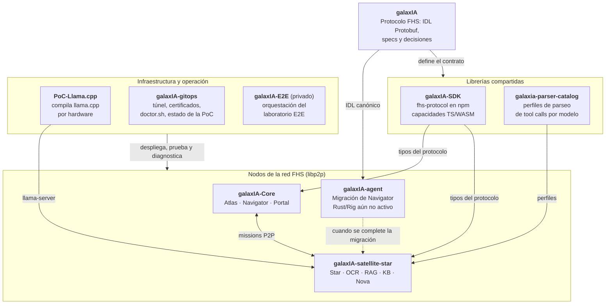
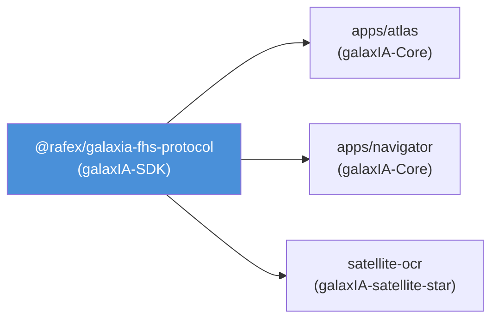

# galaxIA — Mapa del Ecosistema

Este repositorio es el **punto central de la definición del protocolo FHS**
(Federation of Sovereign Horizons). No contiene código ejecutable; solo
especificación, IDL y esquemas.

## Topología de repositorios

```mermaid
flowchart TB
    galaxia["<b>galaxIA</b><br/>Protocolo FHS: IDL Protobuf,<br/>specs y decisiones"]

    subgraph libs["Librerías compartidas"]
        direction LR
        sdk["<b>galaxIA-SDK</b><br/>fhs-protocol en npm<br/>capacidades TS/WASM"]
        parser["<b>galaxia-parser-catalog</b><br/>perfiles de parseo<br/>de tool calls por modelo"]
    end

    subgraph red["Nodos de la red FHS (libp2p)"]
        direction LR
        core["<b>galaxIA-Core</b><br/>Atlas · Navigator · Portal"]
        providers["<b>galaxIA-satellite-star</b><br/>Star · OCR · RAG · KB · Nova"]
        agent["<b>galaxIA-agent</b><br/>Migración de Navigator<br/>Rust/Rig aún no activo"]
    end

    subgraph ops["Infraestructura y operación"]
        direction LR
        llama["<b>PoC-Llama.cpp</b><br/>compila llama.cpp<br/>por hardware"]
        gitops["<b>galaxIA-gitops</b><br/>túnel, certificados,<br/>doctor.sh, estado de la PoC"]
        e2e["<b>galaxIA-E2E</b> (privado)<br/>orquestación del<br/>laboratorio E2E"]
    end

    galaxia -->|define el contrato| libs
    galaxia -->|IDL canónico| agent
    sdk -->|tipos del protocolo| core
    sdk -->|tipos del protocolo| providers
    parser -->|perfiles| providers
    core <-->|missions P2P| providers
    agent -.->|cuando se complete la migración| providers
    llama -->|llama-server| providers
    ops -->|despliega, prueba y diagnostica| red
```

El mismo mapa está en el [`README`](README.md).

## Descripción de cada repositorio

### 🗂️ [galaxIA](https://github.com/rafex/galaxIA) — este repo

**Rol:** Definición del protocolo FHS.

**Contiene:**
- `idl/` — Definiciones IDL del protocolo
  - `asyncapi.yaml` — Canales libp2p y mensajes del wire protocol FHS
  - `fhs-protocol.proto` — Definiciones Protobuf
- `schemas/` — Artefactos de validación documental; el wire canónico es Protobuf
- `docs/` — Documentación del protocolo (Markdown + diagramas Mermaid)
- `spec-native/` — Especificaciones, decisiones (DECISIONS.md), arquitectura

**No contiene:** código ejecutable, apps, scripts de build.

---

### ⚙️ [galaxIA-Core](https://github.com/rafex/galaxIA-Core)

**Rol:** Runtime del sistema FHS — los procesos que corren en los nodos reales.

**Contiene:**
- `apps/atlas` — Bootstrap peer libp2p: punto de entrada a la red (DHT + GossipSub)
- `apps/navigator` — Orquestador: publica Missions, recibe bids y abre streams directos a Star y Satellites
- `apps/portal-chat` — Frontend web de chat
- `apps/portal-tui` — Cliente TUI (terminal)
- `apps/log-agent` — Colector de logs operativos
- `containers/` — Compose files para despliegue
- `scripts/` — Scripts E2E y utilidades operativas
- `helpers/` — Automatización (Makefile, Python, Shell)

**Depende de:** `@rafex/galaxia-fhs-protocol` desde galaxIA-SDK.

---

### 📦 [galaxIA-SDK](https://github.com/rafex/galaxIA-SDK)

**Rol:** Paquetes cliente publicados en npm para consumir el protocolo FHS.

**Contiene (npm workspaces):**
- `packages/fhs-protocol` → `@rafex/galaxia-fhs-protocol` — Contratos TypeScript del wire protocol
- `packages/satellite-capabilities` → `@rafex/galaxia-satellite-capabilities` — Aritmética + CURP (lógica pura)
- `packages/satellite-capabilities-wasm` → `@rafex/galaxia-satellite-capabilities-wasm` — Puerto a WASM (Rust, antes AssemblyScript)
- `apps/satellite-web` — Demo Ephemeral Satellite (Vite + Web Worker + WASM)

**Publicados en:** npmjs.org bajo `@rafex_labs/*`; los consumidores los importan con el alias `@rafex/*` (ver `.npmrc` de cada repo).

---

### ⭐ [galaxIA-satellite-star](https://github.com/rafex/galaxIA-satellite-star)

**Rol:** Implementaciones de referencia de providers del protocolo FHS.

**Contiene:**
- `examples/star-example` — Provider LLM (llama.cpp / Ollama)
- `examples/nova-example` — Provider Nova (fallback)
- `examples/satellite-ocr-example` — Provider OCR (Tesseract)
- `examples/rag-provider` — Provider RAG
- `examples/kb-provider` — Provider de base de conocimiento

**Depende de:** `@rafex/galaxia-fhs-protocol` desde galaxIA-SDK.

---

### 🗃️ [galaxia-parser-catalog](https://github.com/rafex/galaxia-parser-catalog)

**Rol:** Catálogo comunitario de perfiles de parseo tolerante para respuestas de modelos LLM.

**Contiene:**
- `profiles/` — Perfiles JSON de estrategias de parseo por modelo
- `src/` — Librería TypeScript: `match`, `load`, `build-db`
- `catalog.sqlite` — Catálogo pre-compilado en SQLite
- `schema.sql` — Esquema de la base de datos

**Referenciado por:** `ModelParserProfile` en `@rafex/galaxia-fhs-protocol` (SPEC-PARSER-0001).

---

### 🦀 [galaxIA-agent](https://github.com/rafex/galaxIA-agent)

**Rol:** Navigator como agente soberano en Rust sobre [Rig](https://docs.rs/rig).

**Contiene:** separación lógica de responsabilidades del agente (supervisor,
política, documentos, recuperación, gestión de Missions y respuesta), plan de
petición, estructuras de protocolo y fixtures interlingüísticas.

**Estado real:** migración en curso; no reemplaza todavía al Navigator
TypeScript de `galaxIA-Core`. El punto de entrada actual instancia un
`UnconfiguredFhsTransport`, por lo que no puede completar chat ni tools por
FHS. Faltan transporte libp2p productivo, discovery, flujo completo
offer/bid/assign, streams a providers, eventos Portal y aceptación E2E. Ver
[`docs/migracion-desde-ts.md`](https://github.com/rafex/galaxIA-agent/blob/main/docs/migracion-desde-ts.md).

---

### 🦙 [PoC-Llama.cpp](https://github.com/rafex/PoC-Llama.cpp)

**Rol:** Compila e instala llama.cpp con perfiles por hardware (flags SIMD por CPU, BLAS, Vulkan/Metal) en `/opt/llama.cpp`, más los wrappers `start-server.sh`.

**Usado por:** el `llama-server` que consume Star en el laboratorio (Bastion).

---

### 🛠️ [galaxIA-gitops](https://github.com/rafex/galaxIA-gitops)

**Rol:** Despliegue y operación, separado del código de aplicación.

**Contiene:** túnel inverso (rathole) y certificados Let's Encrypt para demos remotas, `scripts/doctor.sh` para diagnosticar una red nueva, y la arquitectura y el estado de la PoC con diagramas D2.

---

### 🧪 galaxIA-E2E (privado)

**Rol:** Orquestación privada del laboratorio de pruebas de punta a punta (topología, PKI del laboratorio).

---

## Flujo de versiones y dependencias

```mermaid
graph LR
    PROTO["@rafex/galaxia-fhs-protocol\n(galaxIA-SDK)"]
    CORE_A["apps/atlas\n(galaxIA-Core)"]
    CORE_N["apps/navigator\n(galaxIA-Core)"]
    STAR_S["satellite-ocr\n(galaxIA-satellite-star)"]

    PROTO --> CORE_A
    PROTO --> CORE_N
    PROTO --> STAR_S

    style PROTO fill:#4a90d9,color:#fff
```

La fuente canónica del contrato de red es el IDL Protobuf de `galaxIA/idl`,
acompañado por las especificaciones del mismo repositorio. `galaxIA-SDK` ofrece
paquetes reutilizables (incluidos los tipos y herramientas TypeScript) para que
los runtimes consuman/implementen ese contrato. Los artefactos JSON de
`schemas/` son auxiliares de documentación y validación: no forman el wire.
AsyncAPI documenta canales y flujos; Protobuf define los mensajes tipados
transmitidos por libp2p.

Para una explicación gradual, con mapa Mermaid/D2 y estado actual, consulta la
[guía del proyecto](docs/guia-del-proyecto.md).

## Registro de decisiones de arquitectura

Ver [`spec-native/DECISIONS.md`](spec-native/DECISIONS.md).

Decisiones clave relacionadas con la topología:
- **DEC-0038** — Split galaxIA / galaxIA-satellite-star (2026-07-06)
- **DEC-0085** — `requestId` → `missionId` en el wire protocol (2026-08-01)
- Migración TypeScript → galaxIA-SDK (2026-08-02, sin DEC formal aún)
- Migración apps runtime → galaxIA-Core (2026-08-02, sin DEC formal aún)
