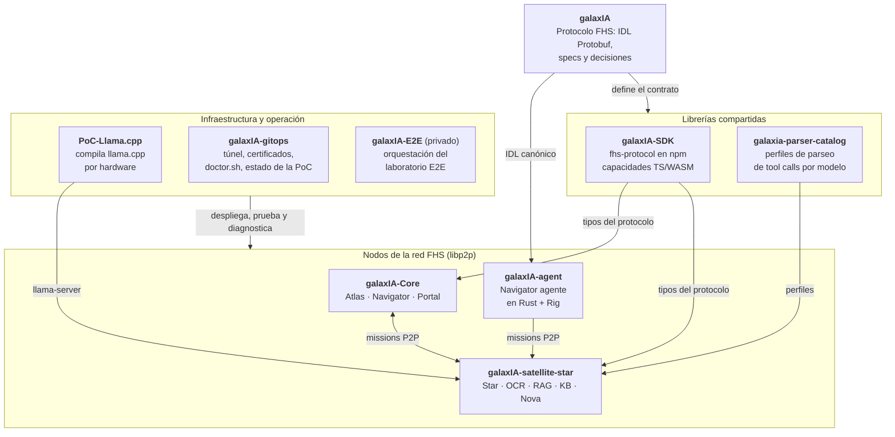

# galaxIA

GalaxIA es un PoC de inteligencia artificial federada y soberana. Conecta equipos reutilizados donde cada nodo aporta capacidades: LLM locales con llama.cpp o herramientas como OCR vía MCP. Un chat web descubre nodos, aplica reglas de privacidad y combina razonamiento y acción. Sin nube, suscripciones ni dueño.

Define **FHS (Federation of Sovereign Horizons)**, un protocolo **libp2p-only**
e independiente de lenguaje. DHT Kademlia, GossipSub y los streams directos
`/fhs/v1/0.1.0` son los únicos caminos normativos. Las definiciones formales
viven en `idl/` y `schemas/`; no hay compatibilidad con transportes web ni JSON
en el wire. Todos los datos transmitidos están tipados en Protobuf.

¿Quieres correrlo? Ver [`docs/instalacion.md`](docs/instalacion.md) (contenedor + release, `npx`, o clonar y compilar).

## Vocabulario

GalaxIA (Galaxy + IA) tiene su propio vocabulario de producto — **Star** (nodo LLM), **Satellite** (nodo de herramientas), **Atlas** (bootstrap peer), **Portal** (chat web), **Navigator** (orquestador), **Beacon** (manifiesto), **Pulse** (heartbeat), **Mission** (ejecución de una tool), **Flight Log** (procedencia/auditoría), **Orbit** (conexión activa), **Signal** (capacidad anunciada). Desde DEC-0033/DEC-0034/DEC-0035 este vocabulario también nombra identificadores de código, archivos, paquetes npm y contenedores (`Atlas`, `Signal`, `Beacon`...) — el wire protocol canónico es `Envelope` Protobuf sobre libp2p, con `handshake`/`handshake_ack`. Tabla completa en [`docs/vocabulario.md`](docs/vocabulario.md).

## Estructura del repo

| Carpeta | Qué es |
|---|---|
| `idl/` | Protobuf, AsyncAPI y framing del protocolo |
| `schemas/` | Artefactos de documentación/validación; no forman parte del wire Protobuf |
| `docs/` | Documentación para humanos — protocolo, despliegue, vocabulario, contenedores |
| `spec-native/` | Contexto técnico para agentes de IA — specs, decisiones (`DECISIONS.md`), roadmap, trazabilidad |
| `site/` | Portal web público ([galax-ia.rafex.io](https://galax-ia.rafex.io)), sitio Jekyll |

Este repo es **IDL + schemas + documentación del protocolo**. El código vive en
los repos del ecosistema.

## Ecosistema

| Repo | Qué es |
|---|---|
| [`galaxIA`](https://github.com/rafex/galaxIA) | Este repo: el protocolo FHS (IDL Protobuf, specs, decisiones, sitio público). |
| [`galaxIA-SDK`](https://github.com/rafex/galaxIA-SDK) | Tipos del protocolo publicados en npmjs como `@rafex_labs/galaxia-fhs-protocol` (los repos lo importan con el alias `@rafex/galaxia-fhs-protocol`) y capacidades de Satellite en TypeScript y WASM (Rust). |
| [`galaxia-parser-catalog`](https://github.com/rafex/galaxia-parser-catalog) | Catálogo de perfiles de parseo tolerante para modelos que escriben las tool calls como texto. |
| [`galaxIA-Core`](https://github.com/rafex/galaxIA-Core) | Runtime de la red: Atlas (bootstrap), Navigator (orquestador) y Portal (chat web). |
| [`galaxIA-satellite-star`](https://github.com/rafex/galaxIA-satellite-star) | Providers de referencia: Star (LLM), OCR, RAG, KB y Nova. |
| [`galaxIA-agent`](https://github.com/rafex/galaxIA-agent) | Navigator como agente en Rust sobre Rig, que ejecuta Missions FHS hacia Star y Satellites. |
| [`PoC-Llama.cpp`](https://github.com/rafex/PoC-Llama.cpp) | Compila e instala llama.cpp con perfiles por hardware; da el `llama-server` que usa Star. |
| [`galaxIA-gitops`](https://github.com/rafex/galaxIA-gitops) | Despliegue y operación: túnel para demos remotas, certificados, `doctor.sh`, arquitectura y estado de la PoC. |
| `galaxIA-E2E` (privado) | Orquestación del laboratorio de pruebas de punta a punta. |

Detalle por repo en [`ECOSYSTEM.md`](ECOSYSTEM.md).

## Estado del proyecto

PoC activa, evolucionando hacia mayor madurez — no producción todavía. El
protocolo está definido como libp2p-only; las implementaciones runtime deben
validar DHT, GossipSub y el stream directo antes de considerarse conformes.
Sigue una metodología **spec-first** ("SpecNative").

- **Hecho en el contrato:** FHS P2P alpha con Envelope Protobuf, DHT, GossipSub, Mission dispatch, handshake directo y provenance (DEC-0090).
- **En curso / próximo:** `rag-provider` y `kb-provider` (ya implementados en `galaxIA-satellite-star`), descubrimiento por mDNS, SDKs de referencia en Python/Rust/Java.
- **Roadmap público:** [Project — galaxIA Roadmap](https://github.com/users/rafex/projects/9) e [Issues](https://github.com/rafex/galaxIA/issues).

## Empezar

Documentación completa para humanos en [`docs/README.md`](docs/README.md) — incluye cómo desplegar, cómo integrar un nuevo provider, y el contrato plug-and-play que debe cumplir. Contexto técnico exhaustivo (specs, decisiones, tareas) en [`spec-native/`](spec-native/).
