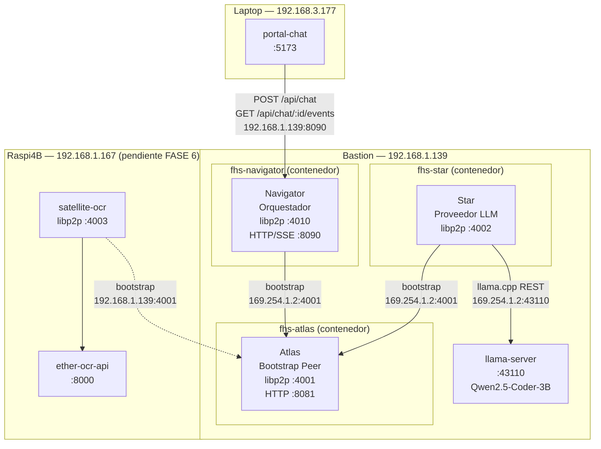
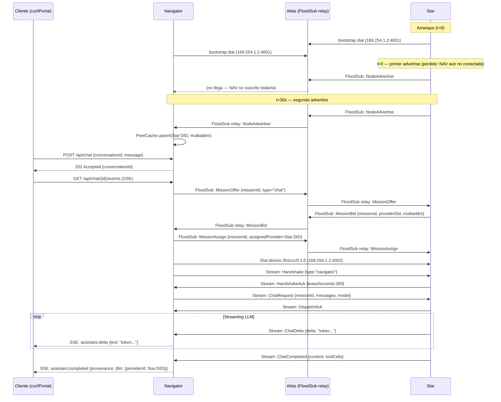
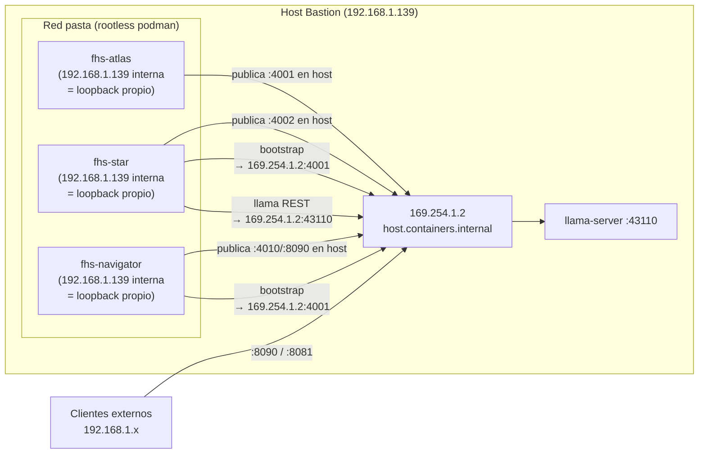
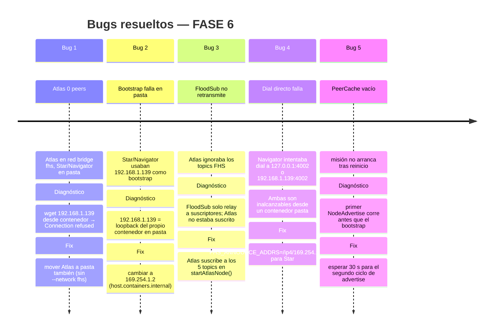

# E2E MVP — Prueba extremo a extremo con contenedores P2P

> **Estado:** ✅ FUNCIONA — chat mission completo verificado  
> **Fecha:** 2026-08-03  
> **Rama:** `main` en los tres repos (`galaxIA`, `galaxIA-Core`, `galaxIA-satellite-star`)

---

## 1. Topología de red

### Hosts físicos del clúster

```
Red LAN: 192.168.1.0/24   (Bastion + Raspi4B)
Red LAN: 192.168.3.0/24   (Laptop — interfaz WiFi)

┌──────────────────────────────────────────┐
│  Bastion (USB-WiFi)                      │
│  192.168.1.139 / 192.168.3.175           │  ← Nodo principal de la PoC
│  OS: Linux (rootless podman, pasta)      │
│                                          │
│  • llama-server :43110  (host, no cont.) │
│  • fhs-atlas    :4001 :8081              │
│  • fhs-star     :4002                    │
│  • fhs-navigator:4010 :8090              │
└──────────────────────────────────────────┘

┌──────────────────────────────────────────┐
│  Raspi4B                                 │
│  192.168.1.167                           │  ← Pendiente en FASE 6
│  OS: Raspberry Pi OS (podman)            │
│                                          │
│  • ether-ocr-api   :8000                 │
│  • satellite-ocr   :4003                 │
└──────────────────────────────────────────┘

┌──────────────────────────────────────────┐
│  Laptop                                  │
│  192.168.3.177                           │  ← Portal chat (no probado en FASE 6)
│  OS: macOS                               │
│                                          │
│  • portal-chat     :5173                 │
└──────────────────────────────────────────┘
```

### Red interna en Bastion — podman pasta

En podman rootless con red `pasta`, todos los contenedores comparten la misma interfaz de red del host. Esto genera una trampa crítica:

```
Desde DENTRO de un contenedor pasta:
  - 192.168.1.139  →  loopback del PROPIO contenedor (¡no llega al host!)
  - 169.254.1.2    →  host.containers.internal (llega al host/otros contenedores)
```

Por eso todos los `FHS_BOOTSTRAP_ADDRS` y `FHS_ANNOUNCE_ADDRS` usan `169.254.1.2`.

---

## 2. Contenedores y stack

### Contenedores activos en Bastion durante la PoC

| Nombre | Imagen | Puertos publicados | Tecnología |
|---|---|---|---|
| `fhs-atlas` | `fhs-atlas:p2p` | `0.0.0.0:4001` (libp2p WS), `0.0.0.0:8081` (HTTP) | Node 22 + libp2p |
| `fhs-star` | `fhs-star:p2p` | `0.0.0.0:4002` (libp2p WS) | Node 22 + libp2p |
| `fhs-navigator` | `fhs-navigator:p2p` | `0.0.0.0:4010` (libp2p WS), `0.0.0.0:8090` (HTTP/SSE) | Node 22 + libp2p + Fastify |

### llama-server (proceso del host, sin contenedor)

| Campo | Valor |
|---|---|
| URL | `http://localhost:43110/v1` |
| Modelo | `qwen2.5-coder-3b-instruct-q4_k_m.gguf` |
| Protocolo | OpenAI-compatible REST |

### Stack técnico por nodo

| Capa | Atlas | Star | Navigator |
|---|---|---|---|
| Runtime | Node.js 22 | Node.js 22 | Node.js 22 |
| Transporte P2P | WebSocket (`@libp2p/websockets`) | WebSocket | WebSocket |
| Seguridad | Noise protocol | Noise | Noise |
| Multiplexor | yamux | yamux | yamux |
| DHT | KadDHT server mode | KadDHT client | KadDHT client |
| PubSub | FloodSub (relay de todos los topics) | FloodSub | FloodSub |
| Identidad | Ed25519 → DID `did:key:z…` | Ed25519 → DID | Ed25519 → DID |
| HTTP | Fastify (health, nodes) | — | Fastify (chat API, SSE) |

---

## 3. Identidades criptográficas

### Atlas

| Campo | Valor |
|---|---|
| DID | `did:key:z6MkrcVRGVT552tpQhDAd6yC9BPodSkjKGFL8mHSVRUcgao3` |
| PeerID | `12D3KooWMybYRNnLvPfqi5sta8kh4sveJCXWw55TQLjY38fVfJjb` |
| Multiaddr interna | `/ip4/192.168.1.139/tcp/4001/ws/p2p/12D3KooWMybYRNnLvPfqi5sta8kh4sveJCXWw55TQLjY38fVfJjb` |
| Multiaddr desde contenedores | `/ip4/169.254.1.2/tcp/4001/ws/p2p/12D3KooWMybYRNnLvPfqi5sta8kh4sveJCXWw55TQLjY38fVfJjb` |
| Identidad persistida en | `~/data/atlas/.fhs-identity-atlas.json` |

### Star

| Campo | Valor |
|---|---|
| DID | `did:key:zE1UN31ucEtTVUdv1QuXynCzEBjqAHATdTpLxYpGZf1fE` |
| PeerID | `12D3KooWNpqXn9VKRniytXRS3WHKZ154g4soJrY7RQhyvoRTYxPA` |
| Multiaddr anunciada | `/ip4/169.254.1.2/tcp/4002/ws/p2p/12D3KooWNpqXn9VKRniytXRS3WHKZ154g4soJrY7RQhyvoRTYxPA` |
| Identidad persistida en | volumen podman `star-data:/data/.fhs-identity-star.json` |

### Navigator

| Campo | Valor |
|---|---|
| DID | `did:key:zFfe17HsNEMT11K3SYrV453C7iBkfegK53vPU1r2Xbdo4` |
| PeerID | `12D3KooWQV1ArRT5RFiVRCYsBTEPqqGxCWoJgNPZ1WkVPqBRVaWz` |
| Multiaddr anunciada | `/ip4/169.254.1.2/tcp/4010/ws/p2p/12D3KooWQV1ArRT5RFiVRCYsBTEPqqGxCWoJgNPZ1WkVPqBRVaWz` |
| Identidad persistida en | volumen podman `navigator-data:/data/.fhs-identity-navigator.json` |

---

## 4. Variables de entorno — valores reales de la PoC

### fhs-atlas

```bash
IDENTITY_KEY_PATH=/app/apps/atlas/data/.fhs-identity-atlas.json
FHS_LISTEN_ADDRS=/ip4/0.0.0.0/tcp/4001/ws
PORT=8081
HOST=0.0.0.0
```

### fhs-star

```bash
IDENTITY_KEY_PATH=/data/.fhs-identity-star.json
FHS_LISTEN_ADDRS=/ip4/0.0.0.0/tcp/4002/ws
FHS_ANNOUNCE_ADDRS=/ip4/169.254.1.2/tcp/4002/ws
FHS_BOOTSTRAP_ADDRS=/ip4/169.254.1.2/tcp/4001/ws/p2p/12D3KooWMybYRNnLvPfqi5sta8kh4sveJCXWw55TQLjY38fVfJjb
LLAMA_CPP_URL=http://169.254.1.2:43110/v1
PROVIDER_NAME=Star FHS Bastion
```

### fhs-navigator

```bash
IDENTITY_KEY_PATH=/data/.fhs-identity-navigator.json
FHS_LISTEN_ADDRS=/ip4/0.0.0.0/tcp/4010/ws
FHS_ANNOUNCE_ADDRS=/ip4/169.254.1.2/tcp/4010/ws
FHS_BOOTSTRAP_ADDRS=/ip4/169.254.1.2/tcp/4001/ws/p2p/12D3KooWMybYRNnLvPfqi5sta8kh4sveJCXWw55TQLjY38fVfJjb
HOST=0.0.0.0
PORT=8090
```

---

## 5. Diagrama de arquitectura general



---

## 6. Diagrama del protocolo FHS P2P (ciclo de misión)



---

## 7. Diagrama de red — contenedores pasta



---

## 8. Resultados de la prueba E2E

### Comando de prueba ejecutado

```bash
CONV="test-e2e3-1785809572"

curl -s -X POST http://127.0.0.1:8090/api/chat \
  -H "Content-Type: application/json" \
  -d '{"conversationId":"'"$CONV"'","message":{"role":"user","content":"Di solo: cuatro"}}'

# Con 0.5s de delay para que el SSE esté listo:
curl -N "http://127.0.0.1:8090/api/chat/$CONV/events"
```

### Logs de la misión (trazabilidad completa)

**Navigator:**
```
[mission] offer cea91d71-89c4-4d62-8a8a-8a2498f66f7c publicado (type=chat)
[mission] 1 bid(s) recibidos para cea91d71-89c4-4d62-8a8a-8a2498f66f7c
[mission] assign cea91d71-89c4-4d62-8a8a-8a2498f66f7c
         → did:key:zE1UN31ucEtTVUdv1QuXynCzEBjqAHATdTpLxYpGZf1fE
           (/ip4/169.254.1.2/tcp/4002/ws/p2p/12D3KooWNpqXn9VKRniytXRS3WHKZ154g4soJrY7RQhyvoRTYxPA)
```

**Star:**
```
[bid] oferta enviada para mision cea91d71-89c4-4d62-8a8a-8a2498f66f7c
[assign] mision cea91d71-89c4-4d62-8a8a-8a2498f66f7c asignada — esperando stream entrante
[stream] conexion entrante de Navigator
[stream] handshake de {"type":"navigator"}
[mission] cea91d71-89c4-4d62-8a8a-8a2498f66f7c — chat iniciado
[mission] cea91d71-89c4-4d62-8a8a-8a2498f66f7c completada (6 chars)
```

### Output SSE recibido por el cliente

```
event: assistant.delta
data: {"text":"Cuatro","conversationId":"test-e2e3-1785809572"}

event: assistant.completed
data: {
  "provenance": {
    "llm": {
      "providerId": "did:key:zE1UN31ucEtTVUdv1QuXynCzEBjqAHATdTpLxYpGZf1fE",
      "providerName": "did:key:zE1UN31ucEtTVUdv1QuXynCzEBjqAHATdTpLxYpGZf1fE",
      "model": "auto"
    },
    "tools": [],
    "dataExported": "Ninguno",
    "jurisdiction": "red local comunitaria"
  },
  "conversationId": "test-e2e3-1785809572"
}
```

---

## 9. Qué funciona ✅

| Componente | Estado | Detalle |
|---|---|---|
| Atlas como bootstrap peer puro | ✅ | Nodos se conectan y forman swarm |
| Atlas como relay FloodSub | ✅ | Suscrito a los 5 topics FHS; retransmite mensajes entre Star y Navigator |
| Bootstrap desde contenedor pasta | ✅ | Usando `169.254.1.2:4001` (host.containers.internal) |
| Star publica `NodeAdvertise` cada 30 s | ✅ | PeerCache del Navigator se llena correctamente |
| Navigator publica `MissionOffer` en FloodSub | ✅ | Star recibe la oferta vía relay de Atlas |
| Star publica `MissionBid` | ✅ | Navigator lo recibe dentro del `bidDeadlineMs` |
| Navigator publica `MissionAssign` con el DID del Star | ✅ | Star identifica que le fue asignada la misión |
| Dial directo Navigator → Star (`/fhs/v1/0.1.0`) | ✅ | Usando `169.254.1.2:4002` (multiaddr anunciada por Star) |
| Handshake sobre stream directo | ✅ | `HandshakeMessage` → `HandshakeAckMessage` |
| Chat request / delta / completed sobre stream | ✅ | `ChatRequest` → streaming de tokens → `ChatCompleted` |
| SSE al cliente (`assistant.delta` + `assistant.completed`) | ✅ | Eventos llegan correctamente al curl/cliente |
| `provenance` con DID real del Star | ✅ | `providerId` es el DID criptográfico del nodo que respondió |
| Identidades persistentes entre reinicios | ✅ | Volúmenes podman `star-data` y `navigator-data` |
| `FHS_ANNOUNCE_ADDRS` override de multiaddrs | ✅ | Solución al problema de red pasta (DEC-0088) |

---

## 10. Qué falla o tiene problemas ⚠️

| Problema | Severidad | Descripción |
|---|---|---|
| DHT timeout al publicar beacon | Baja | `[dht] error publicando beacon: DOMException [TimeoutError]`. KadDHT necesita al menos 3-5 nodos para enrutar; con solo 2 nodos los `put` fallan. No afecta la PoC (FloodSub funciona sin DHT). |
| Primer `NodeAdvertise` se pierde | Media | Al arrancar, Star publica el primer advertise antes de que Navigator haya completado la conexión al bootstrap. El ciclo P2P no puede empezar hasta el segundo advertise (30 s). |
| `providerName` es el DID, no un nombre legible | Baja | Star no populea `providerName` con `PROVIDER_NAME` — el campo queda como el DID. |
| Sin retry en BidCollector si no llegan bids | Media | Si ningún Star está disponible al publicar la oferta, el Navigator espera el `bidDeadlineMs` y luego silenciosamente no hace nada. No hay reintento ni error visible al usuario. |
| Logs de ESLint: 8 warnings de `eslint-disable` sobrantes | Cosmético | Directivas `no-unsafe-*` que ya no son necesarias en algunos archivos del Navigator. |

---

## 11. Qué falta (fuera de alcance de esta PoC) ❌

| Feature | Repositorio afectado | Notas |
|---|---|---|
| Prueba E2E con `satellite-ocr` (Raspi4B) | `galaxIA-satellite-star` | El ciclo `tool.call` / `tool.result` no se probó en FASE 6. Requiere Raspi4B activo con los contenedores reconstruidos para P2P. |
| Prueba desde el portal-chat UI (navegador real) | `galaxIA-Core/apps/portal-chat` | Solo se probó via `curl`. El UI usa el mismo endpoint SSE. |
| `MissionAssign` con selección por reputación real | `galaxIA-Core` | Hoy siempre se asigna al primero en llegar (primer bid). |
| `ReputationUpdateMessage` post-misión | `galaxIA-Core`, `galaxIA-satellite-star` | El campo `reputationScore` existe en el protocolo pero no se actualiza. |
| `Pulse` (heartbeat en stream activo) | `galaxIA-satellite-star` | El IDL lo define pero no está implementado; las misiones largas podrían hacer que el stream quede colgado sin detección. |
| TLS / WSS en producción | todos | Hoy todo es WS en claro. Para despliegue real se necesita TLS. |
| P2P multi-host real (Bastion ↔ Raspi4B) | todos | En esta PoC todo corrió en el mismo host. La verdadera prueba P2P entre hosts está pendiente. |
| `FHS_ANNOUNCE_ADDRS` para multi-host | `galaxIA-Core`, `galaxIA-satellite-star` | Para alcanzar Raspi4B desde Bastion se necesitaría anunciar la IP real de la LAN, no `169.254.1.2`. |

---

## 12. Problemas resueltos durante la PoC (historial de bugs)



---

## 13. Próximos pasos

### Prioridad alta

1. **Probar `satellite-ocr` en Raspi4B** — reconstruir la imagen con el código P2P, levantar con las variables correctas y ejecutar una misión `tool.call` (OCR de imagen).

2. **Reducir tiempo de espera inicial** — implementar un mecanismo de re-advertise al conectarse el primer peer, o que el Navigator espere activamente el primer advertise antes de aceptar misiones.

3. **Prueba desde portal-chat UI** — verificar que el flujo completo funciona desde el navegador (no solo `curl`).

### Prioridad media

4. **P2P multi-host (Bastion ↔ Raspi4B)** — usar las IPs reales de la LAN (`192.168.1.167`) como `FHS_ANNOUNCE_ADDRS` en Raspi4B para que Bastion pueda hacer el dial directo.

5. **Limpiar warnings de ESLint** — 8 directivas `eslint-disable` sobrantes en el Navigator.

6. **`providerName` legible** — pasar el `PROVIDER_NAME` del env al campo `provenance.llm.providerName`.

### Prioridad baja / backlog

7. **TLS / WSS** — para cualquier despliegue fuera de LAN controlada.
8. **`ReputationUpdateMessage`** — cerrar el ciclo de reputación post-misión.
9. **`Pulse` (heartbeat)** — evitar que streams activos queden colgados sin detección.
10. **Rust runtime** — TypeScript valida el IDL; Rust es el destino final (DEC-0088).

---

## 14. Comandos de referencia rápida

### Ver el estado de la red P2P

```bash
# Peers conectados al Atlas
curl http://localhost:8081/health

# Logs en vivo de los tres nodos
podman logs -f fhs-atlas &
podman logs -f fhs-star &
podman logs -f fhs-navigator &
```

### Ejecutar una prueba de chat manual

```bash
CONV="test-$(date +%s)"

curl -s -X POST http://localhost:8090/api/chat \
  -H "Content-Type: application/json" \
  -d "{\"conversationId\":\"$CONV\",\"message\":{\"role\":\"user\",\"content\":\"Hola\"}}" &

sleep 0.5
curl -N "http://localhost:8090/api/chat/$CONV/events"
```

### Reiniciar la pila (sin perder identidades)

```bash
podman restart fhs-atlas
sleep 3
podman restart fhs-star fhs-navigator
# Esperar 30 s antes de la primera misión
```
