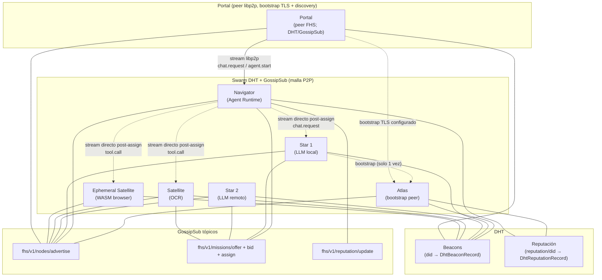
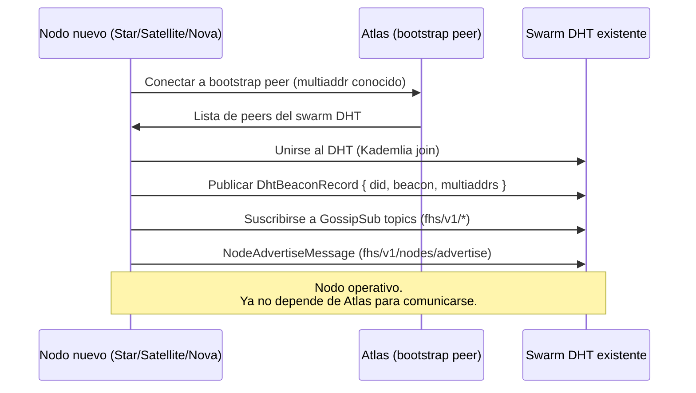

# Arquitectura — Red FHS P2P

## Nodos y Roles

| Nodo | Rol | `provider.type` |
| ---- | --- | --------------- |
| **Atlas** | Bootstrap peer. Primer punto de entrada al swarm DHT. No es un registro central. | `atlas` (especial, no en Beacon) |
| **Star** | Proveedor LLM. Ejecuta inferencia de lenguaje. | `star` |
| **Satellite** | Proveedor de herramientas (tools). Expone capabilities como OCR, búsqueda, CURP, etc. | `satellite` |
| **Nova** | Agente autónomo con loop propio. Puede coordinar Stars y Satellites. | `nova` |
| **Navigator** | Agent Runtime. Recibe Missions del Portal, despacha via GossipSub, ejecuta por stream directo. | — (peer FHS, no en DHT Beacon) |
| **Portal** | Interfaz de chat del usuario y peer FHS. Entra por bootstrap TLS y descubre Navigator por DHT/GossipSub. | — (peer libp2p) |
| **Ephemeral Satellite** | Satellite efímero ejecutando WASM en browser o móvil, delegado por un Nodo Host. | `satellite` + `ephemeral: true` |

## Topología de red

La red es una **malla P2P** (DHT Kademlia + GossipSub). No hay centro.
Los streams directos solo se abren cuando hay una Mission activa.

**Leyenda:**
- `---` conexión GossipSub o DHT (permanente, broadcast)
- `-->` stream directo siempre activo (Portal↔Navigator)
- `-.->` stream directo temporal (solo durante Mission activa, post-assign)

## Cómo se forma el swarm

## Principio de Diseño

**Navigator nunca consulta a Atlas para despachar Missions.**
Navigator escucha los `NodeAdvertiseMessage` del tópico GossipSub `fhs/v1/nodes/advertise`
y mantiene una vista local de los peers disponibles.

Cuando llega una Mission, Navigator:
1. Publica `MissionOfferMessage` en GossipSub.
2. Recoge bids y selecciona el mejor.
3. Abre un stream directo con el provider ganador.
4. Ejecuta la Mission.

Atlas solo interviene cuando un nodo nuevo quiere unirse al swarm por primera vez.

El Portal es una excepción operativa de bootstrap: el navegador no puede
descubrir por mDNS. Su configuración HTTPS solo entrega una multiaddr TLS
inicial; después participa en DHT/GossipSub, verifica los anuncios Protobuf y
abre el chat por el stream libp2p directo. No existe un registro HTTP oculto.

## Discovery vs Routing

| Función | Mecanismo |
| ------- | --------- |
| Descubrir un nodo por DID | DHT lookup (`did` → `DhtBeaconRecord`) |
| Saber qué nodos están activos ahora | GossipSub `fhs/v1/nodes/advertise` (TTL cache) |
| Asignar una Mission | GossipSub offer/bid/assign |
| Ejecutar una Mission | Stream directo `/fhs/v1/0.1.0` |
| Consultar reputación | DHT `reputation/{did}` + GossipSub reputation cache |
