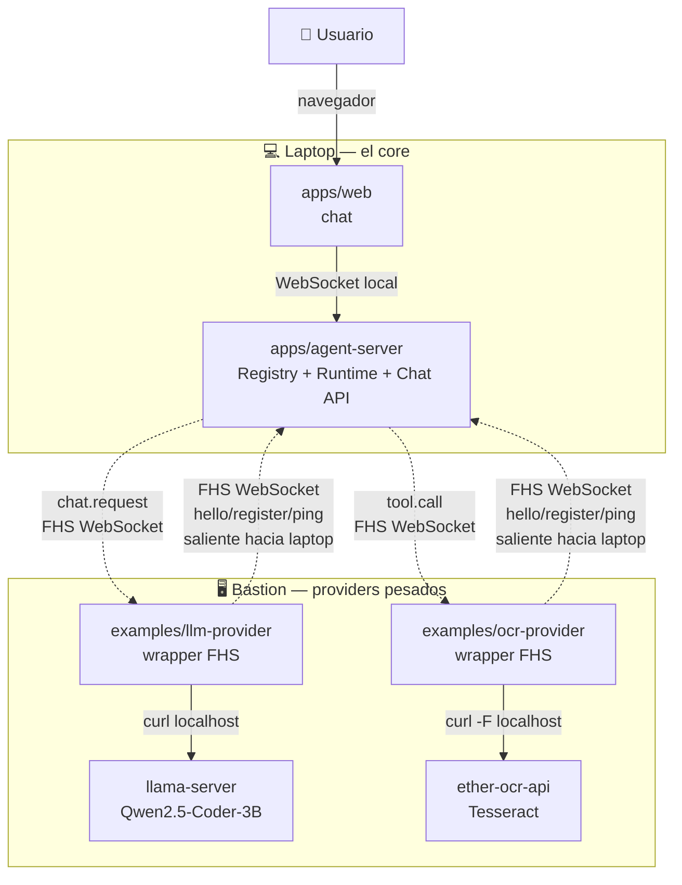
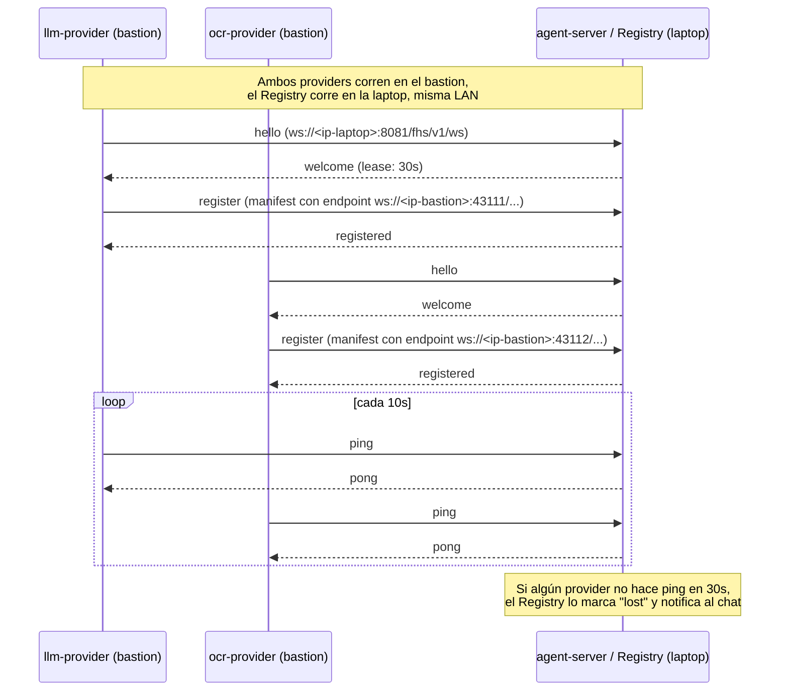

# Despliegue multi-host: laptop + bastion

Hasta ahora todo el stack (`web`, `agent-server`, `llm-provider`, `ocr-provider`) corría en un solo host (el bastion, `192.168.3.173`), simulando federación pero en realidad todo en una sola máquina. Este documento describe el paso a una topología real de **dos nodos en la misma LAN**, que es lo que el protocolo FHS está diseñado para demostrar: recursos de IA repartidos en hardware distinto, descubiertos por WebSocket, no por Docker DNS local.

## Topología objetivo

- **laptop** — el core: `apps/web` (chat) + `apps/agent-server` (Registry + Agent Runtime + Chat API). Es donde vive el catálogo de proveedores y donde el usuario abre el navegador.
- **bastion** — los providers pesados: `examples/llm-provider` (wrapper FHS) + `llama-server` (el modelo real), y `examples/ocr-provider` (wrapper FHS) + `ether-ocr-api` (OCR real).
- Ambas máquinas están en la **misma LAN**, alcanzables por IP directa. El bastion es además el punto de entrada SSH habitual, pero eso es solo para administración — el tráfico del protocolo FHS (WebSocket) va directo laptop↔bastion por la LAN, sin túnel.



**Punto clave**: las conexiones FHS **siempre las inician los providers hacia el Registry** (`hello`/`register`/`ping`), nunca al revés — esto ya estaba en el protocolo (`docs/protocolo.md`, regla 2). Eso significa que el bastion solo necesita **salida** hacia la laptop; la laptop necesita tener su puerto de Registry **accesible desde la LAN** (no solo `localhost`).

## Qué cambia respecto al despliegue de un solo host

| Antes (todo en bastion) | Ahora (laptop + bastion) |
|---|---|
| Providers se registran vía Docker DNS (`ws://agent-server:8081/...`) | Providers se registran vía IP LAN de la laptop (`ws://<ip-laptop>:8081/...`) |
| Providers anuncian su endpoint con nombre Docker (`llm-provider`, `ocr-provider`) | Providers anuncian su endpoint con la IP LAN del bastion |
| Un solo `docker network fhs` conecta todo | No hay red Docker compartida entre hosts — todo pasa por puertos publicados en cada host y la LAN real |
| `llama-server`/`ether-ocr-api` alcanzables solo desde el mismo host | Siguen siendo solo-locales al bastion — los providers FHS siguen siendo el único punto de entrada externo |

### Cambio de código necesario (ya aplicado)

`containers/compose.yaml` tenía el `REGISTRY_URL` y el hostname anunciado por cada provider **hardcodeados** a nombres de Docker DNS — imposible de usar entre dos hosts. Se cambió a variables sobreescribibles:

```yaml
- LLM_PROVIDER_HOST=${LLM_PROVIDER_HOST:-llm-provider}
- REGISTRY_URL=${PROVIDER_REGISTRY_URL:-ws://agent-server:8081/fhs/v1/ws}
```

Los defaults preservan el comportamiento de un solo host sin tocar nada. Para multi-host, se sobreescriben por variable de entorno del shell (tiene precedencia sobre `.env`) al momento de levantar los providers en el bastion.

> Se usó `PROVIDER_REGISTRY_URL`, no `REGISTRY_URL`, a propósito: el `.env` del repo ya define `REGISTRY_URL` para desarrollo local sin contenedores (apunta a `localhost`) — reusar ese nombre habría hecho que `podman-compose` lo cargara automáticamente y rompiera el default de un solo host.

También se quitó `depends_on: agent-server` de `llm-provider`/`ocr-provider` en `compose.yaml` — con dependencia, `podman-compose` intentaba levantar `agent-server` localmente en el bastion aunque solo se pidiera `llm-provider`, lo cual no tiene sentido cuando `agent-server` vive en otra máquina.

## Ciclo de vida del registro entre hosts



## Puertos y firewall

| Servicio | Host | Puerto | Quién debe alcanzarlo |
|---|---|---|---|
| `apps/web` (chat) | laptop | `3000` (o el que uses en dev) | El navegador del usuario (localhost en la laptop, o la LAN si otros quieren probar) |
| `apps/agent-server` (Registry + Chat API) | laptop | `8081` (dev) / `8083` (contenedor, ver `.env`) | Los providers del bastion (`hello`/`register`/`ping`), y el navegador (WebSocket de chat) |
| `examples/llm-provider` | bastion | `43111` (sin remapeo, ver nota) | El agent-server de la laptop (`chat.request`) |
| `examples/ocr-provider` | bastion | `43112` (sin remapeo, ver nota) | El agent-server de la laptop (`tool.call`) |
| `llama-server` | bastion | `8080` | Solo `llm-provider`, local al bastion — **no** necesita ser alcanzable desde la laptop |
| `ether-ocr-api` | bastion | `8000` | Solo `ocr-provider`, local al bastion — **no** necesita ser alcanzable desde la laptop |

**En la laptop**: abrir el puerto del agent-server (`8081`/`8083` según se use contenedor o dev) a la LAN — hoy probablemente solo escucha en `127.0.0.1` si se corrió con `HOST` por defecto. Revisar `HOST=0.0.0.0` en el contenedor (ya está así en `containers/compose.yaml`) o en `just dev-agent` si se corre sin contenedor.

**En el bastion**: abrir `43111`/`43112` a la LAN — son los puertos reales que `llm-provider`/`ocr-provider` publican (sin remapeo, a propósito: el manifiesto anuncia el mismo puerto en el que escuchan; remapear a otro puerto externo, como se hacía antes con `30084`/`30085` en el caso de un solo host, haría que el agent-server de la laptop intentara conectarse al puerto equivocado). FHS es bidireccional sobre la misma conexión WebSocket que el provider abrió — no se abre una conexión nueva desde la laptop, pero el agent-server sí necesita poder alcanzar estos puertos para `chat.request`/`tool.call`.

### Firewall real: UFW, no solo "abrir el puerto en teoría"

Verificado en el despliegue real: ambas máquinas corren UFW con policy `DROP` en `INPUT` y solo SSH permitido por defecto — el resto del tráfico entrante se descarta en silencio (sin rechazar explícitamente, así que el síntoma es un timeout de conexión, no un error claro). No es fail2ban (verificar con `sudo fail2ban-client status` para descartarlo primero) — es la configuración base del firewall. Comandos que se necesitan, acotados a la LAN, no a "Anywhere":

```bash
# En la laptop — abre el puerto del agent-server (Registry + Chat API)
sudo ufw allow from 192.168.3.0/24 to any port 30083 proto tcp comment 'FHS agent-server (Registry+Chat)'
sudo ufw reload

# En el bastion — abre los puertos de los providers
sudo ufw allow from 192.168.3.0/24 to any port 43111 proto tcp comment 'FHS llm-provider'
sudo ufw allow from 192.168.3.0/24 to any port 43112 proto tcp comment 'FHS ocr-provider'
sudo ufw reload
```

Ajustar `192.168.3.0/24` y el puerto de `agent-server` (`30083` es el mapeo de contenedor; `8083`/`8081` si se corre en modo dev) según tu red real. Verificar con `sudo ufw status numbered` en ambas máquinas.

Diagnóstico usado para confirmar que era UFW y no otra cosa: el puerto respondía correctamente en `localhost` y en la IP LAN propia de la máquina, pero no desde la otra máquina — eso descarta un problema de *binding* (la app sí escucha en `0.0.0.0`) y apunta directo a un firewall de host filtrando por origen.

## Cómo desplegar

### En la laptop (el core)

```bash
cd galaxIA
just container-up-core   # web + agent-server
# o en modo dev sin contenedores:
just dev-agent
just dev-web
```

Verificar que el Registry escuche en todas las interfaces, no solo localhost:

```bash
curl http://<ip-laptop>:8081/health
```

### En el bastion (los providers)

```bash
cd galaxIA

# Apuntar los providers al Registry de la laptop
export PROVIDER_REGISTRY_URL="ws://<ip-laptop>:8081/fhs/v1/ws"
export LLM_PROVIDER_HOST="<ip-bastion>"
export OCR_PROVIDER_HOST="<ip-bastion>"

just container-up-llm
just container-up-ocr
```

### Verificar que los providers se registraron

Desde cualquier máquina de la LAN:

```bash
curl http://<ip-laptop>:8081/api/fhs/providers
```

Debe listar `did:key:macmini-raul` (llm) y `did:key:ocr-provider-01` (mcp) con sus endpoints apuntando al bastion.

## Ver logs de cada máquina en vivo (lnav)

Cada máquina de la topología corre el mismo checkout del repo pero levanta
contenedores distintos según su rol. `helpers/just/status.just` trae una
receta de logs por rol, pensada para pararse en esa máquina y correrla ahí
mismo — combinan los logs de sus contenedores en una sola vista de
[`lnav`](https://lnav.org) (colores por nivel, filtro en vivo con `/`, salto
entre errores con `e`/`E`), sin importar si el contenedor se levantó con
`podman-compose` o con `podman run` suelto (como los providers de bastion y
raspi4b en este despliegue):

```bash
# En la laptop (core): agent-server + web
just logs-core

# En el bastion (llm): llm-provider
just logs-llm

# En raspi4b (ocr): ocr-provider + ether-ocr-api
just logs-ocr

# Cualquier otro contenedor, en cualquier máquina
just logs-lnav <contenedor> [contenedor2 ...]
```

`lnav` requiere una terminal interactiva real (no funciona bien sobre un
`ssh host "comando"` no interactivo) — conéctate primero (`ssh laptop`,
`ssh bastion-alqrab`, `ssh raspi4b`, según corresponda) y corre la receta
ya dentro de esa sesión.

## Riesgos y mitigaciones

| Riesgo | Impacto | Mitigación |
|---|---|---|
| El agent-server de la laptop escucha solo en `127.0.0.1` | Alto — los providers del bastion nunca logran conectar | Confirmar `HOST=0.0.0.0` (ya es el default en `containers/compose.yaml`); en dev sin contenedores, exportar `HOST=0.0.0.0` antes de `just dev-agent` |
| Firewall de la laptop bloquea el puerto del agent-server | Alto | Abrir el puerto correspondiente solo a la LAN, no a internet — la laptop no debería exponer el Registry públicamente |
| La laptop se apaga o pierde red — el Registry desaparece | Alto | Es un único punto de fallo nuevo (antes el Registry vivía en el bastion, la máquina "siempre encendida"); documentar como riesgo operativo, no resuelto en esta iteración — ver `spec-native/ROADMAP.md`, "Separar Registry del Agent Backend" |
| `PROVIDER_REGISTRY_URL` mal escrito silenciosamente cae al default de Docker DNS (`ws://agent-server:8081`), que no existe en el bastion | Medio | El provider lo intentará y nunca conectará — revisar logs (`podman logs fhs-llm-provider`) buscando "Conectado al Registry" ausente, no asumir que "sin error visible" significa que funcionó (misma lección de `docs/protocolo-provider.md`, "Lecciones de integración") |
| Latencia extra por ida-vuelta en la LAN (mínima, pero real) sumada a la latencia ya alta del modelo en el bastion | Bajo | No debería ser perceptible en LAN local; medir con las mismas pruebas end-to-end que se usaron para OCR determinístico si hay dudas |

## Verificación end-to-end (checklist)

Siguiendo la lección de `spec-native/TRACEABILITY.md` ("registrado no es probado"): no dar por terminado este cambio solo porque `/api/fhs/providers` muestra los providers en línea.

1. `curl http://<ip-laptop>:30083/api/fhs/providers` — ambos providers `online`. ✅ Verificado 2026-07-02.
2. Enviar un mensaje simple (sin adjunto) por `/api/chat/ws` en la laptop — confirmar respuesta del LLM. ✅ Verificado.
3. Adjuntar un documento — confirmar que `ocr.extracted` llega con el texto correcto (no solo que no hay error). ✅ Verificado: texto extraído coincidió exacto con el contenido real del PDF de prueba.
4. Confirmar "Usar documento" — confirmar que la respuesta final del LLM usa el texto extraído. ✅ Verificado: *"El documento dice: 'HOLA MUNDO PDF TEST - prueba OCR galaxIA'."*
5. Revisar logs de ambos providers en el bastion durante la prueba — deben mostrar `tool.call`/`chat.request` entrantes desde la IP de la laptop, no timeouts. ✅ Verificado.

**Resultado**: topología multi-host (laptop `192.168.3.137` core + bastion `192.168.3.173` providers) validada de punta a punta con tráfico real cruzando ambas máquinas — no solo diseñada. El único trabajo adicional necesario más allá de lo ya documentado en este archivo fue abrir UFW en ambas máquinas (ver sección de firewall arriba) — el protocolo FHS en sí no necesitó ningún cambio de código para funcionar entre dos hosts.

## Enlaces relacionados

- `docs/despliegue.md` — despliegue de un solo host (referencia histórica, sigue siendo válido si no se separan las máquinas).
- `docs/protocolo.md` — regla 2 (registro por lease) y regla 3 (heartbeat), la base de por qué los providers inician la conexión.
- `docs/protocolo-provider.md` — contrato que cualquier provider debe cumplir, incluida la sección "Lecciones de integración".
- `spec-native/DECISIONS.md` DEC-0022 — decisión de adoptar esta topología y el cambio de `compose.yaml`.
