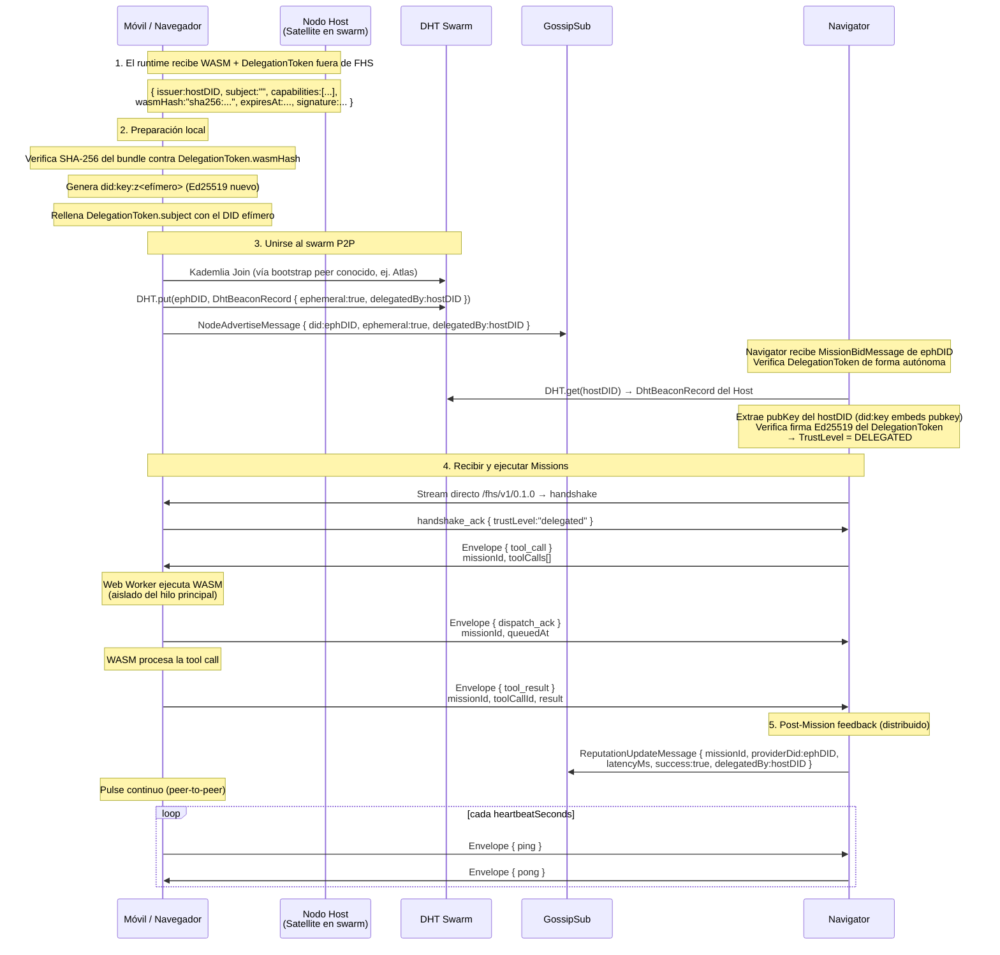
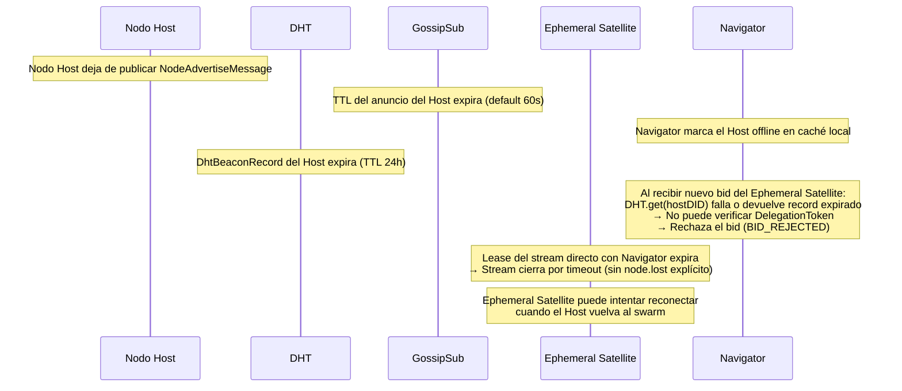
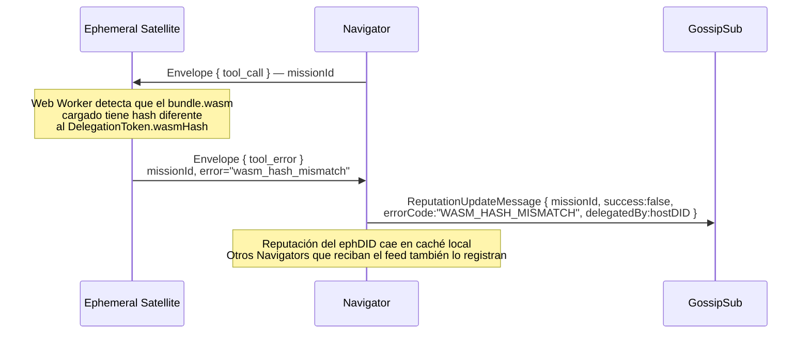

# Ephemeral Satellite — WASM en Dispositivos Móviles

> Spec completa: `spec-native/specs/ephemeral-satellite/SPEC.md`
> IDL wire: `idl/fhs-protocol.proto`; los schemas auxiliares no se transmiten.

## Concepto

Un **Ephemeral Satellite** es un Satellite que:
- Ejecuta sus capabilities como código WASM dentro de un navegador o app móvil.
- Tiene ciclo de vida corto (lease TTL configurable, máx. 24h).
- Es **delegado por un Nodo Host** (Star, Satellite o Nova activo en el swarm) que publicó el WASM.
- Hereda la confianza del Host mediante una firma criptográfica (DelegationToken).

El dispositivo móvil no es un actor anónimo — es una extensión computacional de un nodo conocido.

## Flujo de Vida Completo



## Expiración cuando el Host Sale del Swarm

En el modelo P2P no hay expulsión activa orquestada por Atlas. El ciclo de vida es:



## Flujo de Error: Hash WASM Incorrecto



## DelegationToken (Protobuf)

```protobuf
message DelegationToken {
  string          issuer       = 1;  // did:key:z<host>
  string          subject      = 2;  // did:key:z<efímero>
  repeated string capabilities = 3;  // ["arithmetic.solve", "curp.compute"]
  string          wasm_hash    = 4;  // "sha256:<64 hex chars>"
  int64           expires_at   = 5;  // Unix ms
  bytes           signature    = 6;  // Ed25519 sobre canonical proto(1-5)
}
```

La firma cubre los campos 1-5 en serialización proto canónica (determinista). El verificador (Navigator) extrae la clave pública directamente del DID `issuer` (`did:key` embeds pubkey) — no hay PKI, no hay lookup externo, no hay Atlas en el camino.

## Niveles de Confianza

| TrustLevel | Condición | Comportamiento |
| ---------- | --------- | -------------- |
| `delegated` | DelegationToken válido, Host activo en DHT, firma OK | Navigator enruta Missions sin restricción adicional |
| `community` | Host en DHT pero WASM no firmado directamente por él | Portal muestra badge de advertencia |
| `unverified` | Sin DelegationToken (WASM local / desarrollo) | Portal muestra alerta; Navigator requiere configuración `allowUnverified:true` |

## Arquitectura WASM en el Navegador

```
Página web (thread principal)
├── Se une al swarm DHT (vía bootstrap peer)
├── Publica DhtBeaconRecord + NodeAdvertiseMessage
├── Gestiona stream directo con Navigator (handshake + ping/pong)
└── Despacha Missions al Web Worker

Web Worker (thread aislado)
├── Carga bundle.wasm vía WebAssembly.instantiate()
├── Verifica SHA-256 antes de instanciar
├── Expone funciones string-in / string-out:
│     solveExpression(expr: string): string
│     computeCurpEncoded(input: string): string
└── Responde tool.call con tool.result
```

El Web Worker es obligatorio — el WASM no puede bloquear el thread principal (donde vive la conexión P2P y el stream directo con Navigator).
