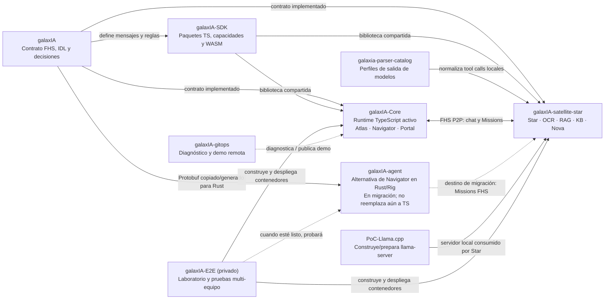

# Guía del proyecto galaxIA: qué es cada pieza y cómo trabaja con las demás

Esta guía está pensada para volver al proyecto después de un tiempo. Empieza
por la idea general, presenta cada repositorio y servicio, y luego recorre una
petición como si la siguiéramos por la red. Los términos técnicos aparecen con
una explicación sencilla la primera vez que se usan.

> **En una frase:** galaxIA conecta computadoras que ofrecen IA o herramientas
> en una red entre pares. El chat encuentra la capacidad apropiada, le encarga
> el trabajo y devuelve el resultado sin que Atlas tenga que actuar como un
> servidor central.

## 1. La idea con una analogía

Imagina un taller comunitario:

- El **Portal** es la ventanilla donde una persona pide ayuda.
- **Navigator** es quien organiza el trabajo y sabe qué servicios están
  disponibles.
- **Atlas** es la dirección que ayuda a encontrar la puerta de entrada al
  taller. No recibe ni reenvía cada encargo.
- **Star** es el puesto que sabe conversar y generar texto usando un modelo de
  lenguaje.
- Los **Satellites** son puestos especializados: leer documentos, buscar en
  una base de conocimiento o recuperar fragmentos relevantes.
- Una **Mission** es un encargo concreto que Navigator entrega a uno de esos
  puestos.
- **FHS** es el idioma y las reglas comunes que permiten que los puestos se
  entiendan aunque estén escritos en lenguajes distintos.

Las computadoras pueden estar en lugares y arquitecturas diferentes. Cada una
anuncia lo que ofrece; quien coordina no necesita conocer de antemano cada
dirección fija de cada herramienta.

## 2. Las cuatro ideas que conviene separar

### 2.1 El contrato: qué mensajes se entienden

El protocolo **FHS (Federation of Sovereign Horizons)** define los mensajes y
las reglas comunes. Sus mensajes de red se representan con **Protobuf**: una
forma compacta y tipada de codificar datos. El contrato canónico se mantiene en
`idl/fhs-protocol.proto` de este repositorio.

El protocolo también fija los caminos de red:

- **DHT Kademlia:** una tabla distribuida para encontrar información por
  identidad, por ejemplo, la dirección anunciada por un peer.
- **GossipSub:** difusión de anuncios y ofertas a los peers suscritos a un
  tema.
- **Stream directo:** canal temporal entre dos peers para intercambiar una
  petición y su respuesta.

No son tres servidores centrales: son mecanismos de la red libp2p. El tráfico
de una conversación no se enruta a través de Atlas.

### 2.2 Los procesos: quién presta cada servicio

Los **runtimes** son los programas que arrancan en una máquina y hacen el
trabajo real. Por ejemplo, Atlas, Navigator, Star y los providers OCR/RAG/KB.
La especificación dice qué deben hablar; cada runtime implementa esa regla.

### 2.3 La interfaz: dónde escribe la persona

El **Portal Chat** muestra conversaciones, controles de privacidad y
procedencia. El servidor web entrega los archivos de la página. Una vez
descargada, la aplicación del navegador participa en FHS y abre conexión P2P a
Navigator. El sitio HTTPS no es el intermediario del chat.

### 2.4 La operación: cómo se pone a prueba

Los repos de operación construyen, configuran, despliegan y comprueban los
servicios. No sustituyen al protocolo ni son parte del camino de una petición.
En la PoC, todos los servicios corren en contenedores Podman excepto
`llama-server`, que es una excepción deliberada en el Bastion. La Mac solo usa
el navegador/controlador y no necesita instalar dependencias de la PoC.

## 3. Mapa de los repositorios

Este mapa distingue los contratos, el software que los implementa y las
herramientas de operación:



La vista complementaria D2 se puede abrir aquí:

<figure class="diagram">
  
  <figcaption>Las flechas sólidas representan relaciones actuales; las punteadas, una migración o integración pendiente.</figcaption>
</figure>

| Repositorio | Qué hace en términos sencillos | Cuándo suele ser el lugar correcto para cambiar algo |
|---|---|---|
| [`galaxIA`](https://github.com/rafex/galaxIA) | Define el idioma y las reglas FHS, conserva IDL Protobuf, especificaciones, decisiones de arquitectura y documentación. No es el servicio de chat que se ejecuta en la red. | Cuando cambian los mensajes, el significado de una regla FHS, la arquitectura conceptual o su documentación. |
| [`galaxIA-SDK`](https://github.com/rafex/galaxIA-SDK) | Publica paquetes reutilizables: contratos/protocolo para TypeScript, capacidades Satellite y un paquete WASM compilado desde Rust, además de una demo web de Satellite efímero. | Cuando un consumidor TypeScript necesita una biblioteca compartida, una capacidad reutilizable o la implementación WASM asociada. |
| [`galaxIA-Core`](https://github.com/rafex/galaxIA-Core) | Contiene el runtime TypeScript que hoy une la PoC: Atlas, Navigator, Portal Chat y otros clientes/ayudantes. | Para el Navigator activo, el frontend, el bootstrap y utilidades del runtime actual. |
| [`galaxIA-satellite-star`](https://github.com/rafex/galaxIA-satellite-star) | Contiene providers de ejemplo/referencia que ofrecen LLM, OCR, búsqueda RAG, consulta KB y el agente Nova. | Cuando se modifica cómo un provider anuncia una capacidad o ejecuta una Mission. |
| [`galaxia-parser-catalog`](https://github.com/rafex/galaxia-parser-catalog) | Enseña a interpretar las respuestas de modelos que escriben llamadas a herramientas como texto JSON en vez de producir llamadas estructuradas. Convierte esa salida local a una llamada tipada antes de enviarla por FHS. | Cuando se necesita soportar la forma peculiar de salida de otro modelo. |
| [`galaxIA-agent`](https://github.com/rafex/galaxIA-agent) | Proyecto de migración para implementar el control de Navigator en Rust con Rig y separar responsabilidades lógicas. No es todavía el reemplazo de producción. | Para trabajar en el futuro agente Rust, respetando las fases y el estado que documenta su guía de migración. |
| [`PoC-Llama.cpp`](https://github.com/rafex/PoC-Llama.cpp) | Detecta características del equipo y ayuda a compilar/instalar/versionar llama.cpp y administrar modelos. | Cuando cambia cómo se prepara el motor local de inferencia. No contiene el agente ni la federación. |
| [`galaxIA-E2E`](https://github.com/rafex/galaxIA-E2E) (privado) | Orquesta las pruebas del laboratorio distribuido: crea imágenes/contenedores, despliega por equipo y revisa que la conversación alcance las capacidades reales. | Al cambiar topología, comandos de despliegue, certificados o aceptación E2E. |
| [`galaxIA-gitops`](https://github.com/rafex/galaxIA-gitops) | Herramientas operativas para diagnósticos y demostraciones remotas, incluidos túnel y certificados de demo cuando se usan. | Al preparar o diagnosticar acceso externo; no es necesario para que una conversación local FHS funcione. |

### Las piezas dentro de los repositorios grandes

**Dentro de `galaxIA-Core`:**

- `apps/atlas`: proceso bootstrap que entra al swarm y ayuda a otros nodos a incorporarse.
- `apps/navigator`: proceso coordinador y runtime TypeScript del agente que está activo ahora.
- `apps/portal-chat`: interfaz web que corre en el navegador; presenta el chat y la actividad.
- `apps/portal-tui`: cliente de chat para terminal, útil para integración y diagnóstico sin navegador.
- `apps/log-agent`: pieza auxiliar para transportar/recoger registros operativos; no procesa peticiones de usuario.
- `packages/fhs-node`: utilidades compartidas para crear nodos libp2p/FHS, identidad, protocolos y transporte. Es biblioteca, no un proceso que el usuario abra.

**Dentro de `galaxIA-SDK`:**

- `fhs-protocol`: tipos y herramientas TypeScript para codificar/decodificar mensajes FHS Protobuf.
- `satellite-capabilities`: capacidades y lógica reutilizable en TypeScript, incluida la lógica de CURP.
- `satellite-capabilities-wasm`: implementación de capacidades compilada desde Rust a WebAssembly para entornos compatibles.
- `apps/satellite-web`: demo de un Satellite efímero desde la web; no es el Portal Chat ni un servicio de servidor permanente.

**Dentro de `galaxIA-satellite-star`:** Star recibe peticiones de generación; OCR extrae texto; RAG indexa y recupera fragmentos; KB consulta documentos de conocimiento; Nova ilustra un provider/agente autónomo. Son programas/provider separados y pueden desplegarse en equipos distintos. Que RAG y KB compartan la Raspi3B en el laboratorio es una decisión de despliegue, no una dependencia del protocolo.

### Cómo decidir dónde hacer un cambio

1. ¿Cambió el mensaje que dos peers deben entender? Empieza en `galaxIA/idl/`.
2. ¿Un runtime TypeScript necesita hablar el contrato o exponer una UI? Revisa
   `galaxIA-SDK` y `galaxIA-Core`.
3. ¿Se agregó una capacidad que alguien ofrece en la red? Revisa el protocolo
   provider y `galaxIA-satellite-star`.
4. ¿Un modelo entrega tool calls en un formato raro? Revisa
   `galaxia-parser-catalog`.
5. ¿Se quiere reemplazar partes del Navigator TypeScript por Rust? Revisa
   `galaxIA-agent`, pero no asumas que ya está en producción.
6. ¿El cambio solo afecta cómo se construye, instala o ejecuta la prueba?
   Revisa `PoC-Llama.cpp`, `galaxIA-E2E` o `galaxIA-gitops`, según corresponda.

## 4. Qué hace cada servicio de la red

### Atlas: ayuda a entrar

Atlas es un peer de arranque conocido. Un nodo que todavía no está en la red
puede conectarse a Atlas para encontrar otros peers y entrar al swarm. Después,
el nodo habla P2P con los demás. Si Atlas desaparece cuando los peers ya están
conectados, deja de ser el punto por el que tendría que pasar cada chat; sí es
una dependencia práctica para equipos nuevos y un punto único de falla en la
PoC actual.

### Navigator: decide y coordina

Navigator recibe las peticiones del Portal, aplica las reglas deterministas de
privacidad y selección, descubre capacidades anunciadas, crea ofertas de
Mission, elige un provider y abre un stream directo. También adapta el
resultado y la procedencia para devolverlos al Portal.

“Determinista” quiere decir que una regla importante —por ejemplo, qué origen
de RAG se permite— la impone el código de control; no se deja como una decisión
libre del modelo de lenguaje.

### Star y llama-server: el cerebro de texto y su motor

**Star** es el provider de lenguaje. Participa en FHS y recibe peticiones del
Navigator. Por separado, llama.cpp es el motor que carga un modelo y calcula
texto. Star lo consume; Navigator no debe saltarse Star para llamar
directamente a llama.cpp.

Esta separación permite cambiar el motor/modelo sin convertir a Navigator en
un cliente particular de llama.cpp, y permite que Star valide/normalice las
respuestas del modelo antes de devolverlas.

### Satellites: herramientas especializadas

- **OCR:** reconoce texto en imágenes o PDF. OCR es extracción, no respuesta:
  convierte el documento en texto que luego se puede indexar y consultar.
- **RAG de red:** guarda/consulta fragmentos de documentos por medio de
  capacidades FHS como `document.index` y `document.query`.
- **KB (knowledge base):** consulta contenido conocido/publicado como base de
  conocimiento; en la PoC comparte máquina con el provider RAG, pero es una
  capacidad separada.
- **Nova:** ejemplo de agente/provider con un ciclo propio. No se debe confundir
  con el papel de Navigator en la PoC descrita.

**RAG** significa generación apoyada por recuperación: antes de pedir una
respuesta, se buscan trozos de información relacionados y se incluyen esos
trozos limitados como contexto. No es necesario meter el documento completo en
el prompt.

El RAG/KB del MVP es una primera implementación ligera, no una búsqueda
semántica avanzada garantizada: el método de puntuación/recuperación actual es
un placeholder de similitud simple. Por eso las fuentes y los resultados deben
tratarse como contexto útil, no como garantía de verdad.

### Portal: la ventana de la persona

Portal Chat dibuja mensajes, muestra actividad/procedencia y conserva la
experiencia del usuario. Descargar la página usa HTTPS; el chat usa el peer de
Navigator mediante el protocolo FHS. Que el servidor web del Portal se caiga
impide cargar/recargar la interfaz, pero una vez servidos los archivos el
camino de mensajes no se convierte por eso en un proxy HTTP.

### Agente Rust/Rig: la ruta futura de Navigator

`galaxIA-agent` separa el trabajo de decisión en piezas lógicas: supervisor,
política, documentos, recuperación, gestión de Missions y construcción de la
respuesta. **Eso es una separación de responsabilidades dentro de un agente**;
no implica necesariamente seis procesos de red que se llamen entre sí.

| Pieza lógica del agente Rust | Responsabilidad sencilla |
|---|---|
| `SovereignAgent` / supervisor | Recibe la petición y coordina las demás piezas. |
| `PolicyAgent` | Decide límites permitidos antes de usar una capacidad: privacidad, modelo, provider y origen de RAG. |
| `DocumentAgent` | Interpreta el material adjunto y organiza documentos/fragmentos sin tratar todo el archivo como un prompt ilimitado. |
| `RetrievalAgent` | Elige y ejecuta la recuperación autorizada: local o de red. |
| `MissionManager` | Busca providers elegibles y administra ofertas, asignaciones, timeouts y reintentos. |
| `ResponseAgent` | Forma la respuesta final y conserva los eventos/procedencia. |

Rig aporta una estructura para un ciclo de agente y herramientas; no descubre
peers ni ejecuta el protocolo FHS automáticamente. El agente necesita usar el
transporte y los mensajes FHS para conversar con Star/Satellites.

El estado es importante: el runtime TypeScript en `galaxIA-Core` sigue siendo
la ruta activa. El servidor Rust actual conecta el supervisor a
`UnconfiguredFhsTransport`, que devuelve “transporte FHS aún no configurado”
para chat y tools. Por lo tanto, aunque hay diseño, código de política y
fixtures compartidas, el camino Rust no puede todavía ejecutar end-to-end las
Missions reales ni reemplazar a Navigator. La migración requiere transporte
P2P real, discovery, offer/bid/assign, streams a Star/Satellites, eventos
Portal y una prueba E2E de corte.

## 5. El recorrido de una petición

El siguiente Mermaid muestra la conversación normal. Las líneas punteadas
representan integración en transición, no el camino que se debe asumir activo.

```mermaid
sequenceDiagram
    actor U as Persona
    participant P as Portal en el navegador
    participant A as Atlas
    participant N as Navigator TypeScript activo
    participant S as Star
    participant L as llama-server
    participant O as OCR Satellite
    participant R as RAG/KB Satellite

    U->>P: Escribe una pregunta / adjunta un documento
    P->>A: Primer ingreso al swarm (bootstrap)
    A-->>P: Ayuda a encontrar peers
    Note over P,A: Luego Atlas no transporta el chat
    P->>N: Petición por stream FHS directo
    N->>N: Valida política, privacidad, contexto y capacidades
    opt Hay adjunto que requiere OCR
        N->>O: Mission document.ocr
        O-->>N: Texto/fragmentos extraídos
    end
    opt RAG de red elegido
        N->>R: Mission document.index / document.query
        R-->>N: Fragmentos relevantes
    end
    Note over P: RAG local, si se elige, se ejecuta en el navegador;
    Note over P,N: se elige local o red; "ambos" queda fuera del MVP actual
    N->>S: Mission chat.generate + contexto acotado
    S->>L: Inferencia local del modelo
    L-->>S: Texto generado
    S-->>N: Resultado por FHS
    N-->>P: Respuesta, eventos y procedencia
    P-->>U: Muestra la respuesta
```

### El mismo recorrido, en palabras

1. La persona abre el Portal; ThinkPad entrega los archivos de la página por
   HTTPS.
2. El navegador se incorpora a FHS y utiliza Atlas para bootstrap si necesita
   entrar al swarm.
3. El navegador encuentra al Navigator y abre con él una conexión FHS directa.
4. Navigator interpreta la petición y fija las reglas antes de acudir al LLM:
   quién puede procesarla, qué modelo/capacidad usar, de qué fuente se permite
   recuperar contexto y cuánto contexto cabe.
5. Si hace falta, Navigator entrega una Mission a OCR, RAG o KB. Cada provider
   atiende su propia Mission; no se le pide al OCR que genere la explicación.
6. Para generar lenguaje, Navigator encarga a Star una Mission. Star conversa
   con `llama-server` y devuelve el resultado al Navigator.
7. Navigator devuelve texto y procedencia al navegador. El Portal presenta
   ambos.

Una petición sencilla puede saltarse OCR y RAG. Una pregunta sobre un PDF
puede requerir OCR y recuperación, y después Star para redactar una respuesta.
No todas las herramientas se deben invocar en todas las preguntas.

### Qué ocurre dentro de una Mission

Una Mission no es solo una llamada de función local. Es la asignación
distribuida de trabajo entre peers FHS:

1. **Oferta (`MissionOffer`):** Navigator publica qué necesita ejecutar y con
   qué límites. Los peers reciben la oferta por GossipSub.
2. **Oferta del provider (`MissionBid`):** un provider que reconoce la
   capacidad indica si puede tomar el trabajo y aporta su oferta.
3. **Elección y asignación (`MissionAssign`):** Navigator valida que el peer
   sirva para esa petición —incluidos permisos, privacidad y capacidad— y
   selecciona a quién asignarla.
4. **Conexión directa:** una vez asignada, Navigator abre un stream libp2p
   directo con el provider ganador y negocia el protocolo FHS/handshake. Atlas
   no reenvía ese tráfico.
5. **Ejecución y resultado:** el provider realiza la tarea (OCR, consulta KB o
   generación) y devuelve eventos/resultado por ese stream.
6. **Fallo o demora:** Navigator aplica timeout y política de reintento; si el
   provider deja de servir, puede intentar reasignar a otro provider elegible
   antes de informar un error. Los límites evitan reintentos interminables.

La oferta/anuncio permite descubrir y escoger; el stream directo es el canal
de ejecución con el provider elegido. No se deben confundir esos dos momentos.

## 6. Privacidad, documentos y tamaño de contexto

Hay dos lugares distintos donde recuperar documentos:

| Opción | Dónde ocurre | Qué sale del navegador hacia FHS |
|---|---|---|
| **RAG local** | En el dispositivo/navegador, si la persona elige esa opción | Solo el contexto acotado que se decida enviar a Star; la búsqueda y el índice local se quedan en el dispositivo. |
| **RAG de GalaxIA** | En un provider RAG de la red, a través de Missions FHS | La consulta/documento que se autorice para indexar o buscar y los fragmentos recuperados necesarios para la respuesta. |
| **Ambos** | No forma parte de la opción del MVP actual | Se mantiene fuera del alcance para evitar sumar rutas y ambigüedad mientras se estabilizan las dos opciones simples. |

**Importante:** “RAG local” dice dónde se busca el contexto; no significa por
sí solo que todo el procesamiento sea local. Si después de recuperar
fragmentos el Portal los envía a un Star remoto para redactar la respuesta,
esos fragmentos salen del dispositivo. Para que la respuesta también sea
totalmente local, el modelo de lenguaje tendría que ejecutarse en el mismo
dispositivo (o en un nodo local elegido expresamente) y la política tendría
que permitirlo. La interfaz debe dejar clara esa diferencia de privacidad.

La lección práctica para adjuntos grandes: **OCR no debe equivaler a “pegar
todo el documento en el prompt del LLM”**. El flujo correcto es extraer,
separar en fragmentos, indexar y recuperar solo los fragmentos útiles con un
límite de tamaño. El documento original puede ser grande; el contexto que
recibe el modelo debe seguir acotado.

FHS es el transporte de red entre peers. Un parser local puede recibir una
respuesta de modelo en texto/JSON y convertirla a una ToolCall Protobuf antes
de transmitirla; eso no convierte JSON en el wire protocol.

## 7. La PoC física

En el laboratorio descrito por [`poc-mvp.md`](./poc-mvp.md), los servicios se
reparten así:

| Equipo | Qué corre | Explicación sencilla |
|---|---|---|
| Bastion `.139` | Atlas, Navigator, Star en contenedores; `llama-server` en el host | Entrada de bootstrap, coordinación y provider LLM central de esta PoC. También es salto SSH administrativo. |
| Raspi4B `.167` | OCR en contenedor | Convierte PDFs/imagenes en texto. |
| Raspi3B portal-pi `.181` | RAG y KB en contenedores | Indexa/consulta fragmentos y contenido de conocimiento. |
| ThinkPad `.239` | Portal Chat en contenedor HTTPS | Sirve la interfaz estática que abre el navegador. No transporta las Missions. |
| Mac `.102` | Navegador/controlador | Abre el Portal y sirve para operar/observar; no corre servicios ni requiere instalar paquetes de la PoC. |

El diagrama D2 físico y los puertos exactos están en
[`poc-mvp.md`](./poc-mvp.md). La Mac usa el Portal en `https://192.168.1.239:8443/`.
GalaxIA (`192.168.1.0/24`) es la red principal de servicio; Netup se usa para
administración/acceso indicado por la topología. Bastion ayuda a entrar por
SSH a equipos que no aceptan acceso directo. Ese rol administrativo es
independiente de que Atlas no sea proxy FHS.

## 8. En qué estado está el proyecto

Esta guía describe la PoC/MVP actual, no una promesa de producción. La
separación importante es:

- **Activo:** el Navigator TypeScript de `galaxIA-Core`, el Portal y los
  providers de referencia que estén habilitados en el laboratorio.
- **Contrato:** el IDL Protobuf y las reglas FHS en `galaxIA`; los runtimes
  necesitan implementarlas correctamente.
- **En transición:** `galaxIA-agent` en Rust/Rig. La existencia de código no
  significa que ya sea el Navigator productivo.
- **MVP ligero:** las primeras recuperaciones KB/RAG sirven para demostrar el
  flujo, pero deben madurar antes de tomarse por un buscador semántico robusto.
- **Pruebas:** `galaxIA-E2E` comprueba la conexión real entre contenedores y
  máquinas; no requiere ejecutar los servicios en la Mac.

El límite de confianza y seguridad también tiene capas: la CA única del
laboratorio permite validar los certificados TLS de servidor; **mTLS completo
no debe suponerse activo**. Bastion es además un punto único de falla de la
topología actual por concentración de bootstrap, Navigator, Star y acceso
administrativo a las Raspberry Pi.

## 9. Glosario corto

| Término | Significado sencillo |
|---|---|
| **Peer** | Un programa/nodo que participa directamente en la red P2P. |
| **DID** | Identificador descentralizado de un nodo; sirve para reconocer su identidad pública. |
| **Beacon** | Ficha que describe a un nodo, sus direcciones y capacidades. |
| **Advertise** | Anuncio de presencia/capacidades distribuido por la red. |
| **Mission** | Una ejecución concreta solicitada a un provider. |
| **Provider** | Nodo que acepta y ejecuta un tipo de capacidad. |
| **Bid** | Oferta de un provider diciendo que puede atender una Mission. |
| **Provenance / procedencia** | Información que indica qué modelo, nodo o herramienta contribuyó al resultado. |
| **WASM** | Formato para ejecutar código compilado, por ejemplo Rust, dentro de un entorno compatible como el navegador. |
| **mDNS** | Descubrimiento de peers en una red local; es distinto de TLS/HTTPS y del bootstrap por Atlas. |
| **Rig** | Framework Rust para construir agentes y herramientas; no reemplaza por sí mismo a libp2p ni a FHS. |

## 10. Por dónde seguir leyendo

- [Mapa y detalle por repositorio](../ECOSYSTEM.md)
- [PoC/MVP: máquinas, IPs, puertos y diagramas operativos](./poc-mvp.md)
- [Vocabulario completo](./vocabulario.md)
- [Reglas FHS explicadas](./protocolo.md)
- [Cómo se descubre la red](./p2p.md)
- [Qué es una Mission](./mission.md)
- [Transporte y Protobuf](./transport.md)
- [Migración del agente Rust](https://github.com/rafex/galaxIA-agent/blob/main/docs/migracion-desde-ts.md)
