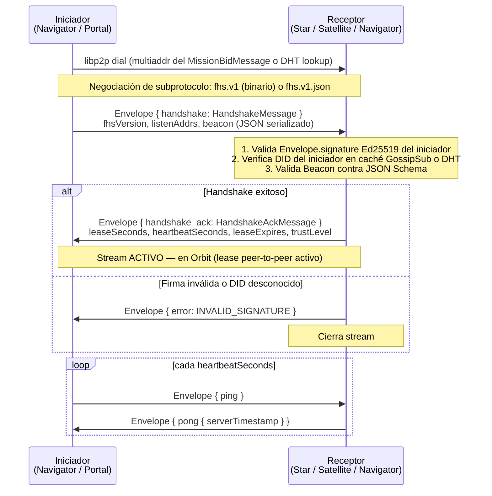
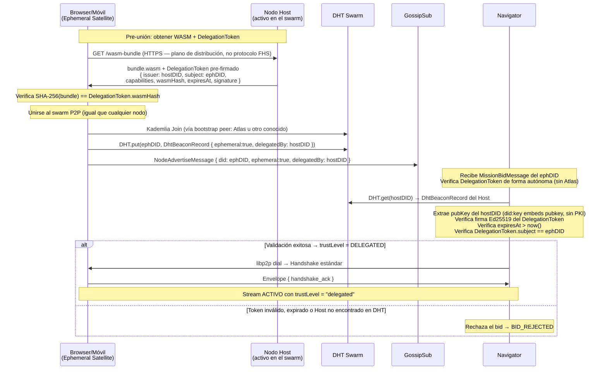
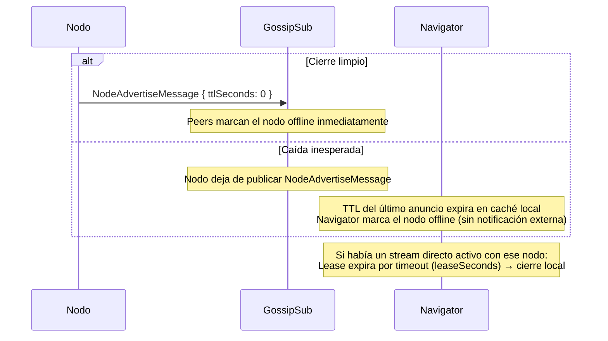

# Handshake — Stream Directo y Ciclo de Vida

## Visión General

El **handshake** establece un **stream directo** `/fhs/v1/0.1.0` entre cualquier par de nodos FHS. Se usa en tres contextos:

- **Portal → Navigator**: al inicio de cada sesión de agente (siempre activo).
- **Navigator → Star**: post-`MissionAssignMessage` en GossipSub.
- **Navigator → Satellite**: post-`MissionAssignMessage` para una Tool Mission.

El handshake **no** sustituye el descubrimiento de nodos — eso ocurre antes mediante DHT y GossipSub (ver `docs/p2p.md`).

## Handshake de Stream Directo



Un nodo en **Orbit** respecto a otro peer tiene un stream activo con lease vigente. No es un estado global — cada par de nodos mantiene su propio lease de forma independiente.

## Handshake de Ephemeral Satellite

El Ephemeral Satellite (WASM en browser o móvil) se une al swarm como cualquier nodo, pero su confianza se verifica via `DelegationToken` — un credential Ed25519 firmado por el Nodo Host que lo avala.



La verificación del `DelegationToken` es autónoma: Navigator la realiza usando solo el DHT y la clave pública embebida en el DID del Host. Atlas no interviene.

## Salida del Swarm

Un nodo sale del swarm cuando deja de publicar `NodeAdvertiseMessage`. No hay un mensaje `node.lost` explícito:



Si el Nodo Host de un Ephemeral Satellite deja de publicar (DhtBeaconRecord expira), los Navigators que intenten verificar el DelegationToken del efímero obtendrán error de verificación y rechazarán sus bids.

## Campos del Beacon

El `HandshakeMessage.beacon` es un JSON serializado siguiendo el schema `beacon-base.schema.json` (y sus extensiones por tipo: `beacon-star`, `beacon-satellite`, `beacon-nova`).

Campos clave para Ephemeral Satellites:

```json
{
  "fhsVersion": "1",
  "provider": {
    "id": "did:key:z<efímero>",
    "type": "satellite",
    "visibility": "community",
    "ephemeral": true,
    "delegatedBy": "did:key:z<host>",
    "leaseSeconds": 3600
  },
  "capabilities": [
    { "id": "arithmetic.solve", "name": "Aritmética" },
    { "id": "curp.compute",    "name": "Cálculo de CURP" }
  ],
  "device": {
    "platform": "browser",
    "wasmTier": "baseline",
    "fingerprint": "sha256:<hash-no-reversible>"
  },
  "endpoint": {
    "url": "wss://atlas.ejemplo.com"
  },
  "privacy": {
    "retention": "none"
  }
}
```

## Parámetros de Lease

| Parámetro | Default | Descripción |
| --------- | ------- | ----------- |
| `leaseSeconds` | 30 | TTL del stream directo. El iniciador debe renovar con ping antes de que expire. |
| `heartbeatSeconds` | 10 | Intervalo recomendado de ping. |
| `leaseExpires` (Ephemeral) | `min(token.expiresAt, now + leaseSeconds)` | El receptor nunca extiende el lease más allá de la expiración del DelegationToken. |
