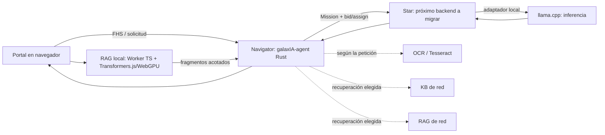
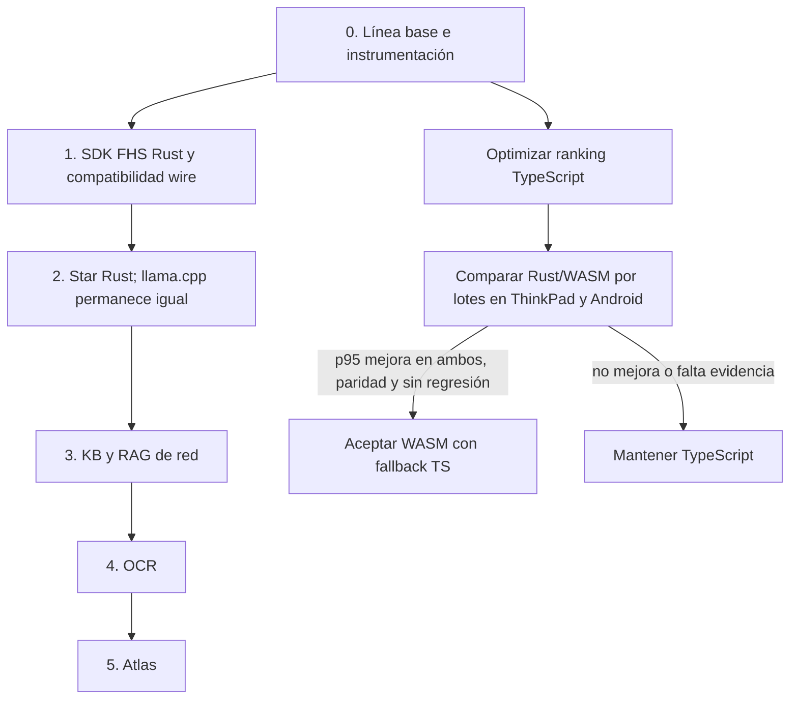

# Ruta de migración a Rust y WebAssembly basada en latencia

## Decisión

Los servicios backend de ejecución de producción migrarán a Rust. La prioridad
se ordena por cuánto participa cada servicio en una respuesta, pero **migrar de
lenguaje no demuestra por sí solo una mejora de latencia**. Se informarán por
separado (a) la paridad funcional Rust y (b) la diferencia de rendimiento
observada bajo una comparación reproducible.

Navigator ya opera como `galaxIA-agent` en Rust/Rig en Bastion. No se vuelve a
migrar ni se trata como pendiente: se optimiza y se completa su observabilidad y
su base compartida. El IDL Protobuf, el wire format FHS y sus mensajes no cambian.

La interfaz del Portal, el DOM y las llamadas de red permanecen en TypeScript
por defecto. Se autoriza investigar Rust/WASM para kernels de cómputo del
navegador, pero solo se acepta si mejora el p95 medido tanto en Android como en
ThinkPad sin regresión funcional, degradación de la experiencia ni requisito de
multihilo/COOP-COEP adicional.

## Evidencia disponible y límites

La observación reciente de Qwen3.5-2B-Q4_K_M registró aproximadamente 16,5 s
para evaluar 443 tokens de prompt y 4,4 s para generar 62 tokens. Una oferta de
Mission precedió a la asignación por unos 2 s. Cada cifra viene de una sola
petición: sirve para elegir qué medir, no para establecer una línea base
estadística ni atribuir lentitud a TypeScript.

El código confirma un plazo predeterminado de pujas de 2 s y una ventana
configurable por request. El recolector espera el plazo completo para comparar
providers, excepto si llega el provider preferido: esa puja puede cerrar la
ventana antes porque la regla existente ya le garantiza la selección. Para
otros providers no se corta al primer bid: hacerlo podría cambiar la elección
por confianza, reputación y latencia. `galaxIA-agent` registra ahora
`bid_wait_ms` por Mission; se medirá qué porcentaje de solicitudes realmente
usa la ruta de provider preferido antes de atribuirle ahorro al TTFT.

También se deben separar el tiempo de red/dispatch, la preparación del prompt y
la inferencia de `llama.cpp`. El costo de inferencia no se atribuye al runtime
Star/Navigator.

## Ruta crítica y prioridades

<figure class="diagram">
  
  <figcaption>El tiempo de inferencia pertenece a llama.cpp; el agente y los providers se miden por su overhead y trabajo previo/posterior.</figcaption>
</figure>

### 0. Medir antes de optimizar

Instrumentar, con correlación por `requestId`/`missionId` ya disponibles, como
mínimo:

- envío del Portal → primer delta visible (TTFT de extremo a extremo);
- envío → respuesta completa;
- resolución/indexación/consulta RAG local, cuando ocurra;
- agente: validación y creación del plan;
- Mission: oferta → primer bid válido → asignación → conexión/handshake;
- Star: entrada de petición → envío al motor → primer token del motor → último
  token;
- providers: duración de consulta y bytes/fragmentos retornados;
- CPU y RSS/PSS en los procesos/contenedores relevantes.

Calcular mediana, p95 y dispersión con repeticiones, además de registrar
dispositivo, versión/imagen, arquitectura, modelo GGUF, cuantización,
parámetros de generación, tamaño del prompt, número de providers y estado
caliente/frío. Nunca mezclar el primer arranque de un modelo con consultas
calientes. El mismo corpus y la misma petición se usan en los lados A/B.

### 1. SDK FHS Rust compartido — habilitador

Consolidar identidad, firmas, Protobuf generado, framing LPP y transporte en
`galaxIA-SDK`, y comprobar compatibilidad con fixtures binarios y peers
TypeScript. Esto reduce divergencia y prepara los siguientes servicios; no se
contabiliza como ahorro de latencia hasta medirlo.

### 2. Star — backend de mayor prioridad

Star participa en cada generación y es el siguiente runtime backend a migrar.
Mantener `llama.cpp` como motor separado. Comparar tiempo añadido por Star antes
del primer token y durante el streaming, además de CPU/memoria. Comparar el
backend TypeScript anterior y Rust con el mismo servidor/modelo/configuración.

### 3. KB y RAG de red — consultas de ruta caliente

Migrar los providers de consulta después de Star. Separar recuperación, acceso
a almacenamiento, serialización Protobuf y transferencia de fragmentos. La
calidad de recuperación y el conjunto de resultados también deben permanecer
equivalentes.

### 4. OCR y Atlas — ruta condicional y plano de control

Migrar OCR después de los providers calientes. Tesseract probablemente domina
el costo total de OCR; medir por separado extracción frente a coordinación.
Atlas se prioriza después porque actúa principalmente en bootstrap y
descubrimiento, no en cada turno ya conectado. Ambos backend migran a Rust,
pero no se presentan como optimización del TTFT de chat hasta que las mediciones
lo sustenten.

Nova de ejemplo, el catálogo de parsers y los scripts E2E/CI no preceden a los
servicios productivos medidos: su migración no acelera por sí misma una respuesta
de producción. No se migra documentación, fixtures o scripts “por rendimiento”.

## Chat y WASM

El RAG local actual ejecuta embeddings con Transformers.js en un Web Worker y
puede usar WebGPU. Esa inferencia se conserva: reemplazarla por WASM en CPU puede
ser más lento, especialmente en Android.

El primer kernel candidato es el ranking en el fallback IndexedDB. Antes del
cambio, se creaba un vector de puntuación para cada registro y se ordenaba la
colección completa aunque solo se necesitara `topK`. Primero se mantiene una
línea TypeScript correcta y optimizada que puntúa en una pasada y conserva solo
los mejores K resultados. Su salida debe coincidir con el orden anterior,
incluidos empates.

Solo después se implementará el mismo ranking como Rust/WASM por lotes dentro
del Worker, con fallback automático a TypeScript si WASM no carga. Se medirán
carga fría y consultas calientes sobre colecciones representativas en Android
y ThinkPad. La ruta inicial será de un hilo y no dependerá de headers nuevos de
aislamiento. El Portal continúa hablando el protocolo FHS Protobuf actual; WASM
es un detalle interno del navegador, no un nuevo formato wire.

Chunking ocurre durante la indexación, no en cada consulta, por eso va después.
El parser Markdown solo se considera si un perfil muestra costo perceptible al
renderizar. No se migra DOM, UI, red ni el chat completo a WASM sin medición que
justifique el costo de interfaz y depuración.

## Diagrama de etapas

<figure class="diagram">
  
  <figcaption>El trabajo de WASM es una rama condicionada por mediciones; las migraciones backend Rust son obligatorias y no prometen aceleración.</figcaption>
</figure>

## Protocolo de comparación y gates

Para cada runtime backend, conservar una imagen anterior utilizable hasta
pasar fixtures Protobuf, comunicación cruzada TS/Rust y E2E de las capacidades
de esa etapa. El corte productivo se hace en contenedores Podman; `llama.cpp`
continúa ejecutándose directamente en el host. No instalar ni ejecutar
servicios de la PoC en macOS.

Para el ranking local, probar corpus vacío, vectores cero, embeddings
duplicados, empates, `topK` menor que la colección y colección grande. Validar
igualdad exacta de IDs/orden y tolerancia numérica acordada de scores. Medir
carga fría del módulo WASM y p50/p95 calientes con el mismo índice, navegador,
hardware y consultas.

WASM se acepta solo cuando el p95 del kernel mejora en ambos equipos, la
respuesta top-K mantiene paridad, y no aumentan de forma relevante el tiempo de
carga, memoria ni la latencia total local. Si un equipo no mejora, permanece el
fallback TypeScript y no se declara aceptación general.

## Estado y registro de evidencia

| Etapa | Estado (2026-09-27) | Evidencia |
|---|---|---|
| Navigator Rust | En Bastion (`galaxIA-agent`) | `tests/e2e` del Portal: 5/5 (DHT, descubrimiento, KB, OCR + RAG de red y local) |
| SDK FHS Rust | `galaxIA-SDK/rust/fhs` (`galaxia-fhs`), usado por el agente, los providers y Atlas | Fixtures dorados del TS; misión completa entre nodos reales (`tests/provider_mission.rs`) |
| Star Rust | En Bastion (`galaxIA-satellite-star/rust/star`) | E2E 4/4. A/B con llama.cpp y prompt iguales, 3 corridas calientes: primer delta dentro de Star 199–237 ms (TS: 235–245 ms); memoria del contenedor 3.2 MB (TS: 57 MB) |
| KB/RAG, OCR Rust | Código y pruebas listos (`rust/kb`, `rust/rag`, `rust/ocr`); imágenes aarch64 en la Raspi4B | Pendiente: paridad E2E en la red del laboratorio |
| Atlas Rust | En Bastion (`galaxIA-Core/rust/atlas`), mismo PeerId | E2E 5/5, también tras reiniciar Atlas. Descubrimiento del Navigator desde el Portal: 1.09 s y 1.12 s (TS: 17.0 s y 1.2 s), porque Atlas reenvía los anuncios vigentes a cada suscriptor nuevo |
| Ranking TypeScript | Optimización inicial y medición local en curso | Tests de equivalencia y telemetría por consulta |
| Ranking Rust/WASM | No iniciado hasta completar comparación física | p95 mejor en ThinkPad y Android, paridad, carga/memoria |

Lectura honesta de la A/B de Star: el tiempo al primer delta no cambió (lo
domina `llama.cpp`), como anticipaba esta ruta; lo que baja es la memoria. La
mejora de descubrimiento no es de lenguaje sino de diseño (reenvío en el
bootstrap), y se midió con n = 2 por lado: sirve para dirigir, no como línea
base estadística.

La telemetría del navegador registra TTFT extremo a extremo y duración del
ranking IndexedDB; el agente registra la espera de pujas por Mission. Los demás
tiempos de etapas remotas deben completarse en el agente Rust, Star y providers
con correlación FHS, sin cambiar el IDL. Mantener un
registro por versión con número de repeticiones, mediana/p95 y configuración;
no convertir la observación inicial de una sola petición en promesa de
rendimiento.

## Documentos relacionados

- [`poc-mvp.md`](./poc-mvp.md): topología física y despliegue de la PoC.
- [`mission.md`](./mission.md): ciclo de una Mission FHS.
- [`transport.md`](./transport.md): transporte libp2p y Protobuf.
- [`galaxIA-Core/docs/agente-rust-rig.md`](https://github.com/rafex/galaxIA-Core/blob/main/docs/agente-rust-rig.md): estado del agente Navigator.
- [`galaxIA-SDK`](https://github.com/rafex/galaxIA-SDK): contrato compartido y capacidades.
