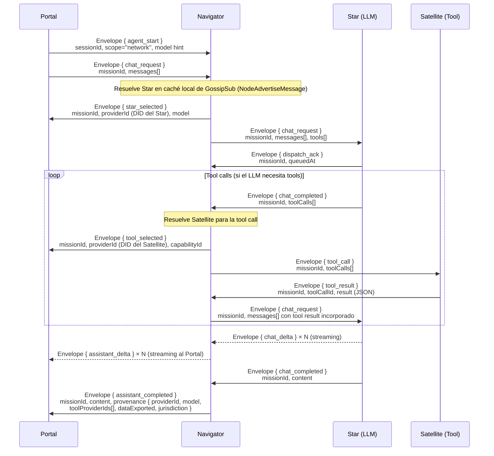
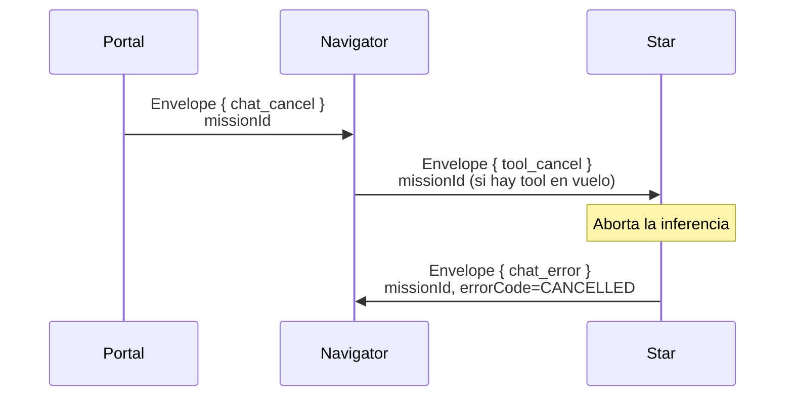
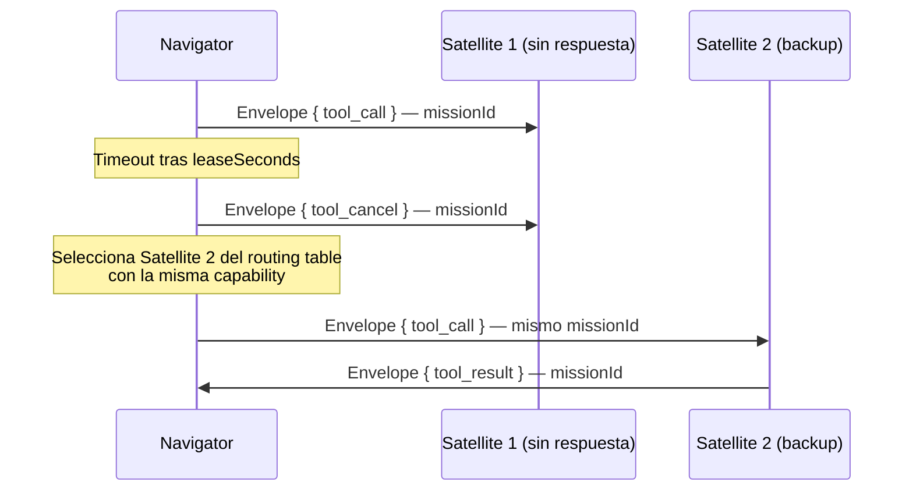

# Mission — Ciclo de Vida de una Tarea

## Concepto

Una **Mission** es la unidad de trabajo del protocolo FHS. Cada Mission tiene un `missionId` (UUID v4) que correlaciona todos los mensajes de ese trabajo a través de nodos.

```
missionId = UUID que acompaña cada mensaje del ciclo de vida:
  chat.request → chat.delta* → chat.completed
  tool.call    → dispatch.ack → tool.result
  agent.start  → agent.status → assistant.delta* → assistant.completed
```

## Flujo Completo: Portal → Navigator → Star → Satellite



## Cancelación



## Degradación Graceful

Si el Satellite seleccionado no responde dentro del timeout:



## Scope de Resolución

Cuando Navigator busca un Star o Satellite para una Mission, usa el `scope` del `AgentStartMessage`:

| Scope | Qué providers considera |
| ----- | ----------------------- |
| `local` | Solo nodos en el mismo host (misma IP) |
| `network` | Nodos en la red local (mismo swarm DHT) |
| `community` | Nodos con `visibility: "community"` en el Atlas y sus pares federados |
| `external` | Todos los nodos públicos de la federación |

## ProvenanceInfo

Cada `AssistantCompletedMessage` incluye `ProvenanceInfo` con la trazabilidad completa:

```json
{
  "providerId":     "did:key:z<star>",
  "model":          "llama3.2:3b",
  "completionTokens": 142,
  "toolProviderIds": ["did:key:z<satellite-ocr>", "did:key:z<ephemeral-satellite>"],
  "dataExported":   false,
  "jurisdiction":   "MX"
}
```

Portal muestra esta información al usuario como la "Tarjeta de Procedencia" de la misión.
Para Ephemeral Satellites, Navigator añade el `trustLevel` del nodo (obtenido del `NodeAdvertiseMessage` o del `MissionBidMessage`).
