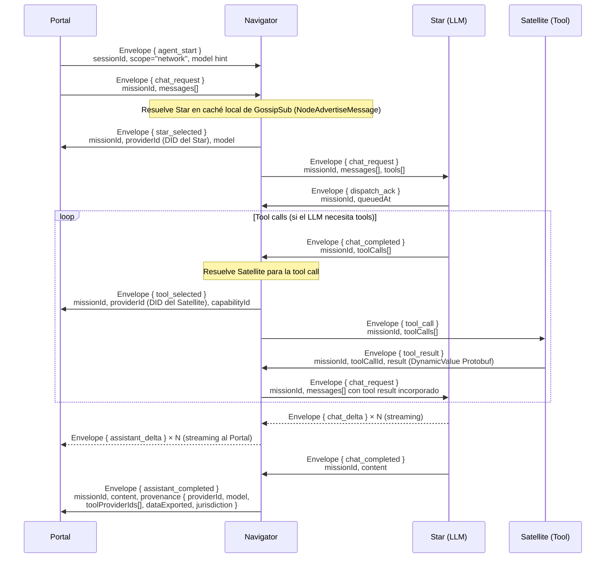
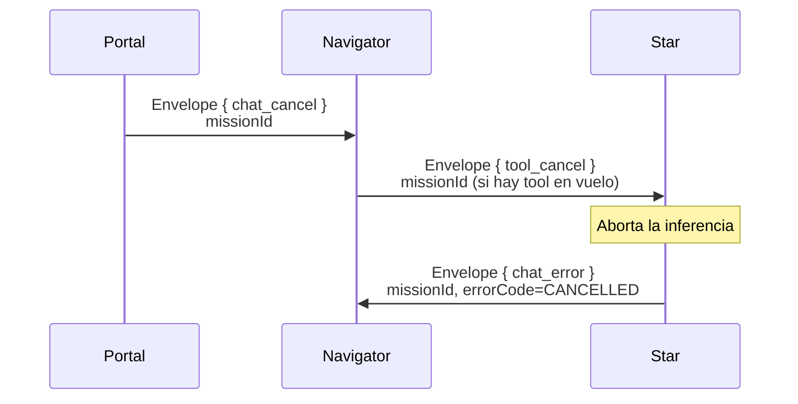
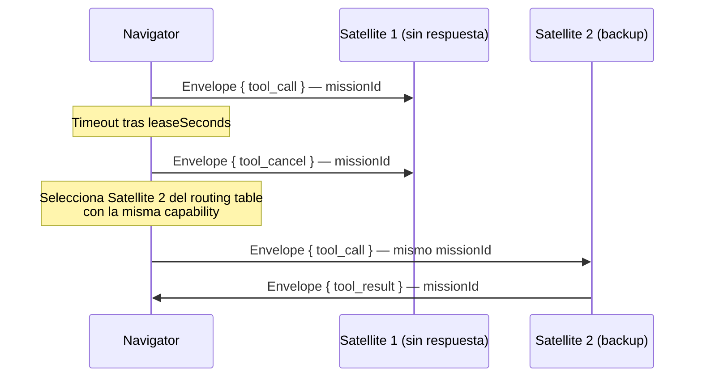

# Mission — Ciclo de Vida de una Tarea

## Concepto

Una **Mission** es la unidad de trabajo del protocolo FHS. Cada Mission tiene un `missionId` (UUID v4) que correlaciona todos los mensajes de ese trabajo a través de nodos.

```
missionId = UUID que acompaña cada mensaje del ciclo de vida:
  chat.request → chat.delta* → chat.completed
  tool.call    → dispatch.ack → tool.result
  agent.start  → agent.status → assistant.delta* → assistant.completed
```

## Regla de despacho (normativa, DEC-0096)

> **Ningún documento autoriza despachar una misión sin oferta, puja y asignación.**

Toda Mission que un Navigator encomienda a un Star, un Satellite o un Nova
(`chat.request`, `tool.call`, trabajo de un agente) se despacha con el ciclo
completo, en este orden:

1. **Oferta:** el Navigator publica un `MissionOfferMessage` firmado en
   `fhs/v1/missions/offer`. La oferta lleva el tipo de misión y las capacidades
   requeridas; **nunca** los argumentos, los mensajes ni los archivos.
2. **Puja:** los providers que cubren **todas** las capacidades requeridas responden
   con un `MissionBidMessage` firmado en `fhs/v1/missions/bid`.
3. **Asignación:** el Navigator elige y publica un `MissionAssignMessage` firmado en
   `fhs/v1/missions/assign`.
4. **Stream directo:** solo entonces el Navigator abre `/fhs/v1/0.1.0` **con el provider
   asignado**, y solo por ese stream viajan los datos de la misión.

### Qué exige a cada parte

- **Navigator:** no abre un stream de misión hacia un provider para el que no haya
  publicado una asignación de ese `missionId`. No existe "llamada directa", "modo local"
  ni "nodo de confianza" que omita el ciclo.
- **Provider:** no ejecuta `chat.request`, `tool.call` ni `tool.list` sin una **asignación
  válida a su DID para ese `missionId`**: firma verificada, mismo Navigator que firmó la
  oferta, no vencida y de **un solo uso**. Si el stream llega antes que la asignación
  (GossipSub y el stream directo son canales distintos), espera la asignación un tiempo
  acotado y, si no llega, rechaza.
- **Selección:** `preferred_provider`, las listas de permitidos y las políticas de privacidad
  **restringen quién puede ganar**; no eliminan ni acortan el ciclo.
- **Autorización del usuario** (`kb.decision`, `tool.authorization.*`): es un requisito
  **adicional**; no sustituye ni se salta el ciclo.

### Qué no cubre

La regla se refiere al despacho **Navigator → providers**. No aplica a la sesión Portal ↔
Navigator (`agent.start`, `chat.request` del usuario), a los anuncios (`NodeAdvertise`,
`DhtBeaconRecord`) ni al `ping/pong` dentro de un stream ya asignado.

### Por qué

- **Distribución:** cualquier nodo calificado puede competir; ningún despacho depende de
  conocer de antemano a un nodo.
- **Buen gobierno:** oferta, puja y asignación firmadas dejan constancia de **quién fue
  elegido, para qué y por qué**; sobre ellas se apoyan la reputación y la auditoría.
- **Seguridad:** un provider solo atiende streams que su Navigator justificó con una
  asignación.

### Sin excepciones

Cualquier variante (despacho directo, caché de asignaciones, delegación) exige **una DEC
que enmiende esta regla antes de implementarse**; una spec, un plan o una nota de PR no
bastan.

### Cumplimiento (estado a 2026-10-01)

- Navigator Rust (`client::chat` / `client::call_tool`): ejecuta el ciclo completo en cada
  llamada.
- Provider Rust del SDK (`provider::serve`): **todavía no exige** la asignación antes de
  ejecutar. Brecha conocida: debe cerrarse (con prueba de conformidad) antes de admitir
  providers de terceros.
- Nodo móvil (Ephemeral Satellite en navegador): debe exigirla desde su primera versión.

## Flujo Completo: Portal → Navigator → Star → Satellite


```mermaid
sequenceDiagram
    participant P as Portal
    participant NAV as Navigator
    participant STAR as Star (LLM)
    participant SAT as Satellite (Tool)

    P->>NAV: Envelope { agent_start }<br/>sessionId, scope="network", model hint

    P->>NAV: Envelope { chat_request }<br/>missionId, messages[]

    note over NAV: Resuelve Star en caché local de GossipSub (NodeAdvertiseMessage)

    NAV->>P: Envelope { star_selected }<br/>missionId, providerId (DID del Star), model

    NAV->>STAR: Envelope { chat_request }<br/>missionId, messages[], tools[]

    STAR->>NAV: Envelope { dispatch_ack }<br/>missionId, queuedAt

    loop Tool calls (si el LLM necesita tools)
        STAR->>NAV: Envelope { chat_completed }<br/>missionId, toolCalls[]

        note over NAV: Resuelve Satellite para la tool call

        NAV->>P: Envelope { tool_selected }<br/>missionId, providerId (DID del Satellite), capabilityId

        NAV->>SAT: Envelope { tool_call }<br/>missionId, toolCalls[]

        SAT->>NAV: Envelope { tool_result }<br/>missionId, toolCallId, result (DynamicValue Protobuf)

        NAV->>STAR: Envelope { chat_request }<br/>missionId, messages[] con tool result incorporado
    end

    STAR-->>NAV: Envelope { chat_delta } × N   (streaming)
    NAV-->>P: Envelope { assistant_delta } × N  (streaming al Portal)

    STAR->>NAV: Envelope { chat_completed }<br/>missionId, content

    NAV->>P: Envelope { assistant_completed }<br/>missionId, content, provenance { providerId, model,<br/>toolProviderIds[], dataExported, jurisdiction }
```

## Cancelación


```mermaid
sequenceDiagram
    participant P as Portal
    participant NAV as Navigator
    participant STAR as Star

    P->>NAV: Envelope { chat_cancel }<br/>missionId

    NAV->>STAR: Envelope { tool_cancel }<br/>missionId   (si hay tool en vuelo)

    note over STAR: Aborta la inferencia

    STAR->>NAV: Envelope { chat_error }<br/>missionId, errorCode=CANCELLED
```

## Degradación Graceful

Si el Satellite seleccionado no responde dentro del timeout:


```mermaid
sequenceDiagram
    participant NAV as Navigator
    participant SAT1 as Satellite 1 (sin respuesta)
    participant SAT2 as Satellite 2 (backup)

    NAV->>SAT1: Envelope { tool_call } — missionId

    note over NAV: Timeout tras leaseSeconds

    NAV->>SAT1: Envelope { tool_cancel } — missionId

    note over NAV: Selecciona Satellite 2 del routing table<br/>con la misma capability

    NAV->>SAT2: Envelope { tool_call } — mismo missionId
    SAT2->>NAV: Envelope { tool_result } — missionId
```

## Scope de Resolución

Cuando Navigator busca un Star o Satellite para una Mission, usa el `scope` del `AgentStartMessage`:

| Scope | Qué providers considera |
| ----- | ----------------------- |
| `local` | Solo nodos en el mismo host (misma IP) |
| `network` | Nodos en la red local (mismo swarm DHT) |
| `community` | Nodos con `visibility: "community"` en el Atlas y sus pares federados |
| `external` | Todos los nodos públicos de la federación |

## ProvenanceInfo

Cada `AssistantCompletedMessage` incluye `ProvenanceInfo` con la trazabilidad completa:

```protobuf
ProvenanceInfo {
  provider_id: "did:key:z<star>"
  model: "llama3.2:3b"
  completion_tokens: 142
  tool_provider_ids: "did:key:z<satellite-ocr>"
  tool_provider_ids: "did:key:z<ephemeral-satellite>"
  data_exported: false
  jurisdiction: "MX"
}
```

Portal muestra esta información al usuario como la "Tarjeta de Procedencia" de la misión.
Para Ephemeral Satellites, Navigator añade el `trustLevel` del nodo (obtenido del `NodeAdvertiseMessage` o del `MissionBidMessage`).
