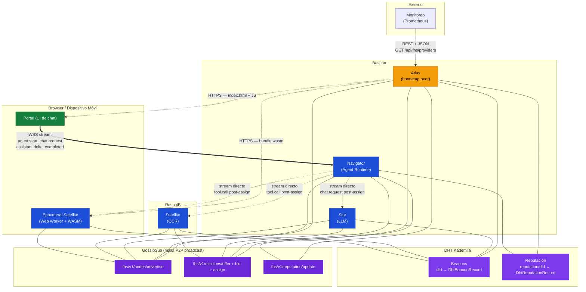
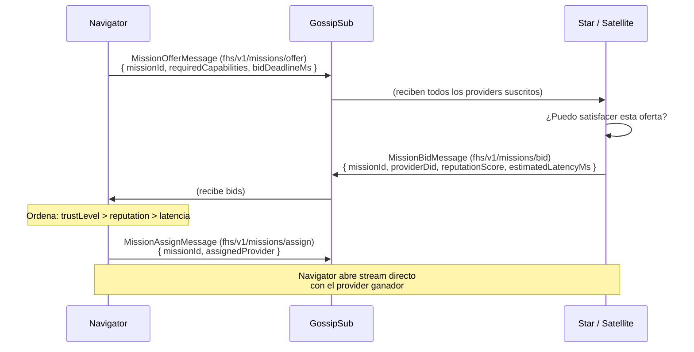
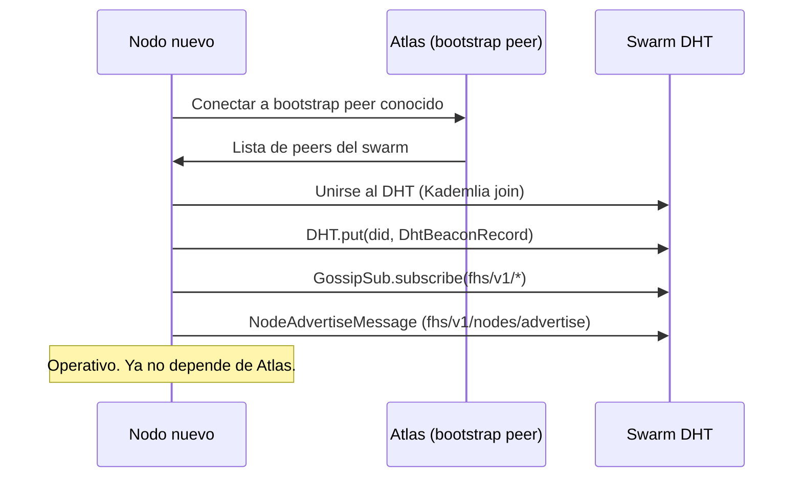
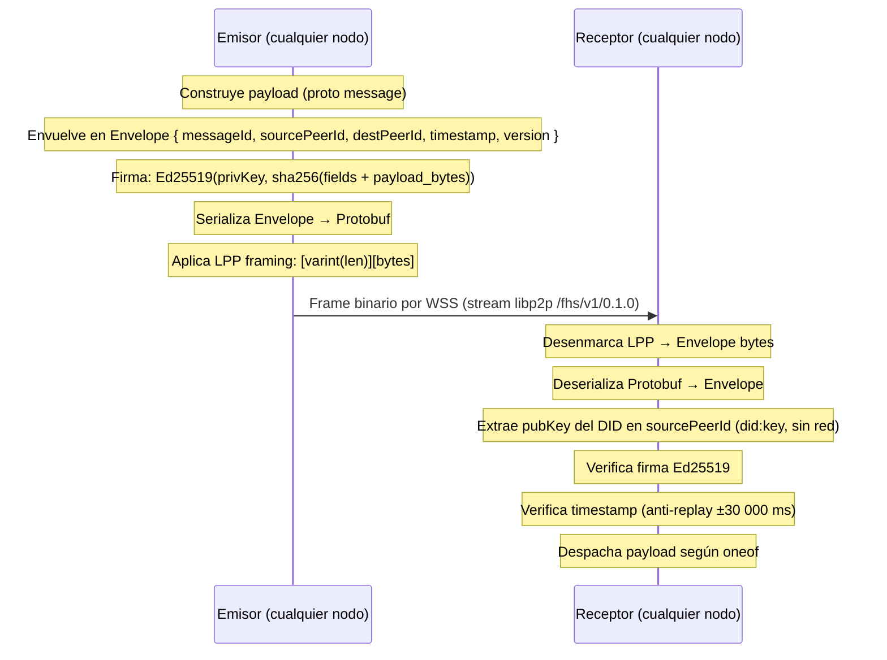
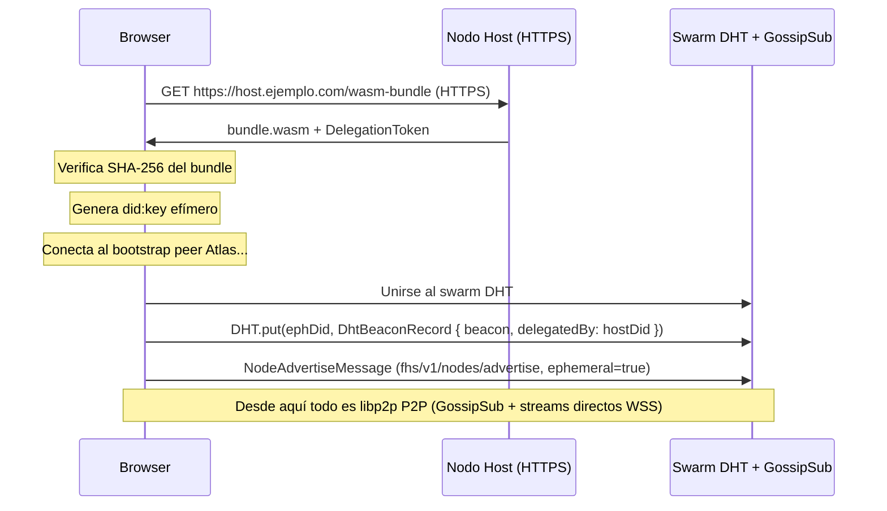

# Red — Protocolos de Comunicación en FHS

Mapa completo de qué protocolo se usa en cada capa del ecosistema:
libp2p (DHT + GossipSub), stream directo FHS, WSS, HTTPS, REST y Protobuf.

---

## Vista de alto nivel

El ecosistema FHS tiene **cuatro planos de comunicación** bien separados:

| Plano | Propósito | Protocolos |
| ----- | --------- | ---------- |
| **Plano P2P** | Descubrimiento, presencia, dispatch de Missions, reputación | libp2p: DHT Kademlia + GossipSub |
| **Plano de ejecución** | Ejecución de Missions (chat, tools) y sesión de agente | Stream directo WSS + Protobuf (`fhs.v1`) |
| **Plano de distribución** | Servir el Portal web y el WASM a los browsers | HTTPS estático |
| **Plano de gestión** | Herramientas externas, dashboards, monitoreo | REST + JSON |

La regla central: **si un mensaje es parte del protocolo FHS, va por libp2p (GossipSub o stream directo).
Si es para herramientas externas no-FHS, puede ir por REST. Si es contenido estático para el browser, HTTPS.**

---

## Diagrama de red completo



**Convención visual:**
- `---` conexión GossipSub o DHT (permanente, bidireccional)
- `==` stream directo permanente (Portal ↔ Navigator)
- `-.->` stream directo temporal (solo durante Mission activa, post-assign)
- `-.` punteado con texto — HTTPS o REST

---

## libp2p — La red P2P

libp2p es el motor de red sobre el que corre FHS. Proporciona:

| Componente | Función |
| ---------- | ------- |
| **DHT Kademlia** | Descubrimiento: cualquier nodo puede buscar a otro por DID |
| **GossipSub** | Pub/Sub broadcast: presencia, dispatch de Missions, reputación |
| **Identify** | Intercambio automático de multiaddrs entre peers conectados |
| **AutoNAT / Relay** | Conectividad para nodos detrás de NAT (móvil, home) |
| **Noise / TLS** | Seguridad en el transporte libp2p |

### Multiaddr — Dirección de un nodo FHS

```
/ip4/1.2.3.4/tcp/8443/tls/ws
```

- `/tls/` — TLS 1.2 mínimo, 1.3 recomendado
- `/ws` — WebSocket (para compatibilidad con browsers)
- El formato `wss://` de URL es la representación HTTP de la misma dirección

### Identidad

```
Clave Ed25519 → DID: did:key:z<base58btc(pubkey)>
              → PeerId libp2p: derivado de la misma clave pública
```

Un solo par de claves, dos representaciones. El DID se usa en el Envelope FHS;
el PeerId lo usa libp2p para enrutar conexiones.

---

## GossipSub — Broadcast P2P

GossipSub es la capa de pub/sub de libp2p. Los mensajes se propagan en malla —
cada nodo los reenvía a sus peers suscritos. No hay servidor central.

### Presencia de nodos

**Tópico:** `fhs/v1/nodes/advertise`

Cada nodo activo publica `NodeAdvertiseMessage` periódicamente (default: cada 30 segundos, TTL = 60s).
Reemplaza el modelo centralizado `node.online` / `node.lost` de Atlas.

```
nodo → GossipSub: NodeAdvertiseMessage {
  did, beacon (JSON), multiaddrs, timestamp, ttlSeconds, signature
}
```

Si un nodo deja de publicar antes de que expire su TTL → los demás lo marcan offline.

### Dispatch de Missions



### Reputación

**Tópico:** `fhs/v1/reputation/update`

Navigator publica `ReputationUpdateMessage` al completar cada Mission.
Todos los nodos suscritos actualizan su caché local. Los nodos que
mantienen registros en DHT actualizan `DhtReputationRecord`.

### Mensajes GossipSub y sus firmas

Los mensajes GossipSub **no son Envelopes**. Cada uno lleva:
- `did` del emisor
- `timestamp` (anti-replay)
- `signature` Ed25519 sobre los campos del mensaje

El receptor verifica la firma usando la clave pública embebida en `did:key`.

---

## DHT — Descubrimiento y reputación

La **DHT Kademlia** almacena records persistentes accesibles por cualquier nodo.

### DhtBeaconRecord

- **Key:** DID del nodo (`did:key:z...`)
- **Value:** `DhtBeaconRecord` serializado en Protobuf
- **Publicado por:** el propio nodo al unirse al swarm
- **TTL:** 24h, renovar cada 12h

Cualquier peer puede hacer `DHT.get(did)` para obtener el Beacon y multiaddrs
de un nodo conocido, incluso si ese nodo no está anunciando en GossipSub ahora mismo.

### DhtReputationRecord

- **Key:** `"reputation/" + DID del provider`
- **Value:** `DhtReputationRecord` firmado por el Navigator evaluador
- **Publicado por:** Navigators después de cada Mission

Múltiples Navigators contribuyen registros independientes bajo la misma key.
Cada registro está firmado por el Navigator que lo publica.

### Flujo de bootstrap (unirse al swarm)



---

## Stream directo FHS — El plano de ejecución

Una vez que Navigator asigna una Mission a un provider (via GossipSub),
abre un **stream directo libp2p** con protocolo `/fhs/v1/0.1.0`.

Los streams directos se usan exclusivamente para:
- La sesión permanente **Portal ↔ Navigator** (agente + chat)
- La ejecución de Missions **Navigator ↔ Star** (chat.request / chat.delta)
- La ejecución de tools **Navigator ↔ Satellite** (tool.call / tool.result)
- El **handshake** entre cualquier par de nodos FHS al abrir un stream

### Mensajes por stream

| Stream | Mensajes principales |
| ------ | -------------------- |
| Portal → Navigator | `agent.start`, `chat.request`, `chat.cancel` |
| Navigator → Portal | `agent.status`, `star.selected`, `tool.selected`, `assistant.delta`, `assistant.completed` |
| Navigator → Star (post-assign) | `chat.request`, `chat.cancel` |
| Star → Navigator | `chat.delta`, `chat.completed`, `chat.error`, `tool.call` |
| Navigator → Satellite (post-assign) | `tool.call`, `tool.cancel`, `tool.list` |
| Satellite → Navigator | `tool.result`, `tool.error`, `tool.list.response`, `dispatch.ack` |
| Cualquier par | `handshake`, `handshake_ack`, `ping`, `pong`, `error` |

### Flujo de un frame Envelope



---

## WSS — El transporte

WSS (WebSocket Secure) es el **transporte físico** de los streams libp2p FHS.

```
WSS = WebSocket sobre TLS
    = TCP + TLS 1.2/1.3 + upgrade HTTP a WebSocket
```

### Por qué WSS es obligatorio

| Razón | Detalle |
| ----- | ------- |
| **Coherencia** | El Portal va por HTTPS; la red inter-nodo cifra igual |
| **Browsers** | HTTPS bloquea `ws://` (*Mixed Content*) — WSS es el único camino para Ephemeral Satellites en browser |
| **Privacidad** | Conversaciones y datos de tools viajan por el canal; TLS protege contra eavesdropping pasivo |
| **Enforcement** | `endpoint.url` en el Beacon tiene `pattern: "^wss://"` — cualquier receptor rechaza `INVALID_MANIFEST` si el nodo declara `ws://` |

### TLS + Ed25519 son complementarios

| Capa | Qué protege | Qué no protege |
| ---- | ----------- | -------------- |
| **TLS (WSS)** | Cifrado en tránsito entre dos puntos directos | No autentica la identidad FHS; no protege mensajes en GossipSub (donde hay relays) |
| **Ed25519 (Envelope / GossipSub)** | Autenticidad del emisor FHS; cualquier nodo puede verificar sin haber estado en la conexión | No cifra — solo firma |

Juntos: el canal está **cifrado** (TLS) **y** cada mensaje está **firmado** (Ed25519).

---

## HTTPS — El plano de distribución

HTTPS sirve contenido estático al browser. **No es parte del protocolo FHS.**

| Recurso | Quién lo sirve | Quién lo consume |
| ------- | -------------- | ---------------- |
| `index.html`, CSS, JS del Portal | Servidor web (nginx) | Browser del usuario |
| `bundle.wasm` + `DelegationToken` | Nodo Host (Satellite) | Browser del Ephemeral Satellite |
| Certificados TLS (Let's Encrypt) | CA pública | El propio servidor |

La descarga del WASM y la carga del Portal son operaciones **request/response** de una sola vez.
HTTP(S) es el protocolo natural para eso.



---

## REST — El plano de gestión

REST es para **integraciones externas** que no implementan el protocolo FHS.
Definido en `idl/openapi.yaml`.

| Endpoint | Método | Quién lo consume |
| -------- | ------ | ---------------- |
| `/api/fhs/providers` | GET | Dashboards, monitoreo |
| `/api/fhs/models` | GET | UIs externas |
| `/api/fhs/metrics/sample` | POST | Prometheus exporter |
| `/api/fhs/atlas/peers` | GET / POST | Gestión de bootstrap peers conocidos |

**Lo que REST NO hace en el modelo P2P:**
- No registra nodos — el nodo se publica en DHT (`DhtBeaconRecord`) directamente
- No despacha Missions — el dispatch es GossipSub (offer/bid/assign)
- No recibe heartbeat — la presencia es GossipSub `NodeAdvertiseMessage` con TTL
- No envía reputación — el feedback es GossipSub `ReputationUpdateMessage`

```
¿El cliente puede unirse al swarm libp2p y hablar FHS?
  Sí → GossipSub + stream directo (protocolo FHS completo)
  No → REST (plano de gestión, solo lectura de estado)
```

---

## Protobuf — El encoding

Protobuf 3 es el **formato de serialización** de todos los mensajes FHS.
Se usa tanto en streams directos (Envelope) como en mensajes GossipSub.

| Contexto | Subprotocol / Encoding | Uso |
| -------- | ---------------------- | --- |
| Stream directo (primario) | `fhs.v1` — Protobuf + LPP framing | Producción |
| Stream directo (compat) | `fhs.v1.json` — JSON | Desarrollo / debugging |
| GossipSub | Protobuf binario (sin LPP) | Producción |
| DHT records | Protobuf binario | Producción |

### Por qué Protobuf en GossipSub también

La firma Ed25519 de los mensajes GossipSub requiere serialización **determinista** —
el mismo mensaje debe producir los mismos bytes en cualquier nodo.
Protobuf canónico lo garantiza; JSON no.

### LPP Framing (solo en stream directo)

```
[varint: N bytes del Envelope proto][N bytes del Envelope serializado]
```

Ver `idl/framing.md` para la spec completa.

---

## Tabla resumen

| ¿Qué necesitas hacer? | Plano | Protocolo | Encoding |
| --------------------- | ----- | --------- | -------- |
| Unirte al swarm P2P | P2P | libp2p DHT | — |
| Publicar tu Beacon en la red | P2P | DHT Kademlia | Protobuf |
| Anunciar tu presencia en tiempo real | P2P | GossipSub `fhs/v1/nodes/advertise` | Protobuf |
| Buscar un nodo por DID | P2P | DHT Kademlia | Protobuf |
| Registrar un Ephemeral Satellite | P2P | DHT + GossipSub | Protobuf |
| Despachar una Mission (buscar provider) | P2P | GossipSub offer/bid/assign | Protobuf |
| Consultar reputación de un provider | P2P | DHT `reputation/{did}` | Protobuf |
| Actualizar reputación post-Mission | P2P | GossipSub `fhs/v1/reputation/update` | Protobuf |
| Establecer sesión Portal ↔ Navigator | Ejecución | Stream directo WSS `/fhs/v1/0.1.0` | Protobuf |
| Ejecutar una Mission de chat | Ejecución | Stream directo WSS | Protobuf |
| Invocar un tool de un Satellite | Ejecución | Stream directo WSS | Protobuf |
| Mantener streams activos (heartbeat) | Ejecución | Stream directo — `ping/pong` | Protobuf |
| Servir el Portal web al browser | Distribución | HTTPS | HTML/CSS/JS |
| Distribuir el bundle WASM | Distribución | HTTPS | binario |
| Consultar providers desde un dashboard | Gestión | REST | JSON |
| Listar modelos desde una UI no-FHS | Gestión | REST | JSON |
| Ingesta de métricas (Prometheus) | Gestión | REST | JSON |
| Debugging de streams directos | Ejecución | `fhs.v1.json` (stream WSS) | JSON |

---

## Puertos de referencia

| Servicio | Puerto | Protocolo | Rol |
| -------- | ------ | --------- | --- |
| Atlas | 8443 | WSS + libp2p | Bootstrap peer, participa en DHT y GossipSub |
| Navigator | 8444 | WSS + libp2p | Agent Runtime, stream permanente con Portal |
| Portal web | 443 | HTTPS | Sirve la app web al browser |
| Star (LLM) | 43111 | WSS + libp2p | Stream directo post-assign |
| Satellite OCR | 43112 | WSS + libp2p | Stream directo post-assign |
| REST API (gestión) | 8443 | HTTPS | Mismo servidor que Atlas, ruta `/api/` |
