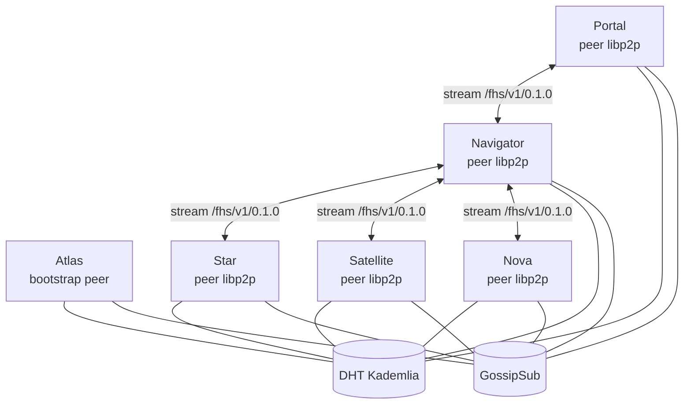
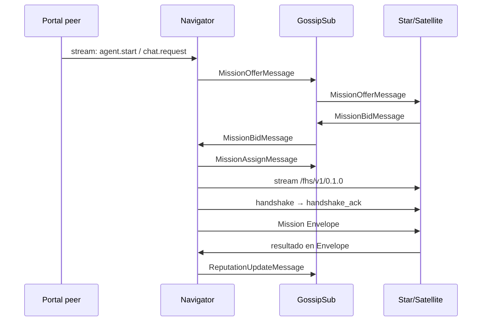

# Red FHS — Topología libp2p

FHS es una red descentralizada. Todos los nodos —Atlas, Navigator, Star,
Satellite, Nova y Portal— participan como peers libp2p. Atlas es solo un punto
de bootstrap; no es un registro ni un proxy de Missions.

## Planes de comunicación

| Plano | Propósito | Camino único |
|---|---|---|
| Descubrimiento | Beacons y reputación | DHT Kademlia |
| Presencia y dispatch | advertise, offer, bid, assign, reputation | GossipSub |
| Ejecución | handshake, chat, tools y Pulse | Stream libp2p `/fhs/v1/0.1.0` |

No existe un plano de borde ni un plano web dentro de FHS.

## Topología



## Identidad

Cada peer conserva una clave Ed25519 persistente:

```text
clave Ed25519 → did:key:z... → PeerId libp2p
```

El DID identifica el emisor en FHS y el PeerId identifica el peer en libp2p.
La clave privada nunca sale del nodo. Los Envelopes, mensajes GossipSub y
records DHT se verifican con la clave pública derivada del DID.

## Multiaddr

`endpoint.multiaddr` es obligatoria en cada Beacon. Es la única dirección que
puede usar un peer para conectar. El PeerId de la multiaddr debe coincidir con
`provider.id`.

Ejemplo conceptual:

```text
/ip4/192.0.2.10/tcp/4001/p2p/<peerId>
```

El transporte y la seguridad concretos son responsabilidad de la configuración
libp2p del swarm. FHS no define una URL alternativa ni un endpoint de aplicación.

## DHT Kademlia

Al unirse al swarm, el nodo:

1. conecta a uno o más bootstrap peers;
2. ejecuta Kademlia join;
3. publica `DhtBeaconRecord` bajo su DID;
4. renueva el record antes de su expiración.

Para encontrar un peer, un nodo resuelve su DID en la DHT, verifica la firma y
abre `/fhs/v1/0.1.0` en una de las multiaddrs anunciadas. La reputación usa la
clave `reputation/{did}` y records firmados por los evaluadores.

## GossipSub

Todos los mensajes de GossipSub son Protobuf firmado y se publican en estos
tópicos:

| Tópico | Mensaje | Propósito |
|---|---|---|
| `fhs/v1/nodes/advertise` | `NodeAdvertiseMessage` | Presencia con TTL |
| `fhs/v1/missions/offer` | `MissionOfferMessage` | Navigator busca provider |
| `fhs/v1/missions/bid` | `MissionBidMessage` | Provider ofrece capacidad |
| `fhs/v1/missions/assign` | `MissionAssignMessage` | Navigator confirma ganador |
| `fhs/v1/reputation/update` | `ReputationUpdateMessage` | Evaluación post-Mission |

## Dispatch descentralizado



## Stream directo y framing

Cada stream usa `/fhs/v1/0.1.0`. La secuencia es:

```text
Envelope(handshake)
Envelope(handshake_ack)
Envelope(ping) / Envelope(pong)
Envelope(payload de Mission)
```

Cada Envelope se serializa con Protobuf y se encapsula con LPP:

```text
[varint longitud][Envelope bytes]
```

Consulta [idl/framing.md](../idl/framing.md) para los límites y validaciones.

## Conectividad

Los nodos pueden usar las capacidades de conectividad de libp2p —Identify,
AutoNAT, relay y multiplexado— según el entorno. Esas capacidades no cambian
el contrato FHS: la aplicación siempre habla con otro peer mediante libp2p y
el protocolo `/fhs/v1/0.1.0`.
