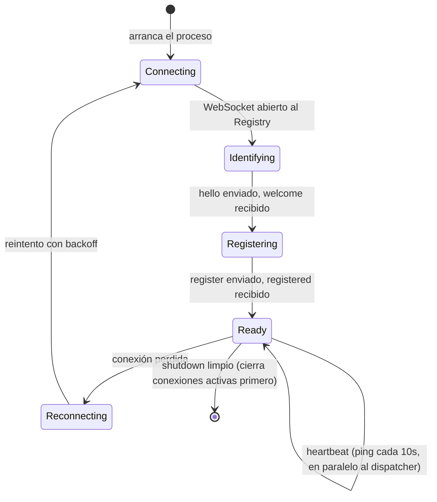
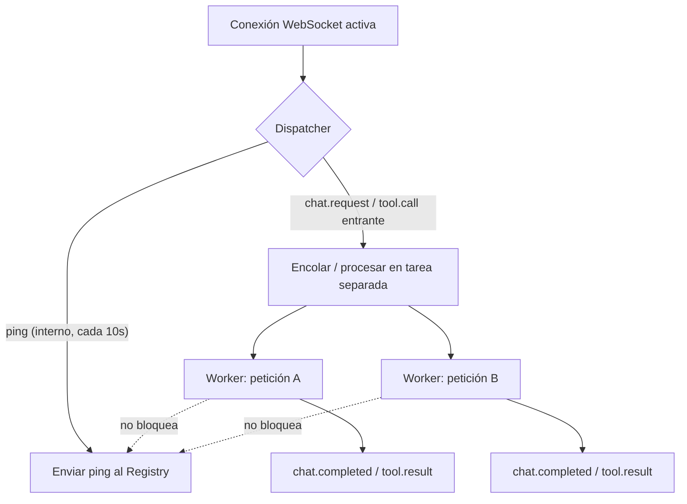

# Protocolo de Provider FHS — contrato plug-and-play

`docs/protocolo.md` define cómo habla el Registry con un nodo. Este documento define algo más estricto: **el contrato interno que todo provider debe cumplir**, sin importar qué servicio envuelva (LLM, OCR, o cualquier capacidad futura). El objetivo es que agregar un provider nuevo no requiera tocar código del Agent Server — solo implementar este contrato.

Hoy `examples/llm-provider` y `examples/ocr-provider` cumplen la mayor parte de este contrato, pero cada uno lo reimplementa desde cero (su propio bucle de conexión, su propio manejo de heartbeat, sus propios códigos de error ad-hoc). Este documento estandariza esas piezas para que el próximo provider — en cualquier lenguaje — no tenga que inventarlas de nuevo.

## Por qué "otro protocolo" y no solo "más documentación"

El protocolo FHS (`protocolo.md`) dice **qué mensajes existen**. No dice:

- en qué orden interno debe procesar un provider las peticiones concurrentes,
- qué debe pasar si dos peticiones llegan mientras una tool tarda 20 segundos,
- qué código de error usar cuando el servicio real (llama.cpp, ether-ocr-api) no responde,
- qué debe loggear un provider para que un fallo sea diagnosticable sin violar privacidad.

Sin esas reglas, cada provider "resuelve a su manera" — que es exactamente la personalización que impide plug-and-play. Este documento cierra ese hueco.

## El ciclo de vida obligatorio de un provider



Todo provider — LLM, OCR, o el que venga después — pasa por estos mismos cinco estados. Ningún provider puede saltarse `Identifying`/`Registering`, ni dejar de emitir heartbeat mientras está en `Ready`.

## Regla central: el dispatcher concurrente ("mosquito")

Un provider no es un servidor request/response simple: mientras atiende una petición larga (ej. OCR de un PDF de varias páginas), **debe seguir respondiendo heartbeat y aceptando otras peticiones**. Si el heartbeat se bloquea por una tarea en curso, el Registry lo marca `lost` (lease de 30s) aunque el provider siga vivo — esto ya está registrado como mejora pendiente en `spec-native/DECISIONS.md` DEC-0009.



Requisito concreto: el heartbeat (`ping`) debe implementarse en un timer/tarea independiente del manejo de peticiones — nunca dentro del mismo bucle síncrono que procesa `chat.request`/`tool.call`. En Node.js esto es casi gratis (event loop); en lenguajes con I/O bloqueante (ej. un script Python síncrono sin `asyncio`) es la razón principal por la que un provider mal escrito deja de responder heartbeat bajo carga.

**Señal verificable de que el mosquito ya tomó la petición:** un heartbeat sano no prueba que una petición específica esté siendo atendida, solo que la conexión sigue viva. Por eso el mosquito debe enviar `dispatch.ack { requestId, queuedAt }` (ver `docs/protocolo.md`) inmediatamente al encolar cada `chat.request`/`tool.call`, antes de empezar el trabajo real — separa la latencia de despacho (tiempo hasta el ack) de la latencia de procesamiento (tiempo hasta el resultado final), y le da al Registry una base real para calcular fiabilidad por nodo (`spec-native/specs/satelite-rating/SPEC.md`). Es obligatorio para nodos nuevos, pero compatible hacia atrás: uno que no lo envíe sigue funcionando, solo sin esa métrica.

## Manifiesto — campos obligatorios sin excepción

Independientemente del tipo (`llm` o `mcp`), todo manifiesto debe declarar:

| Campo | Obligatorio | Motivo |
|---|---|---|
| `fhsVersion` | Sí | El Registry debe poder rechazar versiones incompatibles |
| `provider.id` | Sí | Identidad única (`did:key:<nombre>`) |
| `provider.type` | Sí | `llm` \| `mcp` \| `multi` |
| `provider.visibility` | Sí | Determina en qué `scope` puede resolverse (ver `protocolo.md`) |
| `endpoint` | Sí | Dónde conectarse para hablar el protocolo del tipo correspondiente |
| `privacy.retention` | Sí | Ver sección de privacidad en `protocolo.md` — nunca se asume |
| `privacy.trainingUse` | Sí, si `type: "llm"` | Debe ser explícito, no implícito |

Un manifiesto sin `privacy.retention` **debe ser rechazado por el Registry**, no aceptado con un valor por defecto silencioso — implementado en `apps/agent-server/src/registry/manifest-validation.ts` (DEC-0013), conectado en `ws-handler.ts`: responde `error { code: "INVALID_MANIFEST" }` con el detalle de qué campo falta.

## Códigos de error estandarizados

Todo provider debe usar estos códigos en `chat.error` / `tool.error` en vez de inventar los suyos. Un Agent Server o cliente que consume FHS debe poder tomar decisiones (reintentar, buscar otro provider, informar al usuario) basándose solo en el código, sin parsear el mensaje humano.

| Código | Cuándo usarlo |
|---|---|
| `NOT_IDENTIFIED` | Se recibió un mensaje antes de completar `hello` |
| `INVALID_MANIFEST` | El manifiesto enviado en `register` no cumple el schema mínimo |
| `UPSTREAM_UNAVAILABLE` | El servicio real detrás del provider (llama.cpp, ether-ocr-api, etc.) no responde |
| `UPSTREAM_TIMEOUT` | El servicio real respondió más lento que el timeout configurado |
| `INVALID_ARGUMENTS` | Los argumentos de `tool.call`/`chat.request` no cumplen el schema de la tool/modelo |
| `UNSUPPORTED_CAPABILITY` | Se pidió una capability o modelo que el provider no tiene registrado |
| `INTERNAL_ERROR` | Cualquier otro fallo no clasificado — debe ser la excepción, no la norma |

Ejemplo:

```json
{ "type": "tool.error", "requestId": "...", "toolName": "ocr_extract", "code": "UPSTREAM_UNAVAILABLE", "message": "ether-ocr-api no respondió en 30s" }
```

## Trazabilidad obligatoria del provider

Cada provider debe loggear, por cada `requestId` que procesa, como mínimo:

```
requestId | conversationId (si viaja en el mensaje) | tipo (chat/tool) | resultado (ok/error+code) | duración ms
```

**Nunca el contenido** (texto del mensaje, archivo, respuesta del modelo) salvo que `privacy.retention` lo permita explícitamente. Esta es la misma distinción de la sección "Trazabilidad operacional" en `protocolo.md` — aquí se hace obligatoria a nivel de implementación, no solo de intención.

## Checklist "plug and play" — cuándo un provider está listo

Un provider nuevo puede conectarse al Registry sin ningún cambio en `apps/agent-server` si cumple:

- [ ] Implementa el ciclo de vida completo (`Connecting → Identifying → Registering → Ready`) del diagrama de arriba.
- [ ] El heartbeat corre en una tarea/timer independiente del procesamiento de peticiones (dispatcher concurrente).
- [ ] Envía `dispatch.ack { requestId, queuedAt }` inmediatamente al encolar cada `chat.request`/`tool.call` en su dispatcher, antes de empezar a procesar (ver "Regla central: el dispatcher concurrente" arriba).
- [ ] El manifiesto incluye todos los campos obligatorios de la tabla de arriba, incluidos los de privacidad.
- [ ] Usa los códigos de error estandarizados, no códigos propios.
- [ ] Loggea metadata de trazabilidad por `requestId`, nunca contenido fuera de lo permitido por `retention`.
- [ ] Responde `chat.error`/`tool.error` (nunca cierra la conexión en silencio) ante cualquier fallo del servicio real que envuelve.
- [ ] Si es tipo `mcp`, responde correctamente a `tool.list` con el `inputSchema` real de cada tool (el Agent Server lo usa para armar las tool definitions del LLM sin conocer la tool de antemano).
- [ ] **Se ejecutó al menos una tool call real de punta a punta** (no solo el registro/manifiesto) contra un cliente FHS real, verificando que `tool.capabilityId` resuelve al id esperado y que el resultado no está vacío. Ver "Lecciones de integración" más abajo — el registro exitoso de un provider no implica que las tool calls funcionen.

## Lecciones de integración (bugs reales encontrados al conectar piezas)

Estos tres bugs se encontraron probando el pipeline OCR de punta a punta por primera vez contra el bastion real (no solo build/typecheck). Ninguno se detectó antes porque nunca se había ejecutado una tool call real con un archivo adjunto. Documentados en detalle en `spec-native/DECISIONS.md` DEC-0014, DEC-0015, DEC-0016.

1. **El transporte no coincidía con lo documentado.** `apps/agent-server` usaba el SDK MCP nativo (HTTP) contra un provider que en realidad habla FHS WebSocket. El nombre del tipo (`provider.type = "mcp"`) sugiere "protocolo MCP estándar", pero en este repo significa "provider FHS que expone tools" — un matiz fácil de pasar por alto si solo se lee el nombre del tipo y no `docs/protocolo-provider.md`.
2. **El matching de capability por nombre era demasiado estricto.** Comparar substrings completos (`"ocrextract"` vs `"documentocr"`) parece razonable en un ejemplo de juguete, pero falla con nombres reales. Cualquier heurística de nombre entre dos catálogos independientes (nombre de tool ↔ id de capability) necesita probarse con los nombres reales del provider, no con nombres inventados para el ejemplo.
3. **El registro exitoso de un provider no garantiza que sus tools sean invocables.** El Registry mostraba el provider `online` con su capability declarada — todo parecía correcto por fuera. El bug solo apareció al ejecutar una tool call real. **Regla derivada: "está registrado" y "funciona" son afirmaciones distintas; verificar siempre con una prueba end-to-end antes de dar una integración por completa.**
4. **Que el motor de inferencia soporte tool calling "en teoría" no significa que lo exponga en el formato esperado.** Al conectar `qwen2.5-coder-3b-instruct` vía `llama-server --jinja`, el modelo sí decidía llamar la tool, pero la respuesta llegaba como texto plano en `content` en vez de en el campo estructurado `tool_calls` (ver DEC-0017 en `spec-native/DECISIONS.md`). Cualquier provider LLM que envuelva un motor de inferencia de terceros (llama.cpp, Ollama, vLLM, etc.) debe **verificar el formato real de la respuesta con una llamada `curl` directa incluyendo un `tools` array**, no asumir que "tiene tool calling" basta. Si el motor no llena `tool_calls` de forma confiable, el provider debe implementar un fallback de parseo (como hace `examples/llm-provider/src/llm-bridge.ts`) — es responsabilidad del provider traducir correctamente, no del Agent Server adivinar.

## Deuda técnica conocida

- **DEC-0013 (validación de manifiesto + códigos de error) ya está cerrado** (2026-07-06) — ver `apps/agent-server/src/registry/manifest-validation.ts` y `FHS_ERROR_CODES` en `packages/fhs-protocol/src/constants.ts`. Ver `spec-native/DECISIONS.md` DEC-0009 para la validación de identidad en `hello` (aparte, ya resuelta).
- **DEC-0012 (trazabilidad) ya está cerrado del lado del Agent Server** (`apps/agent-server/src/observability/trace.ts`, ver `mcp-host.ts`/`llm-gateway.ts`) — sigue como deuda que los providers de ejemplo (`examples/llm-provider`, `examples/ocr-provider`) no loggeen todavía su propia metadata local por `requestId`, solo el Agent Server lo hace hoy.
- `examples/llm-provider` y `examples/ocr-provider` no comparten código de dispatcher/heartbeat — cada uno lo reimplementa. Extraer un helper común (aunque sea solo para TypeScript) es la forma más directa de que el contrato de este documento deje de depender de que cada autor lo lea y lo siga a mano.
