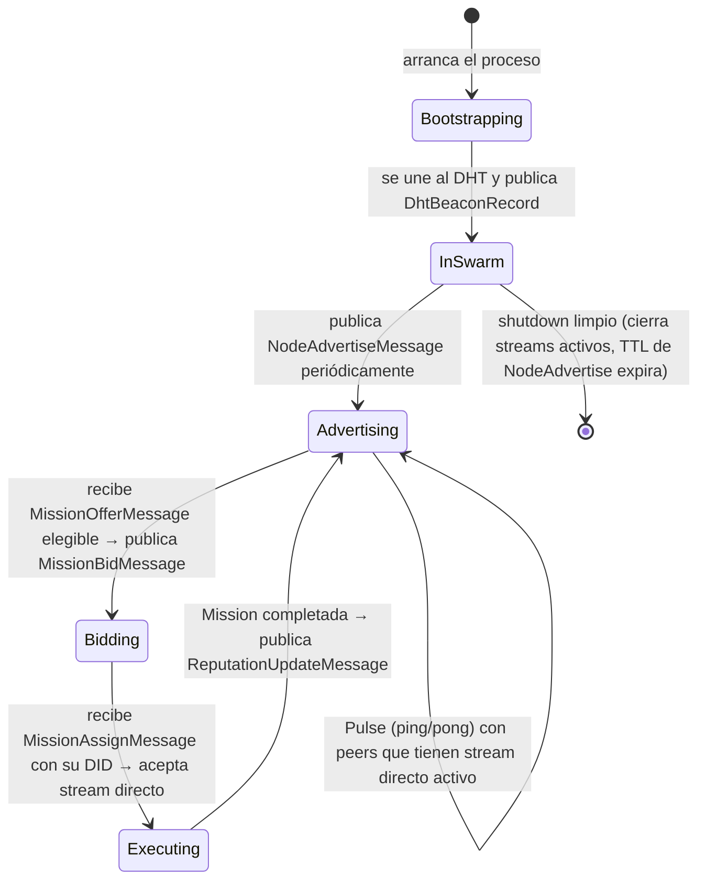

# Protocolo de Provider FHS — Contrato P2P

Todo nodo que quiera participar en la red FHS como provider (Star, Satellite o Nova) debe cumplir este contrato. Si lo cumple, Navigator puede asignarle Missions sin ninguna configuración especial en el Agent Runtime.

---

## El ciclo de vida P2P de un provider


```mermaid
stateDiagram-v2
    [*] --> Bootstrapping: arranca el proceso
    Bootstrapping --> InSwarm: se une al DHT y publica DhtBeaconRecord
    InSwarm --> Advertising: publica NodeAdvertiseMessage periódicamente
    Advertising --> Bidding: recibe MissionOfferMessage elegible → publica MissionBidMessage
    Bidding --> Executing: recibe MissionAssignMessage con su DID → acepta stream directo
    Executing --> Advertising: Mission completada → publica ReputationUpdateMessage
    Advertising --> Advertising: Pulse (ping/pong) con peers que tienen stream directo activo
    InSwarm --> [*]: shutdown limpio (cierra streams activos, TTL de NodeAdvertise expira)
```

---

## Regla central: concurrencia de Pulse y ejecución

Mientras un provider ejecuta una Mission larga (ej. OCR de un PDF), **debe seguir respondiendo Pulse** (ping/pong) en el stream activo. Si el Pulse se interrumpe antes de `leaseSeconds`, el peer cierra el stream — aunque el provider siga vivo. El Pulse debe correr en un timer independiente del procesamiento de Missions.

---

## Qué debe implementar todo provider

### 1. Identidad P2P

Generar o cargar un par de claves Ed25519 persistente. Del par se deriva:
- **DID**: `did:key:z<base58btc(pubkey)>` — la identidad pública del nodo.
- **PeerId libp2p**: derivado de la misma clave — es el mismo nodo, sin ambigüedad.

La clave privada **nunca sale del nodo**. Todos los Envelopes y mensajes GossipSub se firman con ella.

### 2. Unión al swarm (bootstrap)

```
1. Conectar a uno o más bootstrap peers (Atlas por defecto, o cualquier peer conocido)
2. Kademlia Join al DHT
3. Publicar DhtBeaconRecord { did, beacon, multiaddrs, expiresAt=+24h, signature }
4. Suscribir a los tópicos GossipSub relevantes
```

### 3. Anuncio de presencia (NodeAdvertiseMessage)

Publicar en `fhs/v1/nodes/advertise` cada `ttlSeconds / 2` segundos (default cada 30s):

```protobuf
NodeAdvertiseMessage {
  did: "did:key:z..."
  beacon: Beacon { fhs_version: "1", endpoint: Endpoint { multiaddr: "/ip4/.../tcp/.../p2p/<peerId>" } }
  multiaddrs: "/ip4/.../tcp/.../p2p/<peerId>"
  ttl_seconds: 60
  timestamp: 1722620400000
  signature: <ed25519 bytes>
}
```

Si el provider deja de publicar (shutdown limpio o caída), los demás lo marcan offline cuando el TTL expira.

### 4. Respuesta a ofertas de Mission (MissionBidMessage)

Suscribirse a `fhs/v1/missions/offer`. Al recibir un `MissionOfferMessage`:

1. Verificar que tiene TODAS las `requiredCapabilities`.
2. Verificar que su `visibility` es compatible con el `scope` de la oferta.
3. Verificar que `bidDeadlineMs > now()`.
4. Verificar que no está al 100% de `availability.maxConcurrentRequests`.

Si todas se cumplen, publicar `MissionBidMessage` en `fhs/v1/missions/bid`:

```protobuf
MissionBidMessage {
  mission_id: "uuid-v4"
  provider_did: "did:key:z..."
  provider_multiaddrs: "/ip4/.../tcp/.../p2p/<peerId>"
  provider_type: "star"
  offered_capabilities: "chat"
  reputation_score: 0.92
  estimated_latency_ms: 1200
  trust_level: "standard"
  timestamp: 1722620400000
  signature: <ed25519 bytes>
}
```

### 5. Aceptar el stream directo post-assign

Suscribirse a `fhs/v1/missions/assign`. Si `assignedProvider == nuestro DID`:

1. Esperar la conexión libp2p entrante de Navigator.
2. Responder al handshake con `HandshakeAckMessage`.
3. Procesar los mensajes de Mission en el stream.
4. Mantener Pulse (ping/pong) en paralelo con el procesamiento.

### 6. Mensajes de Mission

Según el tipo de nodo:

| Tipo | Mensajes entrantes | Mensajes salientes |
|------|-------------------|--------------------|
| Star (LLM) | `chat.request`, `chat.cancel` | `chat.delta`, `chat.completed`, `chat.error`, `dispatch.ack` |
| Satellite (tool) | `tool.call`, `tool.cancel`, `tool.list` | `tool.result`, `tool.error`, `tool.list.response`, `dispatch.ack` |
| Nova (agente) | `agent.start`, `chat.cancel` | `agent.status`, `assistant.delta`, `assistant.completed`, `chat.error` |

### 7. Códigos de error estandarizados

Usar siempre estos códigos en `chat.error` / `tool.error`:

| Código | Cuándo usarlo |
|--------|---------------|
| `INVALID_SIGNATURE` | Envelope con firma inválida recibido |
| `PEER_UNREACHABLE` | No se puede abrir stream con el peer asignado |
| `UPSTREAM_UNAVAILABLE` | El servicio real detrás del provider no responde |
| `UPSTREAM_TIMEOUT` | El servicio real respondió más lento que el timeout |
| `INVALID_ARGUMENTS` | Los argumentos no cumplen el schema de la tool/modelo |
| `UNSUPPORTED_CAPABILITY` | Se pidió una capability o modelo no registrado en el Beacon |
| `OVERLOADED` | Se superó `maxConcurrentRequests` |
| `CANCELLED` | La Mission fue cancelada por el Portal |
| `INTERNAL_ERROR` | Cualquier otro fallo no clasificado |

Nunca cerrar el stream en silencio ante un fallo. Siempre responder con el error tipado.

### 8. Trazabilidad sin retención de contenido

Loggear metadata por `missionId` — proveedor, duración, éxito/error — pero nunca el contenido de la conversación salvo lo que permita `privacy.retention` en el Beacon.

---

## Beacon obligatorio

Todo provider debe tener un Beacon válido según el schema correspondiente:

- Star: `Beacon.models` (ver `docs/beacon-star.md`)
- Satellite: `Beacon.capabilities` (ver `docs/beacon-satellite.md`)

Campos obligatorios en cualquier Beacon:

| Campo | Obligatorio | Motivo |
|-------|------------|--------|
| `fhsVersion` | Sí | Compatibilidad de protocolo |
| `provider.id` | Sí | DID único del nodo |
| `provider.type` | Sí | `"star"` / `"satellite"` / `"nova"` |
| `provider.visibility` | Sí | Acota en qué scope puede recibir bids |
| `endpoint.multiaddr` | Sí | Única dirección libp2p para DHT y streams directos |
| `privacy.retention` | Sí | Qué hace con los datos recibidos |

---

## Lecciones de integración (bugs reales encontrados)

Documentados en `spec-native/DECISIONS.md` — aplican también al modelo P2P:

1. **Verificar el formato real de `tool_calls` del motor de inferencia** con un `curl` directo incluyendo el array `tools` — no asumir que "soporta tool calling" es suficiente. Si el motor no llena `tool_calls` estructuradamente, el provider debe implementar fallback de parseo.

2. **El matching de capability debe probarse con nombres reales**, no nombres de ejemplo. Comparar `"document.ocr"` (id del Beacon) con el nombre que Navigator usa en `requiredCapabilities` debe funcionar con el valor exacto que cada parte declara.

3. **El registro exitoso en el swarm no garantiza que las tool calls funcionen**. Verificar siempre con una Mission real de punta a punta — el bid exitoso no es suficiente.

---

## Checklist plug-and-play

Tu provider puede participar sin configuración especial en Navigator si:

- [ ] Genera y persiste un par de claves Ed25519 (clave privada fuera del repo, nunca en Git).
- [ ] Se une al DHT swarm y publica su `DhtBeaconRecord` correctamente firmado.
- [ ] Publica `NodeAdvertiseMessage` periódicamente con su Beacon y multiaddrs.
- [ ] Responde `MissionBidMessage` solo cuando puede satisfacer la oferta.
- [ ] Acepta el stream directo post-assign y completa el handshake.
- [ ] El Pulse (ping/pong) corre en paralelo — no bloqueado por el procesamiento de Missions.
- [ ] Usa los códigos de error estandarizados.
- [ ] El Beacon incluye todos los campos obligatorios, incluyendo `privacy.retention`.
- [ ] **Se probó al menos una Mission real de punta a punta** — el bid exitoso no garantiza que la ejecución funcione.

---

## Referencias

- [`docs/p2p.md`](./p2p.md) — modelo de red P2P completo
- [`idl/gossipsub.md`](../idl/gossipsub.md) — especificación de tópicos GossipSub
- [`idl/flows.md`](../idl/flows.md) — diagramas de secuencia de los flujos principales
- [`docs/beacon-star.md`](./beacon-star.md) — Beacon de Star con ejemplo completo
- [`docs/beacon-satellite.md`](./beacon-satellite.md) — Beacon de Satellite con ejemplo completo
