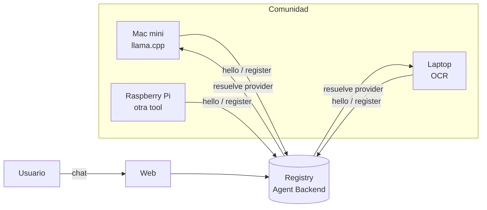
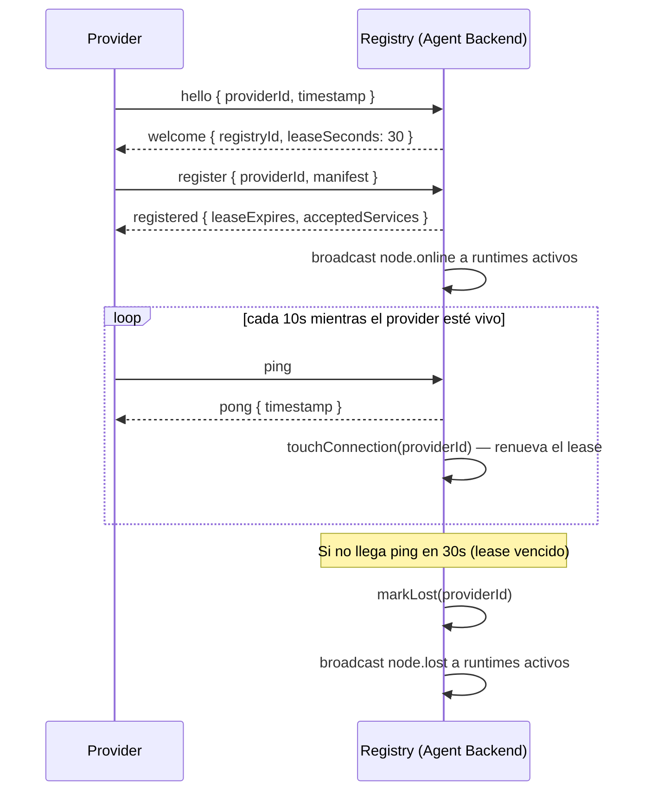
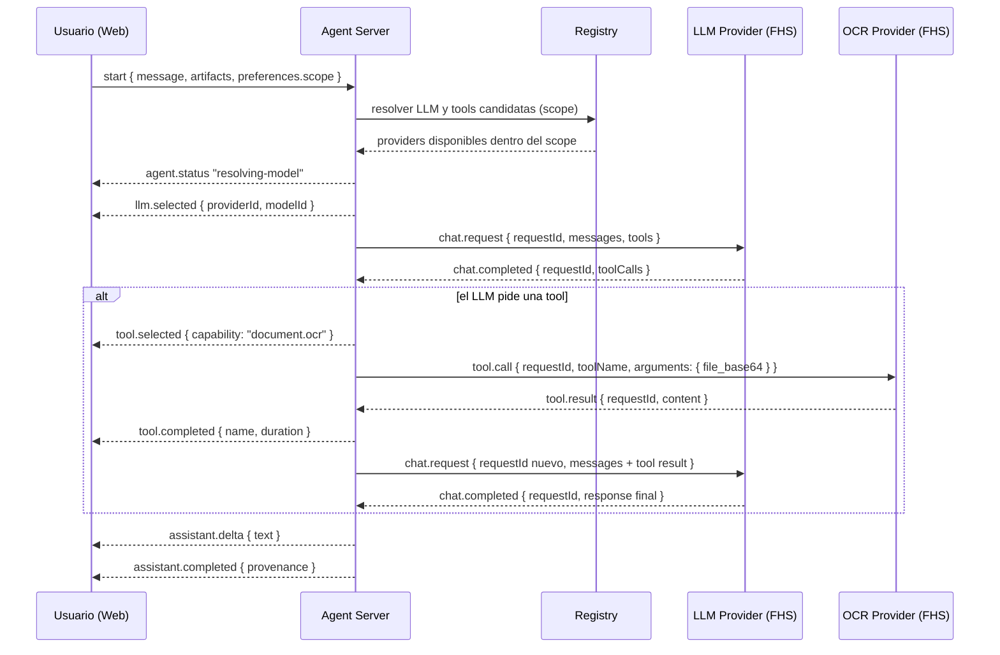
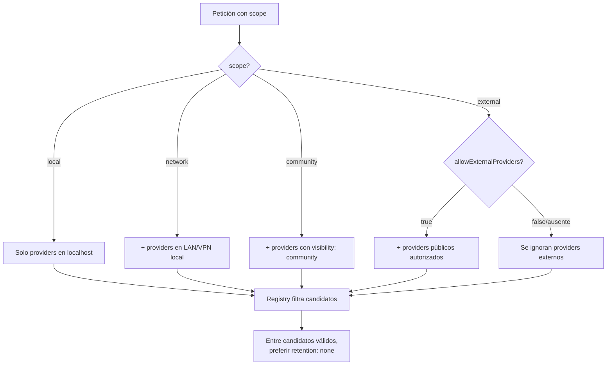

# Protocolo FHS v0.1

FHS significa **Federation of Sovereign Horizons** (Federación de Horizontes Soberanos). Es un protocolo para que computadoras locales se descubran entre sí y compartan recursos de inteligencia artificial.

## Idea central

Una comunidad tiene varias computadoras:

- Una Mac mini con llama.cpp corriendo un modelo local.
- Una laptop con un servidor OCR.
- Una Raspberry Pi con otra herramienta.

Cada una de esas computadoras es un **nodo**. El protocolo FHS permite que esos nodos:

1. **Se registren** en un catálogo común.
2. **Anuncien** qué pueden hacer: generar texto, extraer texto de imágenes, etc.
3. **Sean descubiertos** por el chat.
4. **Sean usados** cuando el agente lo necesite.



## Las 10 reglas de FHS v0.1

### 1. Identidad verificable

Todo nodo se identifica con un identificador único:

```
did:key:macmini-raul
did:key:raspi-ocr-01
```

Para la prueba de concepto usamos nombres simples. En producción se usaría criptografía Ed25519 (ver `spec-native/DECISIONS.md` DEC-0004).

### 2. Registro por arrendamiento (lease)

Un nodo no se registra una sola vez y se va. Debe renovar su registro periódicamente. Si no renueva en 30 segundos, el sistema lo marca como "perdido".

### 3. Heartbeat obligatorio

Mientras está vivo, el nodo envía un `ping` cada 10 segundos. El provider es responsable de emitirlo incluso si está ocupado procesando otra petición — ver el requisito de dispatcher concurrente en [`protocolo-provider.md`](./protocolo-provider.md).

### 4. Servicios declarados

Un nodo dice explícitamente qué ofrece. El sistema no escanea puertos ni fuerza descubrimiento.

### 5. Capacidades, no implementaciones

No se pide "¿tienes Tesseract?". Se pide "¿tienes `document.ocr`?". Así se puede cambiar la implementación sin afectar al consumidor.

### 6. Resolución por ámbito (scope)

Cada petición lleva un ámbito de privacidad:

- `local` — solo mi máquina
- `network` — solo mi red local
- `community` — mi comunidad de confianza
- `external` — cualquier proveedor autorizado

Detalle completo en la sección [Privacidad](#privacidad).

### 7. Transparencia obligatoria

Cada respuesta del agente incluye su procedencia: qué modelo razonó, qué tool usó, qué datos viajaron y dónde. Detalle en [Privacidad y trazabilidad](#privacidad).

### 8. Proveedor rechazable

El usuario puede vetar un proveedor específico. El sistema busca alternativas automáticamente.

### 9. Degradación graceful

Si no hay lo óptimo, se usa lo siguiente. Si no hay nada, se informa. Nunca se inventa una respuesta.

### 10. Registry observable, no controlador

El Registry solo sabe qué nodos existen y qué ofrecen. No ejecuta tools, no ve datos del usuario, no toma decisiones por el agente.

## Tipos de proveedores

En v0.1 hay dos tipos:

- **`llm`** — modelos de lenguaje compatibles con OpenAI API.
- **`mcp`** — servidores MCP con tools.

En el futuro se planean `embedding`, `storage`, `resource` y `agent`.

Todo provider, sin importar el tipo, debe seguir el mismo contrato de ciclo de vida. Ver [`protocolo-provider.md`](./protocolo-provider.md) — es lo que hace posible que un provider nuevo sea **plug and play**: el Registry y el Agent Runtime no necesitan código especial por proveedor, solo por tipo (`llm`/`mcp`).

## Ciclo de vida de un nodo (registro + heartbeat)



### Pulse de transporte (DEC-0010) — complementa, no reemplaza, el heartbeat de arriba

Además del heartbeat de aplicación (`ping`/`pong` JSON de arriba), el Registry envía un ping/pong **nativo de WebSocket** (RFC 6455, no un mensaje FHS) hacia cada nodo conectado, cada `HEARTBEAT_INTERVAL_SECONDS`. Si un nodo no responde durante `MISSED_PONG_THRESHOLD` ciclos seguidos (3, no 1 — para no quedar más estricto que el propio lease de 30s que complementa), el Registry cierra la conexión — más rápido que esperar el lease completo de aplicación, y sin agregar ningún mensaje ni tipo nuevo al protocolo.

Esto solo detecta **si el socket sigue vivo** (proceso caído, red partida) — no dice nada sobre si el nodo está atendiendo correctamente una Mission en curso, ni distingue "atorado" de "ocupado pero progresando": si el event loop del nodo está genuinamente bloqueado, tampoco va a responder al ping nativo, así que en el peor caso converge al mismo síntoma que se buscaba evitar (aunque se detecta más rápido que antes). Resolver eso es responsabilidad exclusiva del propio nodo — el dispatcher concurrente ("mosquito", DEC-0009/`satelite-rating`) que cada nodo debe implementar garantiza que **en algún momento** se responderá una petición en curso sin bloquear el resto, pero no garantiza **cuándo** — el protocolo no ofrece ni ofrecerá una señal de "progreso" intermedia por diseño, para no aumentar la complejidad del Registry (DEC-0005).

### Timeout configurable del lado del cliente (DEC-0010)

Quien inicia una Mission o una conversación con una Star puede indicar `preferences.maxWaitMs` — cuánto tiempo está dispuesto a esperar antes de abandonar, en vez del default fijo del stack (~300s, pensado para hardware comunitario lento). Es un límite de paciencia del cliente, no una señal de salud del nodo: si se cumple, el Agent Server simplemente deja de esperar esa respuesta y libera la conversación, sin importar si el nodo sigue procesando o no — el nodo no se entera de que el cliente abandonó (no hay mensaje de cancelación en el protocolo), así que puede seguir gastando recursos en una petición ya abandonada.

**Recomendación para quien implemente UI sobre este campo:** el rango razonable de `maxWaitMs` es alto (varios minutos), no segundos — el hardware comunitario que federa esta red (equipos reutilizados, sin GPU dedicada) puede tardar minutos en una sola inferencia u OCR. Un timeout bajo (ej. 10-30s) no es una opción realista de "impaciencia legítima", es indistinguible de cancelar la petición casi siempre — cualquier control de UI para este campo debería partir de un piso cercano al default (~300s) hacia arriba, no hacia abajo.

### Mensajes de registro

**Registro de nodo**

```json
{
  "type": "hello",
  "providerId": "did:key:macmini-raul",
  "timestamp": 1719700000
}
```

Respuesta:

```json
{
  "type": "welcome",
  "registryId": "registry-001",
  "leaseSeconds": 30
}
```

**Publicar servicios**

```json
{
  "type": "register",
  "providerId": "did:key:macmini-raul",
  "manifest": { /* ver manifiesto-llm.md o manifiesto-mcp.md */ },
  "timestamp": 1719700000
}
```

Respuesta:

```json
{
  "type": "registered",
  "leaseExpires": 1719700030,
  "acceptedServices": 2
}
```

**Heartbeat**

```json
{ "type": "ping" }
```

Respuesta:

```json
{ "type": "pong", "timestamp": 1719700005 }
```

**Notificaciones del Registry**

Cuando un nodo se conecta o se cae, el Registry notifica a los agentes:

```json
{
  "type": "node.online",
  "providerId": "did:key:raspi-ocr-01",
  "providerName": "OCR Raspberry Pi",
  "services": [
    { "kind": "mcp", "capabilities": ["document.ocr"] }
  ]
}
```

```json
{
  "type": "node.lost",
  "providerId": "did:key:raspi-ocr-01",
  "providerName": "OCR Raspberry Pi",
  "services": [
    { "kind": "mcp", "capabilities": ["document.ocr"] }
  ]
}
```

## Chat por WebSocket (frontend ↔ Agent Backend)

El frontend se conecta a:

```
ws://<host>:8081/api/chat/ws
```

Envía:

```json
{
  "type": "start",
  "conversationId": "opcional",
  "message": { "role": "user", "content": "Extrae el texto de esta imagen" },
  "artifacts": ["data:image/png;base64,..."],
  "preferences": {
    "model": "auto",
    "scope": "community"
  }
}
```

Recibe eventos en tiempo real:

```json
{ "type": "agent.status", "data": { "status": "resolving-model", "message": "Buscando modelo..." } }
{ "type": "llm.selected", "data": { "providerId": "...", "providerName": "...", "modelId": "...", "reason": [...] } }
{ "type": "tool.selected", "data": { "capability": "document.ocr", "providerId": "...", "providerName": "..." } }
{ "type": "assistant.delta", "data": { "text": "El texto extraído es..." } }
{ "type": "assistant.completed", "data": { "provenance": { ... } } }
```

## Flujo completo de un mensaje (chat + tool call)



### Mensajes entre Agent Server y Providers

**Chat (LLM)**

```
Agent Server → Provider:  chat.request   { requestId, request: GenerateRequest }
Provider → Agent Server:  dispatch.ack   { requestId, queuedAt }  (opcional, ver abajo)
Provider → Agent Server:  chat.delta     { requestId, delta: string }
Provider → Agent Server:  chat.completed { requestId, response: GenerateResponse }
Provider → Agent Server:  chat.error     { requestId, code, message }
```

**Tools (OCR, MCP)**

```
Agent Server → Provider:  tool.list         { requestId }
Provider → Agent Server:  tool.list.response  { requestId, tools: [...] }
Agent Server → Provider:  tool.call         { requestId, toolName, arguments }
Provider → Agent Server:  dispatch.ack      { requestId, queuedAt }  (opcional, ver abajo)
Provider → Agent Server:  tool.result       { requestId, toolName, content: [...] }
Provider → Agent Server:  tool.error        { requestId, toolName, code, message }
```

`requestId` es obligatorio y debe repetirse igual en la respuesta — es la base de la trazabilidad operacional (ver más abajo).

**`dispatch.ack` — el "mosquito" confirmando que ya tomó la petición**

```json
{ "type": "dispatch.ack", "requestId": "...", "queuedAt": 1719700000123 }
```

Un nodo lo envía inmediatamente al encolar un `chat.request`/`tool.call` en
su dispatcher interno ("mosquito"), **antes** de empezar el trabajo real —
distingue la latencia de despacho (tiempo hasta este ack) de la latencia
de procesamiento (tiempo hasta el resultado final). Es obligatorio para
todo nodo nuevo que implemente el contrato de
[`protocolo-provider.md`](./protocolo-provider.md), pero **opcional para
compatibilidad hacia atrás**: un nodo que no lo envía sigue funcionando
igual, solo sin latencia de despacho en las métricas de fiabilidad del
Registry (ver `spec-native/specs/satelite-rating/SPEC.md`). Si el nodo
rechaza la petición de inmediato, no envía este ack — va directo a
`chat.error`/`tool.error`.

## Resolución por ámbito (scope) — cómo decide el Registry



## Privacidad

FHS existe para que una comunidad tenga IA útil **sin ceder control de sus datos**. Cualquier implementación del protocolo — sin importar el lenguaje — debe respetar estas garantías. No son opcionales ni "buenas prácticas": son requisito para que un provider sea considerado FHS-compatible.

### Ámbito (`scope`) — quién puede ver la petición

El `scope` no es metadata decorativa: **condiciona qué proveedores puede resolver el Registry** para una petición dada.

| Scope | Significado | Efecto en la resolución |
|---|---|---|
| `local` | Solo el equipo del usuario | Solo se consideran proveedores corriendo en `localhost`/mismo host |
| `network` | Red local del usuario | Se agregan proveedores visibles en la LAN/VPN local |
| `community` | Comunidad de confianza declarada | Se agregan proveedores con `visibility: "community"` en su manifiesto |
| `external` | Cualquier proveedor autorizado | Se agregan proveedores públicos, solo si el usuario lo habilita explícitamente (`allowExternalProviders: true`) |

Una petición con `scope: "local"` **nunca** debe resolver a un proveedor `external`, sin importar si ese proveedor es "mejor" (más rápido, más capaz). El scope es un techo, no una preferencia.

### Retención (`privacy.retention` en el manifiesto)

Todo proveedor declara qué hace con los datos que recibe:

- `"none"` — no persiste nada, procesa y descarta.
- `"session"` — conserva mientras dura la conversación, luego borra.
- Cualquier otro valor debe documentarse explícitamente en el manifiesto del proveedor (no asumir significado implícito).

El agente **debe preferir proveedores con `retention: "none"`** cuando hay más de un candidato para la misma capacidad, salvo que el usuario indique lo contrario.

### Uso para entrenamiento (`privacy.trainingUse`)

Booleano obligatorio en el manifiesto de todo proveedor `llm`. Si `trainingUse: true`, el Registry debe exponerlo de forma visible al usuario antes de resolver ese proveedor — nunca en silencio.

### Procedencia (`provenance`) — trazabilidad orientada al usuario

Cada respuesta del agente (`assistant.completed`) incluye:

```json
{
  "llm": { "providerId": "...", "providerName": "...", "model": "..." },
  "tools": [{ "capability": "document.ocr", "providerId": "...", "providerName": "..." }],
  "dataExported": "Datos enviados a tools federadas",
  "jurisdiction": "red local comunitaria"
}
```

Esto no es telemetría opcional: es la forma en que el usuario puede auditar, después de cada respuesta, exactamente qué modelo razonó, qué herramienta se ejecutó y a dónde viajaron sus datos. Cualquier SDK o implementación del protocolo, en cualquier lenguaje, debe propagar este objeto sin omitir campos.

### Trazabilidad operacional — privacidad no significa "sin rastro"

**"No retener contenido" y "no poder diagnosticar errores" no son la misma cosa.** Privacidad restringe qué se guarda; trazabilidad exige que lo que sí se guarda alcance para resolver un incidente ("mi OCR falló ayer a las 15:03", "el chat respondió con datos de otro proveedor").

Regla: **todo mensaje FHS con `requestId` debe poder correlacionarse extremo a extremo — como metadata, nunca como contenido.**

Se distinguen dos capas:

| Capa | Qué incluye | Se retiene según `privacy.retention` |
|---|---|---|
| **Contenido** | Texto del mensaje, imagen/PDF adjunto, respuesta del modelo | Sí — sujeto a la política declarada por cada provider |
| **Metadata de trazabilidad** | `conversationId`, `requestId`, `providerId`, `capability`/`modelId`, `timestamp`, `duration`, `success`/`error.code` | Siempre — no es negociable, no es "dato del usuario" |

Un provider FHS-compatible debe loggear la capa de metadata (mínimo: `requestId`, resultado, duración) en cada `chat.request`/`tool.call` que procesa, **sin loggear el contenido** salvo que su `retention` declarada lo permita explícitamente. Esto permite reconstruir la cadena `conversationId → requestId → providerId → resultado` para depurar un fallo, sin violar la promesa de privacidad.

Ver [`spec-native/DECISIONS.md`](../spec-native/DECISIONS.md) DEC-0012 para el estado de esta garantía en la implementación actual (hoy es un gap: el `requestId` se genera pero no se loggea ni se correlaciona con `conversationId`).

### Checklist de privacidad y trazabilidad para implementar un provider FHS

Antes de considerar un provider "listo", verifica que:

- [ ] Declara `privacy.retention` en su manifiesto (nunca lo omite).
- [ ] Si es tipo `llm`, declara `privacy.trainingUse`.
- [ ] Respeta el `scope` recibido en cada petición — nunca procesa datos fuera del ámbito autorizado.
- [ ] No registra ni loggea el **contenido** de las peticiones más allá de lo declarado en `retention`.
- [ ] Sí registra la **metadata de trazabilidad** (`requestId`, éxito/error, duración) de cada petición procesada, para poder diagnosticar fallos sin exponer contenido.
- [ ] Responde con suficiente información para que el agente construya `provenance` correctamente.

## Implementaciones en otros lenguajes

FHS es JSON sobre WebSocket — no depende de TypeScript ni de Node.js. Cualquier lenguaje con soporte de WebSocket y JSON puede implementar un provider o un cliente FHS. Ver [`implementacion-multilenguaje.md`](./implementacion-multilenguaje.md) para la guía de soporte en **Python, Rust, Java y TypeScript/JavaScript** (los primeros lenguajes soportados oficialmente) y [`protocolo-provider.md`](./protocolo-provider.md) para el contrato exacto que cualquier provider, en cualquier lenguaje, debe cumplir para ser plug-and-play.
