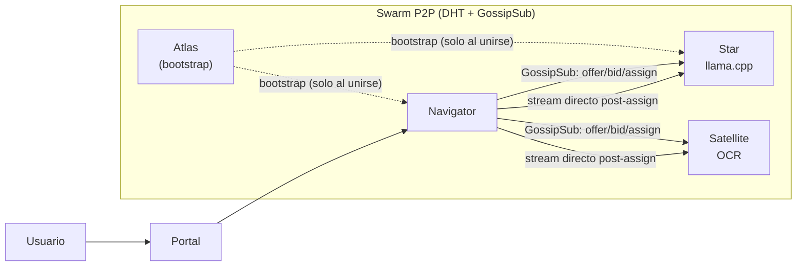
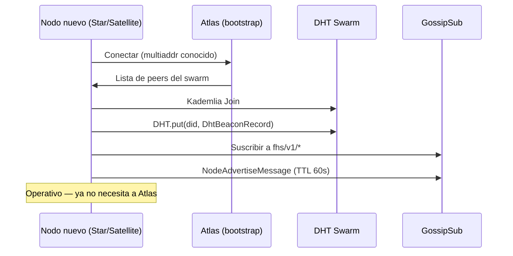
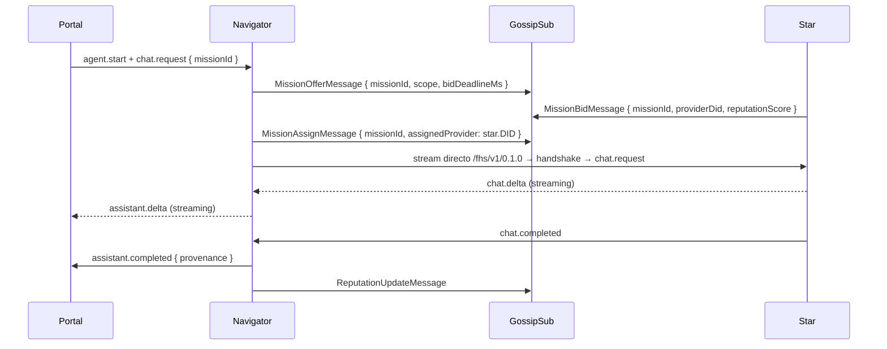

# Protocolo FHS — Red P2P Descentralizada

FHS significa **Federation of Sovereign Horizons** (Federación de Horizontes Soberanos). Es el protocolo que hace posible que computadoras de una comunidad se descubran y compartan recursos de inteligencia artificial **sin ningún servidor central obligatorio**.

## Idea central

Una comunidad tiene varias computadoras:
- Una Mac mini con llama.cpp corriendo un modelo local — un **Star**.
- Una laptop con un servidor OCR — un **Satellite**.
- Una Raspberry Pi con otra herramienta — otro **Satellite**.

Cada una es un **nodo**. El protocolo FHS permite que esos nodos:
1. **Se anuncien** en una red P2P distribuida.
2. **Sean descubiertos** sin depender de un catálogo central.
3. **Reciban Missions** directamente de Navigator mediante GossipSub.
4. **Las ejecuten** por stream directo punto-a-punto.


```mermaid
flowchart LR
    subgraph "Swarm P2P (DHT + GossipSub)"
        AT["Atlas\n(bootstrap)"]
        S1["Star\nllama.cpp"]
        S2["Satellite\nOCR"]
        NAV["Navigator"]
    end
    U["Usuario"] --> PORT["Portal"]
    PORT --> NAV
    NAV -->|"GossipSub: offer/bid/assign"| S1
    NAV -->|"stream directo post-assign"| S1
    NAV -->|"GossipSub: offer/bid/assign"| S2
    NAV -->|"stream directo post-assign"| S2
    AT -.->|"bootstrap (solo al unirse)"| S1
    AT -.->|"bootstrap (solo al unirse)"| NAV
```

No hay un Registry central que todos deban consultar. Atlas es solo el punto de entrada inicial — una vez en el swarm, los nodos operan entre sí sin intermediarios.

---

## Las 10 reglas del protocolo FHS

### 1. Identidad verificable

Todo nodo se identifica con un `did:key` (método W3C, Ed25519) — el identificador **es** la clave pública del nodo:

```
did:key:z6MkiqnzSFKAqXxjRUNnEku2wD3Gzas28sqByzQYaqEjkZhF
```

Cada Envelope y cada mensaje GossipSub van firmados con la clave privada correspondiente. Cualquier receptor verifica la firma sin PKI externa — la clave pública está embebida en el DID.

### 2. Presencia por TTL, no por lease con servidor central

Un nodo activo publica `NodeAdvertiseMessage` en GossipSub cada 30 segundos con `ttlSeconds = 60`. Si deja de publicar, los demás lo marcan offline cuando el TTL expira. No hay servidor que "marque" a un nodo como perdido — el silencio es la señal.

### 3. Pulse en streams directos

Cuando dos nodos tienen un stream directo activo (durante una Mission), mantienen un Pulse (`ping`/`pong`) cada 10 segundos. Si el Pulse se interrumpe antes de `leaseSeconds`, cada nodo cierra el stream localmente.

### 4. Capacidades declaradas en el Beacon

Un nodo dice explícitamente qué ofrece en su Beacon: modelos LLM, capabilities de tools, etc. Ningún nodo escanea puertos ni fuerza descubrimiento. Lo que no está en el Beacon no existe para la red.

### 5. Capacidades, no implementaciones

Navigator pide `document.ocr`, no "¿tienes Tesseract?". La implementación detrás de una capability es privada al nodo. El protocolo solo dicta cómo se anuncia y cómo se invoca.

### 6. Dispatch descentralizado por GossipSub

Navigator no consulta a ningún Registry para encontrar un provider. Publica un `MissionOfferMessage` en GossipSub, recibe `MissionBidMessage` de los nodos disponibles, y asigna al mejor según `trustLevel → reputationScore → estimatedLatencyMs`.

### 7. Resolución por scope

El campo `scope` en el `MissionOfferMessage` acota qué providers pueden hacer bid: `local` / `network` / `community` / `external`. Ningún provider fuera del scope declarado puede responder — no es solo una preferencia, es un filtro del protocolo.

### 8. Transparencia obligatoria

Cada `AssistantCompletedMessage` incluye `ProvenanceInfo`: qué modelo razonó, qué Satellite se usó, si los datos salieron de la comunidad. El usuario puede auditar cada respuesta.

### 9. Proveedor rechazable

Navigator puede reemplazar un provider mid-Mission si falla o el usuario lo veta. GossipSub permite publicar una nueva oferta para el mismo `missionId` y asignar a otro candidato sin interrumpir el flujo.

### 10. Reputación distribuida

Navigator publica `ReputationUpdateMessage` en GossipSub y actualiza `DhtReputationRecord` en la DHT después de cada Mission. No hay servidor central de rating — la reputación es agregada y verificable por cualquier nodo.

---

## Ciclo de vida de un nodo


```mermaid
sequenceDiagram
    participant N as Nodo nuevo (Star/Satellite)
    participant A as Atlas (bootstrap)
    participant D as DHT Swarm
    participant G as GossipSub

    N->>A: Conectar (multiaddr conocido)
    A->>N: Lista de peers del swarm

    N->>D: Kademlia Join
    N->>D: DHT.put(did, DhtBeaconRecord)

    N->>G: Suscribir a fhs/v1/*
    N->>G: NodeAdvertiseMessage (TTL 60s)

    Note over N: Operativo — ya no necesita a Atlas
```

---

## Flujo de una Mission de chat


```mermaid
sequenceDiagram
    participant Po as Portal
    participant NAV as Navigator
    participant G as GossipSub
    participant S as Star

    Po->>NAV: agent.start + chat.request { missionId }
    NAV->>G: MissionOfferMessage { missionId, scope, bidDeadlineMs }
    S->>G: MissionBidMessage { missionId, providerDid, reputationScore }
    NAV->>G: MissionAssignMessage { missionId, assignedProvider: star.DID }
    NAV->>S: stream directo /fhs/v1/0.1.0 → handshake → chat.request
    S-->>NAV: chat.delta (streaming)
    NAV-->>Po: assistant.delta (streaming)
    S->>NAV: chat.completed
    NAV->>Po: assistant.completed { provenance }
    NAV->>G: ReputationUpdateMessage
```

---

## Privacidad

En el flujo Portal ↔ Navigator, los adjuntos viajan como `ArtifactRef` dentro
de `ChatRequestMessage`. El texto OCR se anuncia con `ocr.extracted` y se
conserva como `DocumentContext` estructurado para preguntas posteriores. Las
recomendaciones de KB y su decisión son payloads Protobuf del mismo stream
libp2p; no abren endpoints HTTP, WebSocket ni SSE adicionales.

- **`scope`** en el `MissionOfferMessage` acota qué providers pueden responder — es un filtro de protocolo, no una preferencia.
- **`privacy.retention`** en el Beacon declara qué hace el nodo con los datos recibidos (`"none"` / `"session"` / etc.).
- **`ProvenanceInfo`** en cada `AssistantCompletedMessage`: qué modelo razonó, qué Satellite se usó, si los datos salieron de la comunidad — auditable por el usuario.
- **Trazabilidad ≠ retención de contenido**: cada `missionId` puede seguirse de extremo a extremo como metadata sin guardar el contenido de la conversación.

---

## Planos de comunicación

| Plano | Para qué | Protocolo |
|-------|----------|-----------|
| P2P (DHT + GossipSub) | Descubrimiento, presencia, dispatch de Missions, reputación | libp2p Kademlia + GossipSub |
| Stream directo | Ejecución de Missions (chat.request, tool.call) | libp2p `/fhs/v1/0.1.0` + Protobuf |

---

## Referencias

- [`idl/fhs-protocol.proto`](../idl/fhs-protocol.proto) — definición completa de todos los mensajes
- [`idl/gossipsub.md`](../idl/gossipsub.md) — especificación de tópicos GossipSub
- [`docs/p2p.md`](./p2p.md) — modelo de red P2P completo
- [`docs/trust.md`](./trust.md) — confianza y reputación
- [`docs/protocolo-provider.md`](./protocolo-provider.md) — contrato que todo provider debe cumplir
