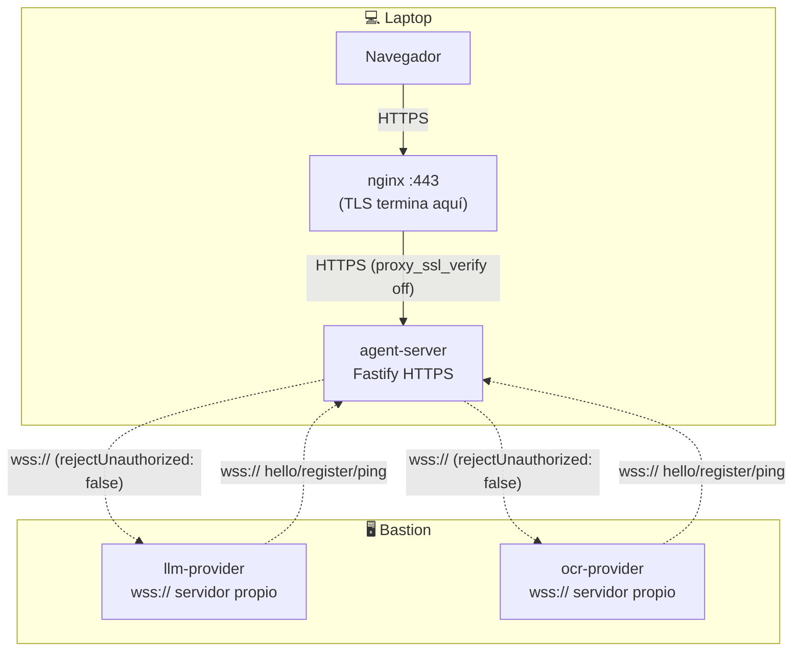

# TLS con certificado autofirmado

Último ajuste de esta PoC: cifrar todo el tráfico del protocolo FHS con HTTPS/WSS, usando un certificado autofirmado — no hay CA de confianza involucrada, es exclusivamente para que el tráfico no viaje en texto plano por la LAN entre laptop y bastion (ver `docs/despliegue-multi-host.md`).

**No usar en producción.** Un certificado autofirmado no prueba identidad ante terceros — solo cifra el canal. Para producción real, usar una CA propia de la comunidad o certificados de una CA pública.

## Qué se cifra



Todo el tráfico FHS (Registry, chat, tools) queda cifrado. Lo que **no** se cifra a propósito (tráfico interno del mismo host, no cruza la LAN): `llm-provider → llama-server` y `ocr-provider → ether-ocr-api` (ambos vía `curl` local dentro del bastion).

## Generar el certificado

Un solo par clave/certificado, compartido entre todos los servicios (self-signed, sin jerarquía de CA):

```bash
just tls-gen-cert <ip-laptop> <ip-bastion>
# ejemplo real de esta PoC:
just tls-gen-cert 192.168.3.137 192.168.3.173
```

Esto genera `certs/dev.crt` y `certs/dev.key` en la raíz del repo (gitignored — nunca se versiona la clave privada). El certificado incluye `subjectAltName` para `localhost`, `127.0.0.1`, y ambas IPs — necesario porque cada servicio lo usa con un hostname distinto según desde dónde se conecte.

**Copiar el mismo par a ambas máquinas** (laptop y bastion) — no regenerar por separado, o cada máquina tendría una clave distinta y las conexiones cruzadas fallarían la verificación (aunque esté en modo `rejectUnauthorized: false`, cada servidor sirve su propio cert, así que deben coincidir para que tenga sentido el flujo, aunque técnicamente `rejectUnauthorized:false` acepta cualquier cert igual — se documenta la práctica correcta, no el mínimo que "funciona").

```bash
scp certs/dev.crt certs/dev.key laptop:~/repositorys/github/galaxIA/certs/
scp certs/dev.crt certs/dev.key bastion:~/ruta/al/repo/certs/
```

## Activar TLS

El overlay `containers/compose.tls.yaml` se suma al `compose.yaml` normal — no lo reemplaza ni lo modifica. Nada del despliegue sin TLS se rompe si no se usa este overlay.

### En la laptop (core)

```bash
just container-up-core-tls
```

### En el bastion (providers)

```bash
export PROVIDER_REGISTRY_URL="wss://<ip-laptop>:30083/fhs/v1/ws"
export LLM_PROVIDER_HOST="<ip-bastion>"
export OCR_PROVIDER_HOST="<ip-bastion>"

just container-up-llm-tls
just container-up-ocr-tls
```

Nota el esquema `wss://` en `PROVIDER_REGISTRY_URL` — a diferencia del despliegue sin TLS, aquí hay que declararlo explícitamente (el default de `compose.yaml` sigue siendo `ws://` para no romper el caso sin TLS).

## Verificar

```bash
# Health por HTTPS (con -k porque el cert es autofirmado)
curl -k https://<ip-laptop>:30083/health

# Providers registrados — los endpoints deben mostrar wss://, no ws://
curl -k https://<ip-laptop>:30083/api/fhs/providers
```

Abrir el chat en `https://<ip-laptop>:443` — el navegador mostrará la advertencia normal de certificado no confiable (esperado, es autofirmado); aceptar y continuar.

## Cómo funciona en el código

- **`apps/agent-server`**: `TLS_CERT_PATH`/`TLS_KEY_PATH` (env) activan `https` en la configuración de Fastify — cubre `/fhs/v1/ws` (Registry) y `/api/chat/ws` (chat) con el mismo servidor, sin cambios en el código de esas rutas.
- **`examples/llm-provider`, `examples/ocr-provider`**: mismas variables activan un `https.createServer` interno para su propio servidor de chat/tools, y cambian el esquema anunciado en el manifiesto (`wss://` en vez de `ws://`). El cliente que se conecta al Registry también usa `wss://` cuando `REGISTRY_URL` lo especifica.
- **Clientes WebSocket** (`llm-gateway.ts`, `mcp-host.ts`, y los clientes de Registry en ambos providers): pasan `{ rejectUnauthorized: false }` cuando la URL empieza con `wss://` — sin esto, Node rechazaría el certificado autofirmado por no tener una CA reconocida.
- **`apps/web` (nginx)**: `containers/web/nginx-tls.conf` termina TLS para el navegador y reenvía a `agent-server` por `https://` con `proxy_ssl_verify off` (mismo motivo: cert autofirmado).
- **Frontend (`apps/web/src/services/api.ts`)**: ya elegía `wss://` automáticamente cuando `location.protocol === "https:"` — no necesitó ningún cambio.

## Riesgos y alcance deliberadamente limitado

| Riesgo | Mitigación |
|---|---|
| `rejectUnauthorized: false` acepta *cualquier* certificado, no solo el nuestro — vulnerable a MITM si un atacante ya está en la LAN | Aceptable para una PoC en LAN de confianza; para producción, verificar contra una CA propia (fijar el certificado esperado, no desactivar la verificación) |
| La clave privada vive en texto plano en `certs/dev.key` en cada máquina | Gitignored, permisos `600` al generarla; no es peor que cualquier clave de servidor de desarrollo, pero no rotar ni reusar fuera de esta PoC |
| Un solo certificado compartido entre todos los servicios, sin identidad individual por nodo | Suficiente para cifrar el canal; no reemplaza la identidad verificable del protocolo (DID, `did:key:...`) que ya cubre "quién es quién" a nivel de aplicación |

## Enlaces relacionados

- `docs/despliegue-multi-host.md` — la topología que este documento cifra.
- `spec-native/DECISIONS.md` DEC-0023 — decisión y verificación de esta funcionalidad.
