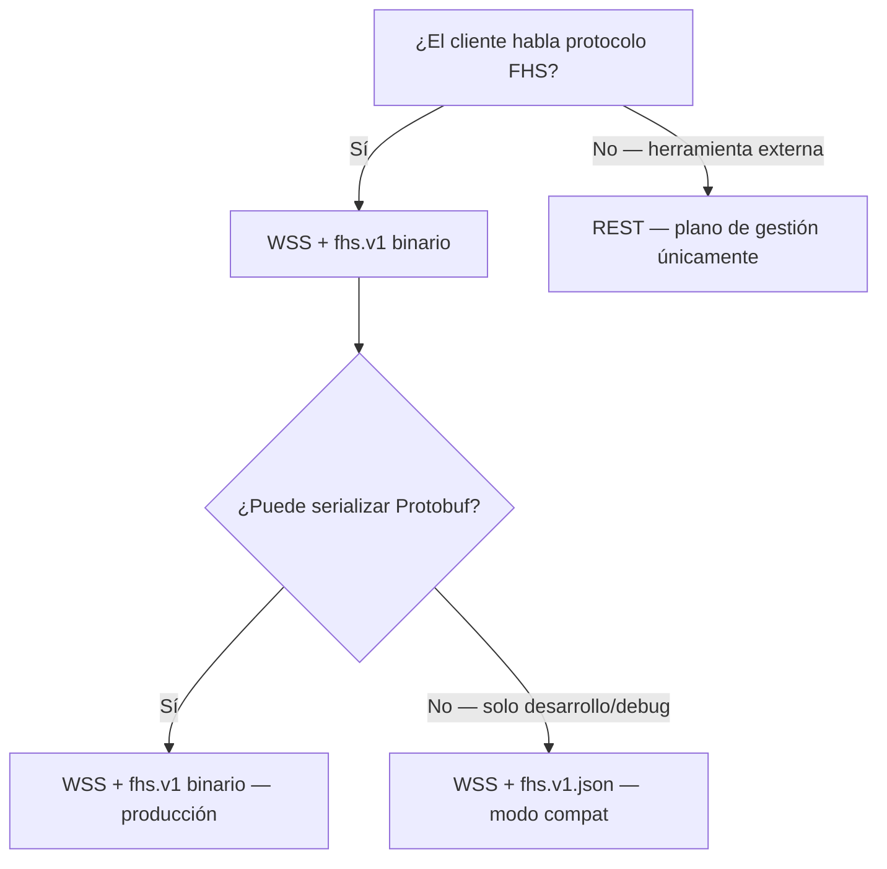

# Transporte — WSS + Protobuf (obligatorio)

## Principio

> **WSS (WebSocket Secure, TLS obligatorio) + Protobuf binario es el único transporte
> permitido en el protocolo FHS.**
> `ws://` sin cifrado **no es válido** y Atlas rechaza el handshake de cualquier nodo
> que lo declare en su Beacon con el error `INVALID_MANIFEST`.

La coherencia del sistema lo exige: si el Portal (chat web) sirve por HTTPS y el usuario
espera privacidad en sus conversaciones, la capa de red entre nodos debe cifrar igualmente.
No tendría sentido proteger el último tramo (browser↔servidor) y dejar sin cifrar la
comunicación inter-nodo donde viajan los mismos datos.

## Capa de Transporte

```
WSS (WebSocket Secure — TLS sobre TCP)
  └── Subprotocol: Sec-WebSocket-Protocol: fhs.v1
        └── Frames binarios
              └── LPP framing: [varint: longitud][Envelope bytes]
                    └── Envelope (Protobuf 3) → payload oneof
```

- **Conexión**: `wss://` siempre. Sin excepciones.
- **TLS**: mínimo TLS 1.2; recomendado TLS 1.3.
- **Certificados**: Let's Encrypt para producción; autofirmados aceptados con validación explícita en clientes.
- **Encoding**: Protocol Buffers 3 (binario), serialización determinista para firmas.
- **Framing**: Length-Prefixed Protobuf (LPP) — ver `idl/framing.md`.
- **Autenticación**: firma Ed25519 en cada Envelope. TLS cifra el canal; Ed25519 autentica el emisor. Ambas capas son complementarias, no alternativas.

## Negociación de Subprotocolo

```
GET /register HTTP/1.1
Host: atlas.ejemplo.com
Upgrade: websocket
Sec-WebSocket-Protocol: fhs.v1, fhs.v1.json
```

| Subprotocol | Frames | Uso |
| ----------- | ------ | --- |
| `fhs.v1` | Binario (Protobuf + LPP) | **Primario — producción, P2P** |
| `fhs.v1.json` | Texto (JSON) | Depuración y herramientas de desarrollo únicamente |

`fhs.v1.json` existe para facilitar el desarrollo con herramientas como `wscat` o Postman.
No es un modo de producción — ambos modos requieren WSS de igual forma.

## Multiaddr P2P

Para conexiones directas nodo-a-nodo (libp2p, DEC-0086), el multiaddr usa TLS:

```
/ip4/1.2.3.4/tcp/8443/tls/ws
```

**No** se usa `/ip4/1.2.3.4/tcp/8081/ws` (sin `/tls/`). Atlas rechaza `listen_addrs`
que no incluyan `/tls/` o `/wss`.

## Aplicación en el Beacon

El campo `endpoint.url` del Beacon (`schemas/beacon-base.schema.json`) tiene la restricción:

```json
"url": {
  "type": "string",
  "format": "uri",
  "pattern": "^wss://",
  "description": "WebSocket Secure URL del nodo. Obligatoriamente wss://."
}
```

Atlas evalúa el Beacon contra el schema en el momento del handshake. Un `endpoint.url`
que empiece por `ws://` (sin `s`) produce `INVALID_MANIFEST` y el handshake es rechazado.

## Cuándo NO usar WebSocket

WebSocket (WSS o no) no es para todo:

| Caso | Alternativa |
| ---- | ----------- |
| Herramientas de monitoreo externas (Prometheus, dashboards) | REST — plano de gestión (`idl/openapi.yaml`) |
| Integraciones con sistemas sin soporte WebSocket | REST — plano de gestión |
| Descarga del bundle WASM por Ephemeral Satellites | HTTPS estático (distribución, no protocolo FHS) |

**REST es solo plano de gestión**, no protocolo FHS. Cualquier comunicación que sea
parte del protocolo (registro, Missions, heartbeat, feedback) va por WSS+Proto.

## Diagrama de Transporte



## Configuración de TLS

Para infraestructura propia, ver `docs/tls-autofirmado.md`.

Variables de entorno relevantes (todos los nodos):

```bash
TLS_CERT_PATH=/etc/fhs/tls/cert.pem   # Certificado TLS del servidor
TLS_KEY_PATH=/etc/fhs/tls/key.pem     # Clave privada TLS (≠ clave FHS Ed25519)
ATLAS_URL=wss://atlas.ejemplo.com:8443/fhs/v1/ws  # Siempre wss://
```
