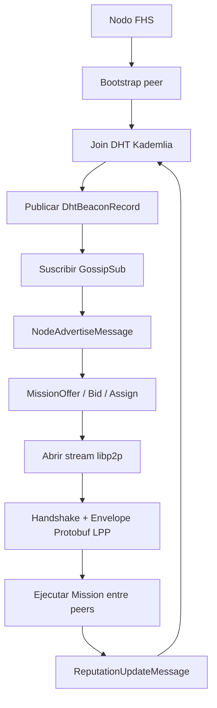

# Transporte FHS: libp2p-only

## Regla normativa

**libp2p es el único transporte del protocolo FHS.** Todo mensaje y todo
payload de una Mission viaja por una capacidad libp2p:

| Necesidad | Camino FHS |
|---|---|
| Descubrimiento de nodos y Beacons | DHT Kademlia |
| Presencia, ofertas, bids y reputación | GossipSub |
| Handshake, chat y tools | Stream `/fhs/v1/0.1.0` |

No existen endpoints web, adaptadores de borde ni rutas de compatibilidad. Un
cliente que no pueda abrir libp2p no es un cliente FHS conforme.

Atlas es únicamente un bootstrap peer. No registra nodos, no despacha Missions
y no recibe el contenido de una conversación.

## Dependencias externas y adjuntos IPFS

La regla libp2p-only aplica al protocolo FHS y a la comunicación entre sus
peers. Una dependencia externa puede imponer otro protocolo que galaxIA no
controla:

- Un gateway HTTP/HTTPS de IPFS externo puede usarse para **leer** un CID cuando
  ese servicio no ofrece acceso libp2p. Es una adaptación en la frontera del
  servicio externo, no un transporte FHS y no lleva Envelopes ni mensajes de
  Mission.
- Si el nodo IPFS pertenece a la red galaxIA, se debe usar el acceso
  IPFS/libp2p nativo. El gateway web no es el camino interno de la red.
- El gateway externo debe ser explícito, limitado a lectura y validado contra
  el CID. Nunca se anuncia en `Beacon.endpoint.multiaddr` ni se usa para
  descubrimiento, dispatch, heartbeat, chat o tool calls.

La misma frontera aplica a adaptadores locales de servicios LLM/OCR externos:
su HTTP/HTTPS no forma parte del protocolo FHS.

## Stream directo

El stream se negocia con el protocolo libp2p:

```text
/fhs/v1/0.1.0
```

Cada frame contiene exactamente un Envelope Protobuf firmado. Beacon, schemas
de tools, argumentos, resultados y records también son mensajes Protobuf; no
se encapsula JSON dentro de ningún campo.

```text
[varint: longitud][Envelope Protobuf bytes]
```

La identidad del peer se deriva de Ed25519 (`did:key:z...` y PeerId libp2p).
Cada Envelope, mensaje GossipSub y record DHT lleva la firma Ed25519 del
emisor.

## Capas de la red

### DHT Kademlia

La DHT publica y resuelve `DhtBeaconRecord` bajo el DID del nodo y
`DhtReputationRecord` bajo `reputation/{did}`. El record contiene las
multiaddrs libp2p del peer y está firmado por quien lo publica.

### GossipSub

Los tópicos normativos son:

- `fhs/v1/nodes/advertise`
- `fhs/v1/missions/offer`
- `fhs/v1/missions/bid`
- `fhs/v1/missions/assign`
- `fhs/v1/reputation/update`

Los mensajes de estos tópicos son Protobuf firmado. No son Envelopes de stream.

### Stream de ejecución

Después de descubrir y asignar un provider, el Navigator abre el stream
`/fhs/v1/0.1.0` directamente con su multiaddr. El stream transporta el
handshake, Pulse y los mensajes de la Mission.

## Beacon y direccionamiento

`endpoint.multiaddr` es obligatoria y es la única autoridad de conexión. No se
anuncia una URL alternativa. La multiaddr debe identificar el PeerId correcto y
permitir que libp2p establezca el transporte y la seguridad negociados por la
red.

## Flujo normativo



## Seguridad

libp2p negocia el canal seguro y el multiplexado. FHS añade identidad y
autenticidad de mensaje mediante Ed25519 en el Envelope, GossipSub y DHT. Un
peer debe verificar PeerId, DID, firma, timestamp, versión y destinatario antes
de procesar un payload.

Consulta [idl/framing.md](../idl/framing.md),
[idl/fhs-protocol.proto](../idl/fhs-protocol.proto) y
[docs/p2p.md](p2p.md) para los detalles de wire y descubrimiento.
