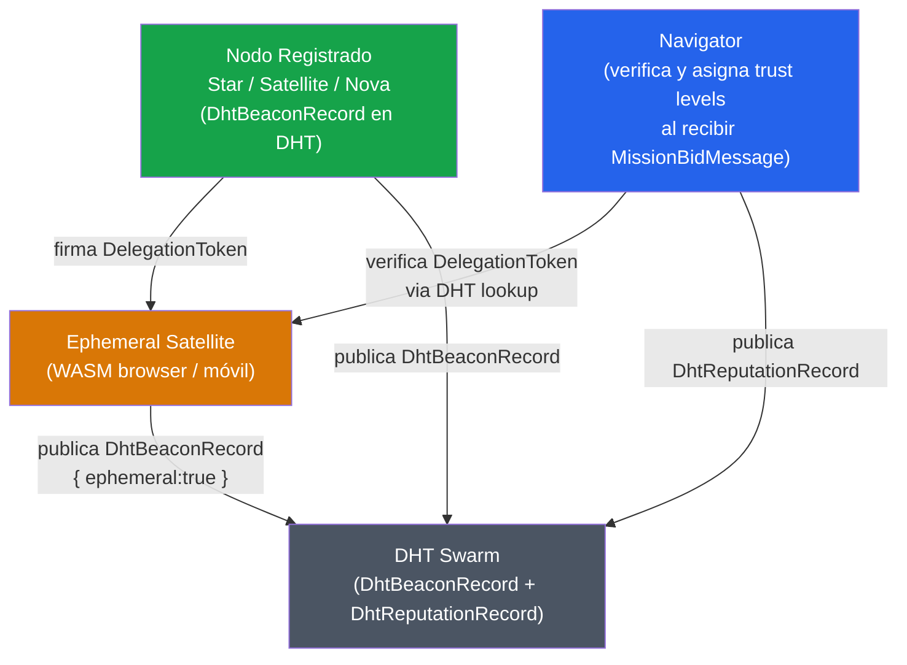
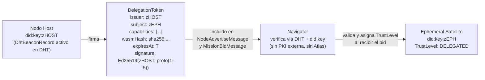

# Confianza — Niveles, Delegación y Reputación

## Modelo de Confianza de FHS

La confianza en FHS se basa en dos pilares:

1. **Identidad verificable** — `did:key:z...` + firma Ed25519 en cada Envelope y mensaje GossipSub.
   Todo nodo prueba ser quien dice ser en cada mensaje. No hay sesiones ni tokens de sesión.

2. **Reputación distribuida** — La DHT y GossipSub almacenan el historial de Missions completadas.
   Los `DhtReputationRecord` son publicados por Navigators y accesibles a toda la red sin registro central.

## Jerarquía de Confianza



## Niveles de Confianza

Los trust levels se asignan en Navigator al evaluar un `MissionBidMessage` o al establecer un handshake de stream directo.

| TrustLevel | Valor proto | Condición de asignación |
| ---------- | ----------- | ----------------------- |
| `standard` | `"standard"` | Nodo con `DhtBeaconRecord` válido (no efímero) — Star, Satellite, Nova, Navigator |
| `delegated` | `"delegated"` | Ephemeral Satellite con `DelegationToken` válido: firma Ed25519 del Host verificada, `expiresAt` vigente, Host activo en DHT |
| `community` | `"community"` | Ephemeral Satellite cuyo Host está en DHT pero el WASM no fue firmado directamente por él |
| `unverified` | `"unverified"` | Ephemeral Satellite sin `DelegationToken` (WASM local / desarrollo) |

## Cadena de Delegación



La propiedad central de `did:key`: la clave pública del Host está **embebida en el DID**. Navigator no necesita consultar ningún servicio externo para verificar la firma — deriva la clave del string `did:key:z...` en local.

## Reputación

La reputación es distribuida: Navigator publica `ReputationUpdateMessage` en GossipSub y actualiza el `DhtReputationRecord` en DHT después de cada Mission completada.

```
Por cada Mission completada, Navigator:
  → Publica ReputationUpdateMessage en fhs/v1/reputation/update
  → Actualiza DhtReputationRecord { score, missionsSuccess, missionsError, latencyMs }

Para Ephemeral Satellites:
  → El campo delegatedBy correlaciona la reputación del efímero con su Nodo Host
  → Si el WASM produce errores sistemáticos → reputación del efímero cae → bids rechazados

Para errores de WASM_HASH_MISMATCH:
  → Navigator publica ReputationUpdateMessage { success: false, errorCode: "WASM_HASH_MISMATCH" }
  → Otros Navigators pueden filtrar bids de ese DID
```

El modelo de scoring completo (ponderación, umbrales, ranking en offer/bid) se define en SPEC-SATRATING-0001.

## Decisiones de Confianza en Navigator

Navigator usa el `trustLevel` del `NodeAdvertiseMessage` y del `MissionBidMessage` para decidir:

| TrustLevel | Navigator puede routear automáticamente | Requiere confirmación del usuario |
| ---------- | --------------------------------------- | --------------------------------- |
| `standard` | Sí | No |
| `delegated` | Sí | No |
| `community` | Sí (con alerta en Portal) | No |
| `unverified` | Solo si `allowUnverified: true` en config | Sí, primera vez |

## Revocación

En Fase 1, la revocación es implícita:

- El `DelegationToken` tiene `expiresAt` — expira solo.
- Si el `DhtBeaconRecord` del Nodo Host expira en DHT, los Navigators no pueden verificar tokens del efímero → bids rechazados.
- Un Ephemeral Satellite con múltiples errores via GossipSub cae en reputación y deja de ganar bids.

Revocación activa (Host publica invalidación del DID efímero en DHT) queda para Fase 2.
