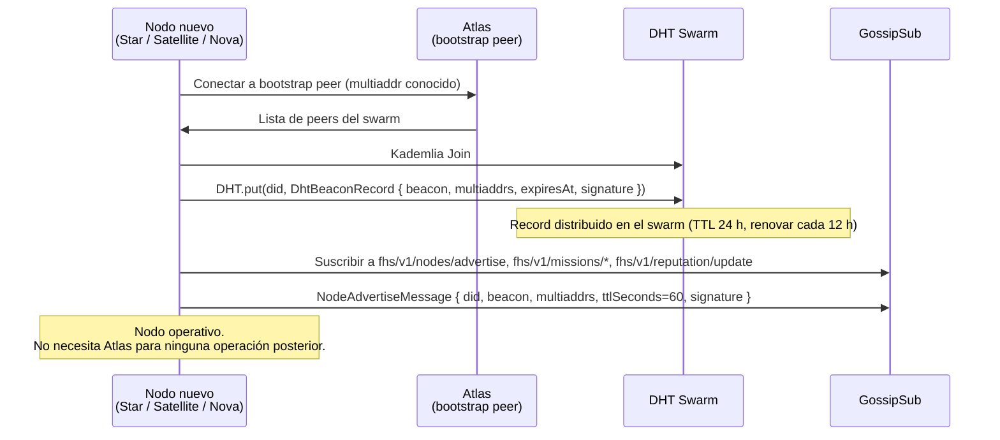
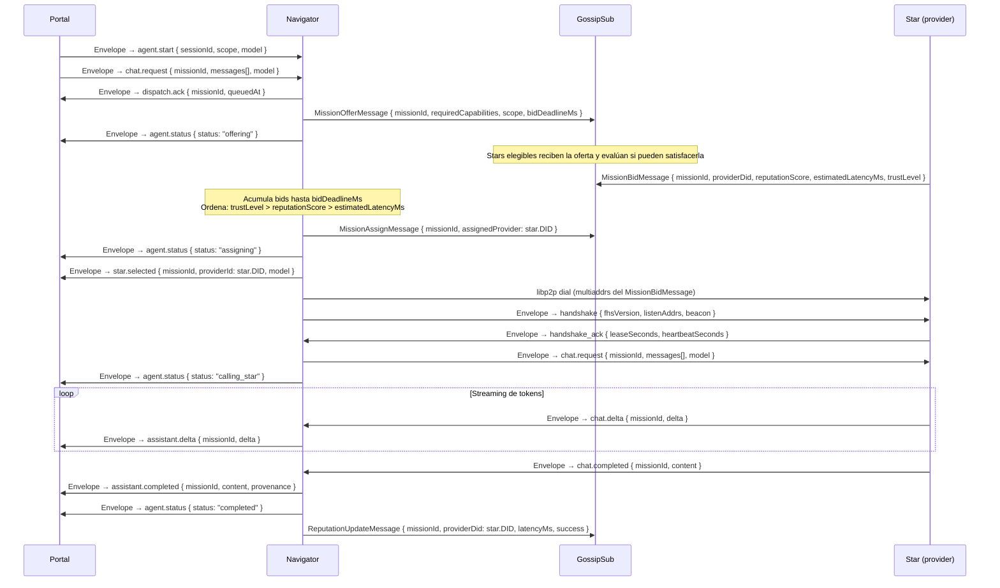
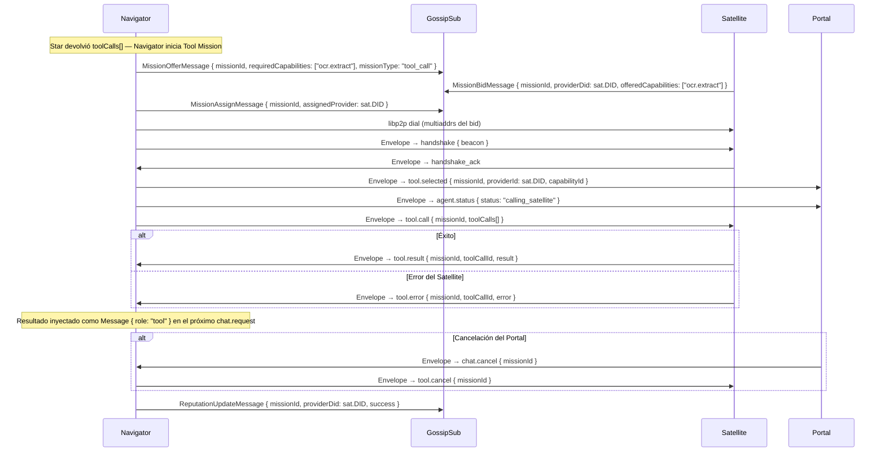
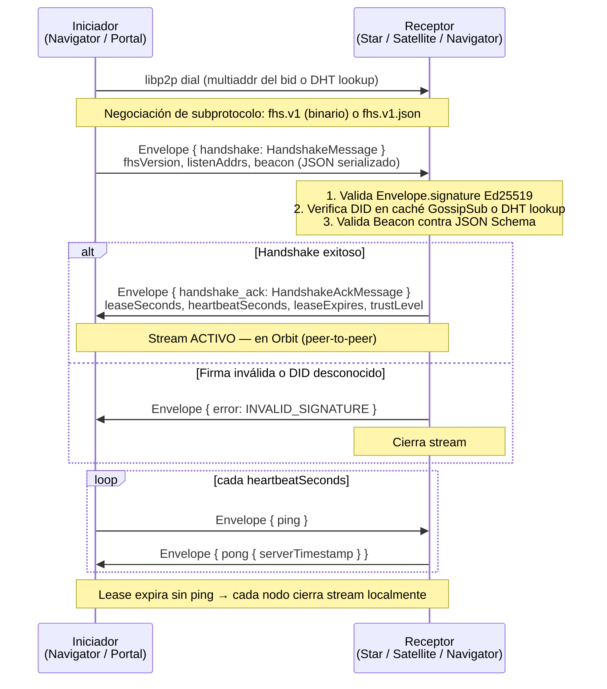
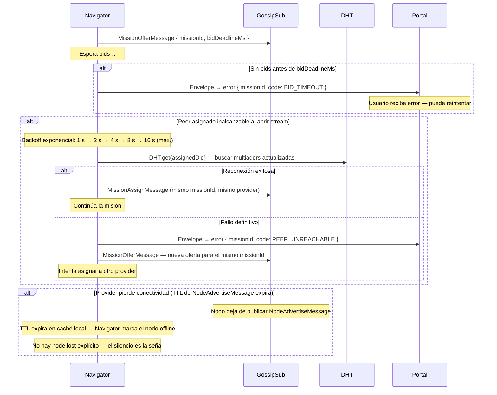

# FHS Protocol — Flujos de Secuencia

**Versión:** 2.0  
**DECs:** DEC-P2P-001 (libp2p: DHT + GossipSub)  
**Fecha:** 2026-08-02

Todos los mensajes de stream directo viajan dentro de un `Envelope` firmado con Ed25519.  
Los mensajes GossipSub llevan su propia firma (sin Envelope).  
El framing binario se describe en [idl/framing.md](framing.md).

---

## 1. Bootstrap — Unión al Swarm P2P

Flujo de un nodo nuevo (Star, Satellite, Nova, Navigator) al unirse a la red FHS.

---

## 2. Dispatch de Misión — GossipSub (offer → bid → assign)

Navigator recibe una Mission del Portal y asigna el mejor provider vía GossipSub antes de abrir el stream directo.

---

## 3. Misión de Tool Call — Navigator → Satellite

Subflujo intercalado en la Misión de Chat cuando el Star solicita invocar una herramienta.

---

## 4. Handshake de Stream Directo

Establecimiento de un stream directo `/fhs/v1/0.1.0` entre cualquier par de nodos FHS: Navigator↔Star, Navigator↔Satellite, Portal↔Navigator.

---

## 5. Error y Reconexión

Manejo de errores P2P: sin bids disponibles, peer inalcanzable, y reconexión con backoff.

---

## Referencias

- [idl/fhs-protocol.proto](fhs-protocol.proto) — definición completa de todos los tipos de mensaje
- [idl/asyncapi.yaml](asyncapi.yaml) — canales WebSocket y GossipSub
- [idl/gossipsub.md](gossipsub.md) — especificación de tópicos GossipSub
- [idl/framing.md](framing.md) — especificación LPP de framing binario
- [protocol/p2p.md](../protocol/p2p.md) — modelo de red P2P completo
- [schemas/](../schemas/) — JSON Schemas de los Beacons
- [spec-native/DECISIONS.md](../spec-native/DECISIONS.md) — DEC-P2P-001
