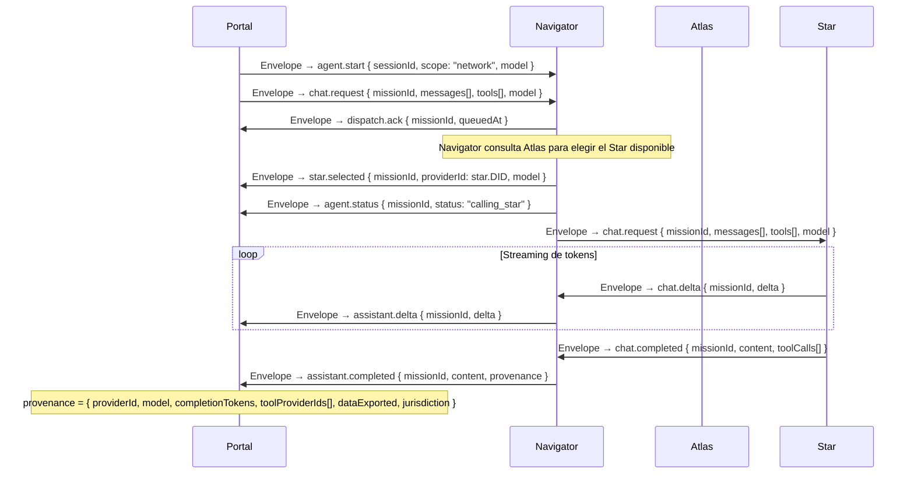
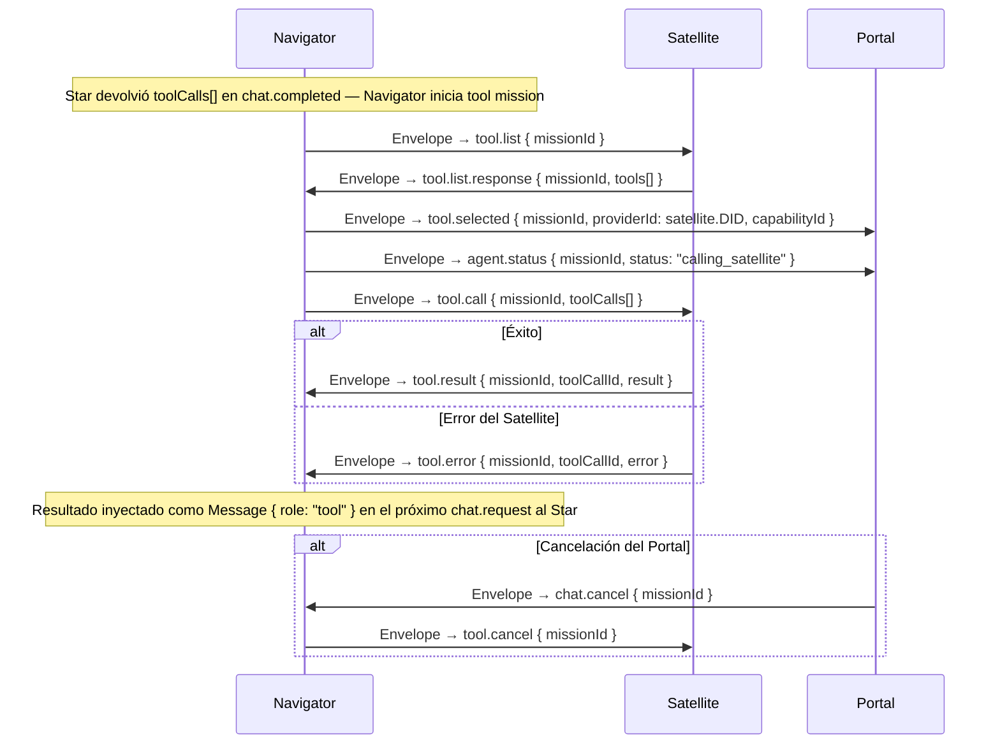
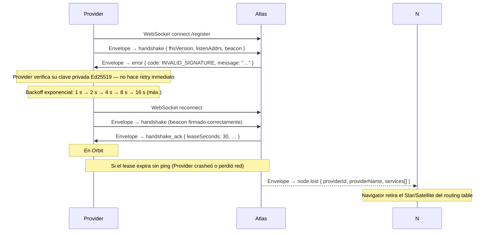
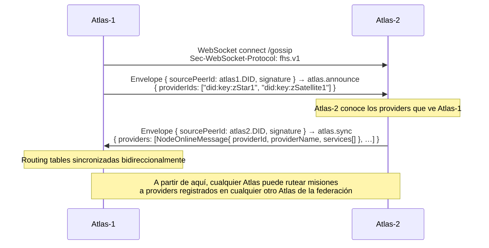

# FHS Protocol — Flujos de secuencia

**Versión:** 1.0  
**DECs:** DEC-0086 (LPP framing + gossip), DEC-0087 (Envelope P2P, Handshake 2-step)  
**Fecha:** 2026-08-02

Todos los mensajes viajan dentro de un `Envelope` firmado con Ed25519 (`source_peer_id` + `signature`).  
El framing binario se describe en [idl/framing.md](framing.md).

---

## 1. Registro de Provider — Handshake 2-step (DEC-0087)

Flujo de registro de un Star, Satellite o Nova ante un Atlas. Reemplaza el flujo de 4 mensajes (hello → welcome → register → registered) con 2 mensajes mutuamente autenticados vía Envelope.

```mermaid
sequenceDiagram
  participant P as Provider<br/>(Star / Satellite / Nova)
  participant A as Atlas

  P->>A: WebSocket connect /register<br/>Sec-WebSocket-Protocol: fhs.v1
  note over P,A: Negociación de subprotocolo; Atlas elige fhs.v1 (binario) o fhs.v1.json

  P->>A: Envelope { sourcePeerId: provider.DID, signature } → handshake<br/>{ fhsVersion, listenAddrs: ["/ip4/…/tcp/8081/ws"], beacon: "{…JSON…}" }
  note over A: Valida Envelope.signature + beacon schema (beacon-base.schema.json)

  A->>P: Envelope { sourcePeerId: atlas.DID, signature } → handshake_ack<br/>{ fhsVersion, leaseSeconds: 30, heartbeatSeconds: 10, leaseExpires, acceptedServices }
  note over P: Provider entra en estado Orbit

  loop Cada heartbeatSeconds (Pulse)
    P->>A: Envelope → ping {}
    A->>P: Envelope → pong { serverTimestamp }
  end

  note over A: Sin ping antes de leaseSeconds → emite node.lost y libera el DID del routing table
```

---

## 2. Misión de Chat — Portal → Navigator → Star

Flujo completo de una conversación con un LLM a través de la red FHS.



---

## 3. Misión de Tool Call — Navigator → Satellite

Subflujo que se intercala dentro de la Misión de Chat cuando el Star solicita invocar una herramienta.



---

## 4. Error y reconexión

Manejo de errores de autenticación y reconexión con backoff exponencial.



---

## 5. Gossip Atlas ↔ Atlas

Sincronización de routing tables entre Atlas en una federación distribuida sin coordinador central (DEC-0086).



---

## Referencias

- [idl/fhs-protocol.proto](fhs-protocol.proto) — definición completa de todos los tipos de mensaje
- [idl/asyncapi.yaml](asyncapi.yaml) — canales WebSocket y bindings
- [idl/framing.md](framing.md) — especificación LPP de framing binario
- [schemas/](../schemas/) — JSON Schemas de los Beacons
- [spec-native/DECISIONS.md](../spec-native/DECISIONS.md) — DEC-0086, DEC-0087
