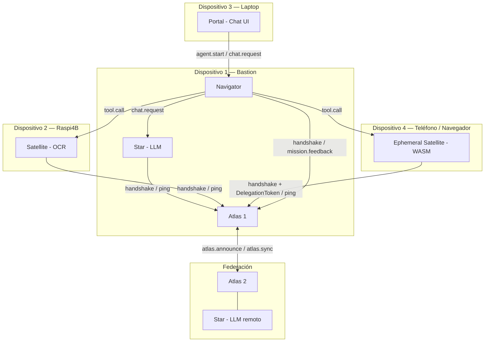

# Arquitectura — Red FHS

## Nodos y Roles

| Nodo | Rol | `provider.type` |
| ---- | --- | --------------- |
| **Atlas** | Registry + bootstrap peer. Mantiene el routing table de nodos en Orbit. Federa con otros Atlas. | `atlas` (especial, no en Beacon) |
| **Star** | Proveedor LLM. Ejecuta inferencia de lenguaje. | `star` |
| **Satellite** | Proveedor de herramientas (tools). Expone capabilities como OCR, búsqueda, CURP, etc. | `satellite` |
| **Nova** | Agente autónomo con loop propio. Puede coordinar Stars y Satellites. | `nova` |
| **Navigator** | Agent Runtime. Recibe Missions del Portal y las despacha a Stars y Satellites. | — (nodo interno) |
| **Portal** | Interfaz de chat del usuario. Inicia sesiones de agente con Navigator. | — (cliente) |
| **Ephemeral Satellite** | Satellite efímero ejecutando WASM en un dispositivo móvil o navegador, delegado por un Nodo Host. | `satellite` + `ephemeral: true` |

## Topología de Red

## Modelo de Federación

Atlas actúa como Registry local. Múltiples Atlas se federan entre sí mediante gossip P2P:
- `atlas.announce` — un Atlas notifica a sus pares los DIDs en Orbit
- `atlas.sync` — el receptor devuelve su estado completo

Cada Atlas tiene su propio `did:key:z...`. La autenticación entre Atlas usa el mismo mecanismo de Envelope signature que cualquier otro par FHS.

## Principio de Diseño

**Navigator no sabe a priori qué nodos existen.** Atlas empuja `node.online` / `node.lost` cuando la topología cambia. Navigator reacciona actualizando su routing table local — no hace polling REST a Atlas.

## Orbit

Un nodo está en **Orbit** cuando:
1. Completó el handshake de 2 pasos con Atlas (`handshake` → `handshake_ack`).
2. Mantiene Pulse activo (ping/pong dentro del `heartbeatSeconds` acordado).
3. Su lease no ha vencido (`leaseExpires`).

Un nodo sale del Orbit cuando:
- El Pulse cae (timeout > `leaseSeconds`)
- El nodo cierra la conexión WebSocket
- Atlas revoca el lease (ej. firma inválida detectada post-handshake)
- Para Ephemeral Satellites: su Nodo Host sale del Orbit

Al salir del Orbit, Atlas emite `node.lost` a todos los Navigators conectados.
