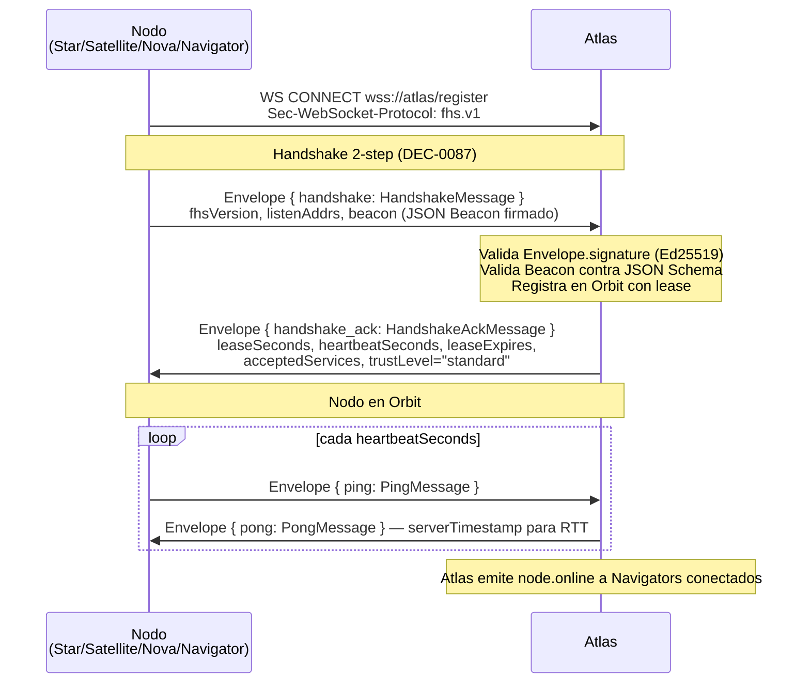
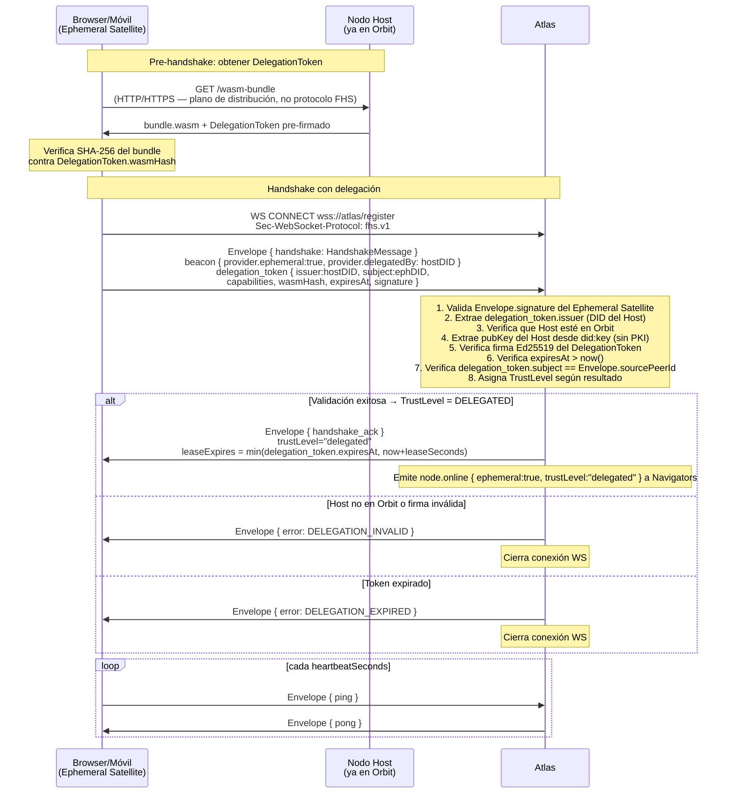
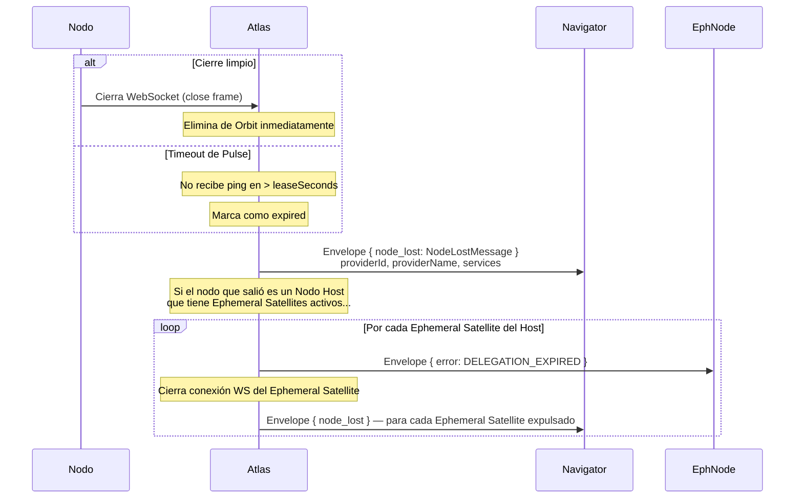

# Handshake — Protocolo de Conexión y Ciclo de Vida

## Visión General

Un nodo entra en **Orbit** mediante un handshake de 2 pasos seguido de un Pulse (ping/pong) periódico. Este flujo reemplaza el protocolo de 4 pasos (hello/welcome/register/registered) eliminado en DEC-0087.

## Handshake Estándar (Nodo Persistente)



## Handshake de Ephemeral Satellite



## Salida del Orbit



## Campos del Beacon

El `HandshakeMessage.beacon` es un JSON serializado que sigue el schema `beacon-base.schema.json` (y sus extensiones por tipo: `beacon-star`, `beacon-satellite`, `beacon-nova`).

Campos clave para Ephemeral Satellites:

```json
{
  "fhsVersion": "1",
  "provider": {
    "id": "did:key:z<efímero>",
    "type": "satellite",
    "visibility": "community",
    "ephemeral": true,
    "delegatedBy": "did:key:z<host>",
    "leaseSeconds": 3600
  },
  "capabilities": [
    { "id": "arithmetic.solve", "name": "Aritmética" },
    { "id": "curp.compute",    "name": "Cálculo de CURP" }
  ],
  "device": {
    "platform": "browser",
    "wasmTier": "baseline",
    "fingerprint": "sha256:<hash-no-reversible>"
  },
  "endpoint": {
    "url": "wss://atlas.ejemplo.com"
  },
  "privacy": {
    "retention": "none"
  }
}
```

## Parámetros de Lease

| Parámetro | Default | Descripción |
| --------- | ------- | ----------- |
| `leaseSeconds` | 30 | TTL del Orbit. El nodo debe renovar con ping antes de que expire. |
| `heartbeatSeconds` | 10 | Intervalo recomendado de ping. |
| `leaseExpires` (Ephemeral) | `min(token.expiresAt, now + leaseSeconds)` | Atlas nunca extiende más allá de la expiración del DelegationToken. |
