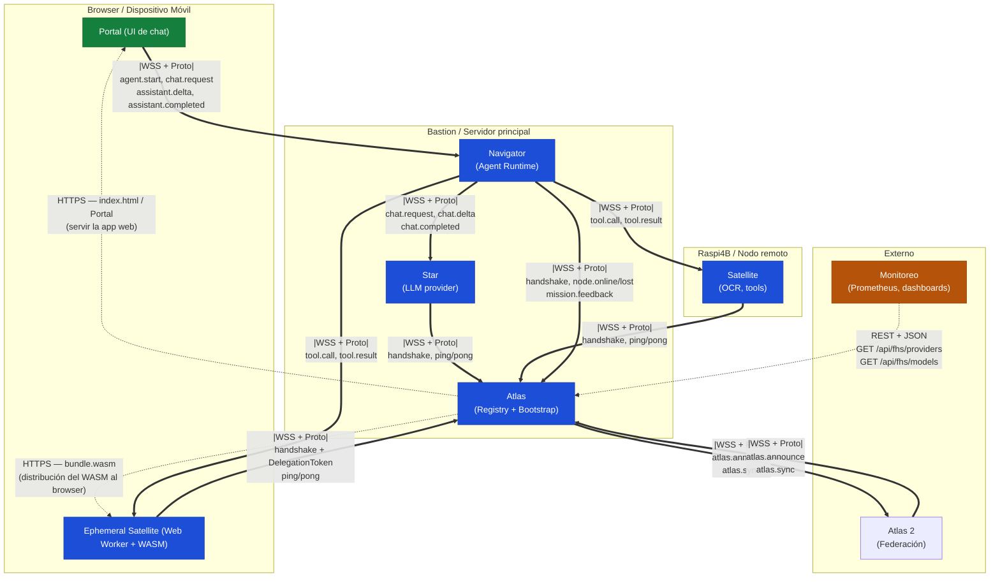
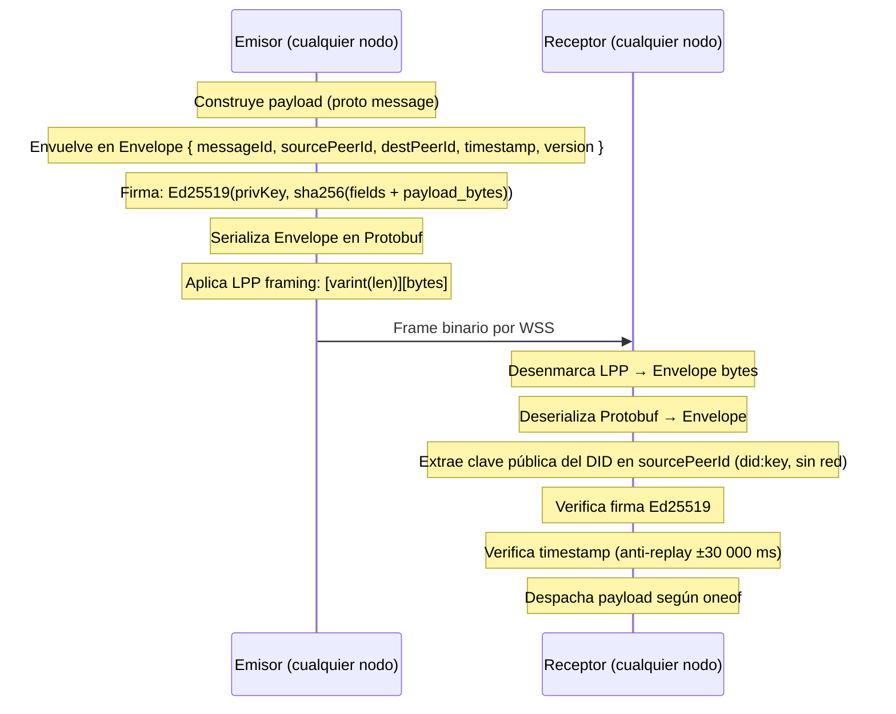
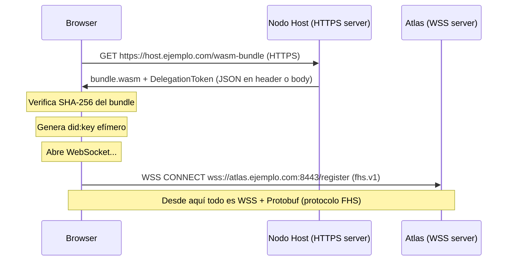

# Red — Protocolos de Comunicación en FHS

Mapa completo de qué protocolo se usa en cada conexión del ecosistema:
P2P FHS, WSS, HTTPS, REST y Protobuf.

---

## Vista de alto nivel

El ecosistema FHS tiene **tres planos de comunicación** bien separados:

| Plano | Propósito | Protocolos |
| ----- | --------- | ---------- |
| **Plano de protocolo** | Todo lo que es FHS: registro, Missions, heartbeat, federación | WSS + Protobuf (modo binario `fhs.v1`) |
| **Plano de distribución** | Servir el Portal web y el WASM a los browsers | HTTPS estático |
| **Plano de gestión** | Herramientas externas, dashboards, monitoreo | REST + JSON |

La regla central: **si un mensaje es parte del protocolo FHS, viaja por WSS+Proto.
Si es para un humano o una herramienta externa no-FHS, puede ir por HTTPS/REST.**

---

## Diagrama de red completo



**Convención visual:**
- `==` línea doble — plano de protocolo (WSS + Protobuf)
- `-.` línea punteada — plano de distribución (HTTPS) o gestión (REST)

---

## P2P FHS — El protocolo

### Qué es

"P2P" en FHS significa que **cada nodo tiene identidad propia** (`did:key:z...`)
y **autentica cada mensaje** que envía con su clave Ed25519.
No hay un broker central que tenga que confiar en los mensajes — cada receptor
verifica la firma del Envelope directamente, sin intermediarios.

La topología actual es **estrella** con Atlas al centro (no una malla completa),
pero el protocolo es P2P en el sentido de que cualquier nodo puede hablar con
cualquier otro si conoce su DID y tiene una ruta.

### Dónde se usa

| Conexión | Mensajes principales |
| -------- | -------------------- |
| Star → Atlas | `handshake`, `ping`, `pong` |
| Satellite → Atlas | `handshake`, `ping`, `pong`, `dispatch.ack` |
| Ephemeral Satellite → Atlas | `handshake + DelegationToken`, `ping`, `pong` |
| Navigator → Atlas | `handshake`, `ping`, `pong`, `mission.feedback` |
| Atlas → Navigator | `node.online`, `node.lost` |
| Navigator → Star | `chat.request`, `chat.cancel`, `chat.delta`, `chat.completed` |
| Navigator → Satellite | `tool.call`, `tool.cancel`, `tool.result` |
| Navigator → Ephemeral Satellite | `tool.call`, `tool.cancel`, `tool.result` |
| Portal → Navigator | `agent.start`, `chat.request`, `chat.cancel` |
| Navigator → Portal | `agent.status`, `star.selected`, `tool.selected`, `assistant.delta`, `assistant.completed` |
| Atlas → Atlas | `atlas.announce`, `atlas.sync` (gossip de federación) |

### Flujo de un frame FHS



---

## WSS — El transporte

WSS es el **medio físico** por donde viajan los frames FHS. No es el protocolo
en sí — es la capa de red segura que los transporta.

```
WSS = WebSocket sobre TLS
    = TCP + TLS 1.2/1.3 + upgrade HTTP a WebSocket
```

### Por qué WSS y no ws:// plano

| Razón | Detalle |
| ----- | ------- |
| **Coherencia** | El Portal web va por HTTPS; la red inter-nodo debe cifrar igual |
| **Browsers** | Un browser en página HTTPS bloquea conexiones `ws://` (*Mixed Content*) — WSS es el único camino posible para Ephemeral Satellites |
| **Privacidad** | Las conversaciones y los datos de herramientas viajan por el canal — el cifrado de transporte protege contra eavesdropping pasivo en la red |
| **Enforcement** | `endpoint.url` en el Beacon tiene `pattern: "^wss://"` — Atlas rechaza `INVALID_MANIFEST` si el nodo declara `ws://` |

### Roles de WSS y Ed25519

WSS y la firma de Envelope son **complementarios**, no alternativos:

| Capa | Qué protege | Qué no protege |
| ---- | ----------- | -------------- |
| **WSS / TLS** | Cifrado en tránsito entre dos puntos directos (punto A → punto B) | No autentica la identidad FHS del nodo, no protege mensajes que pasen por relays |
| **Ed25519 (Envelope)** | Autenticidad del emisor FHS (cualquier nodo puede verificar sin haber estado en la conexión original) | No cifra — solo firma |

Juntos cubren: el canal está cifrado (TLS) **y** el mensaje está firmado (Ed25519).

---

## HTTPS — El plano de distribución

HTTPS es para servir contenido estático al browser. **No es parte del protocolo FHS.**

### Dónde aparece

| Recurso | Quién lo sirve | Quién lo consume |
| ------- | -------------- | ---------------- |
| `index.html`, CSS, JS del Portal | Servidor web (nginx / Vite dev) | Browser del usuario |
| `bundle.wasm` + `DelegationToken` | Nodo Host (Satellite que publicó el WASM) | Browser del Ephemeral Satellite |
| Certificados TLS (Let's Encrypt renewal) | CA pública | El propio servidor |

### Por qué HTTPS y no WSS aquí

La descarga del WASM y la carga del Portal son operaciones de **request/response** de una sola vez,
no flujos de mensajería continua. HTTP(S) es el protocolo natural para eso. Además, los servidores
de contenido estático (nginx, CDN) no hablan WSS.



---

## REST — El plano de gestión

REST existe para **integraciones externas** con herramientas que no implementan el protocolo FHS:
dashboards de monitoreo, scripts de CI, herramientas de introspección. Definido en `idl/openapi.yaml`.

### Qué expone

| Endpoint | Método | Quién lo consume |
| -------- | ------ | ---------------- |
| `/api/fhs/providers` | GET | Dashboards, scripts de monitoreo |
| `/api/fhs/providers?type=star` | GET | Clientes externos que necesitan listar Stars |
| `/api/fhs/models` | GET | UIs que muestran modelos disponibles |
| `/api/fhs/metrics/sample` | POST | Agentes de métricas (Prometheus exporter) |
| `/api/fhs/atlas/peers` | GET / POST | Gestión manual de peers de federación |

### Lo que REST NO hace

- **No registra nodos** — los nodos se registran vía `handshake` por WSS+Proto
- **No despacha Missions** — las Missions viajan por WSS+Proto entre Navigator y providers
- **No recibe heartbeat** — el Pulse (ping/pong) es exclusivo del canal WSS
- **No envía `mission.feedback`** — el feedback va por el canal WSS+Proto de Atlas

### Regla de decisión

```
¿El cliente puede abrir una conexión WebSocket y hablar FHS?
  Sí → WSS + Protobuf (protocolo FHS)
  No → REST (plano de gestión, solo lectura de estado)
```

---

## Protobuf — El encoding

Protobuf 3 es el **formato de serialización** de todos los mensajes FHS.
No es un protocolo de red — es cómo los bytes se convierten en estructuras de datos.

### Modos

| Subprotocol WSS | Encoding | Uso |
| --------------- | -------- | --- |
| `fhs.v1` | Protobuf binario + LPP framing | **Producción** |
| `fhs.v1.json` | JSON (modo compat) | Desarrollo / debugging |

Ambos modos viajan siempre por WSS. La diferencia es solo el encoding del payload.

### Por qué Protobuf y no JSON en producción

| Criterio | Protobuf | JSON |
| -------- | -------- | ---- |
| Tamaño | 3-10× menor | Mayor |
| Velocidad de parse | Más rápido | Más lento |
| Schema enforcement | Compilado (`.proto`) | Runtime |
| Firma determinista | Sí (serialización canónica para Ed25519) | No (whitespace, orden de claves) |
| Legibilidad humana | No | Sí |

La firma Ed25519 del Envelope requiere serialización **determinista** — el mismo mensaje
siempre produce los mismos bytes. Protobuf canónico lo garantiza; JSON no.

### LPP Framing

En modo binario, cada frame WebSocket contiene:

```
[varint: N bytes del Envelope proto][N bytes del Envelope serializado]
```

El varint usa la misma codificación que Protobuf internamente (base-128, little-endian de 7 bits).
Esto permite parsear mensajes de longitud arbitraria sin depender de los frames WebSocket.
Ver `idl/framing.md` para la especificación completa.

---

## Tabla resumen

| ¿Qué necesitas hacer? | Protocolo | Encoding |
| --------------------- | --------- | -------- |
| Registrar un nodo (Star/Satellite/Nova/Navigator) | WSS P2P FHS | Protobuf |
| Mantener un nodo en Orbit (Pulse) | WSS P2P FHS | Protobuf |
| Registrar un Ephemeral Satellite con DelegationToken | WSS P2P FHS | Protobuf |
| Ejecutar una Mission de chat | WSS P2P FHS | Protobuf |
| Invocar un tool de un Satellite | WSS P2P FHS | Protobuf |
| Enviar reputación post-Mission a Atlas | WSS P2P FHS | Protobuf |
| Federar dos instancias de Atlas | WSS P2P FHS (gossip) | Protobuf |
| Notificar al Portal sobre el agente | WSS P2P FHS | Protobuf |
| Servir el Portal web al browser | HTTPS | HTML/CSS/JS |
| Distribuir el bundle WASM a un Ephemeral Satellite | HTTPS | binario |
| Consultar providers desde un dashboard | REST | JSON |
| Listar modelos desde una UI no-FHS | REST | JSON |
| Ingesta de métricas (Prometheus) | REST | JSON |
| Debugging de mensajes en desarrollo | WSS P2P FHS | JSON (fhs.v1.json) |

---

## Puertos de referencia

| Servicio | Puerto | Protocolo |
| -------- | ------ | --------- |
| Atlas (registro + gossip) | 8443 | WSS |
| Navigator (Portal ↔ Navigator) | 8444 | WSS |
| Portal web | 443 | HTTPS |
| Star (LLM) | 43111 | WSS |
| Satellite OCR | 43112 | WSS |
| REST API (gestión) | 8443 | HTTPS (mismo servidor que Atlas, ruta `/api/`) |
