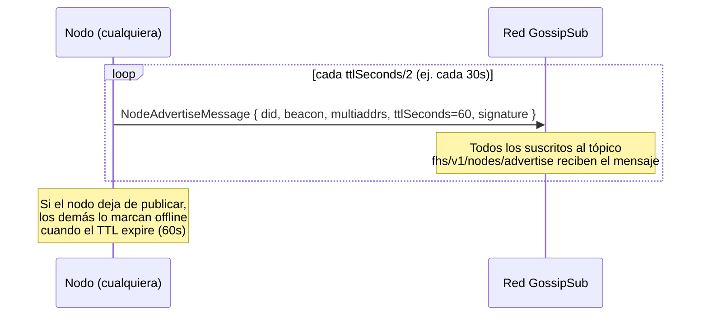
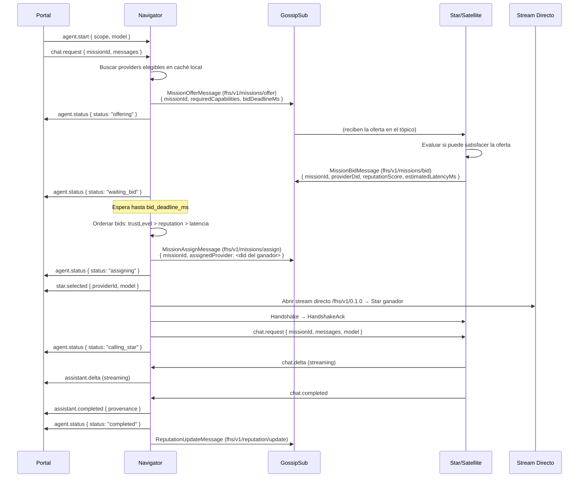
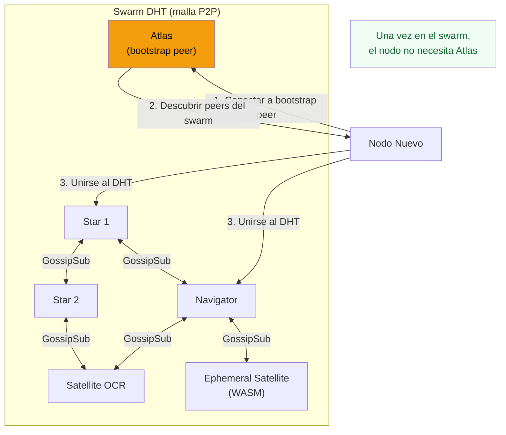
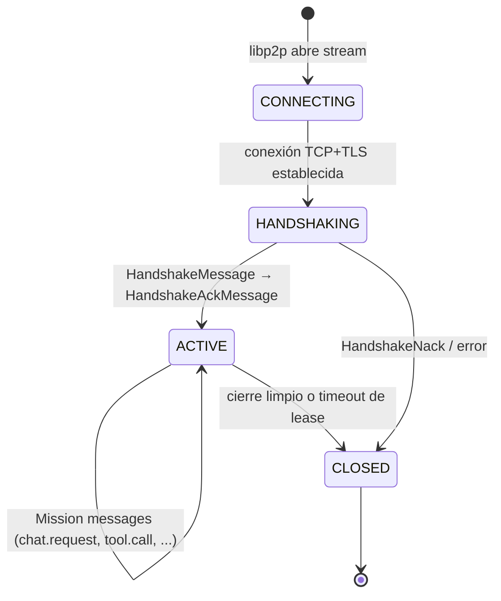

# P2P — Red Descentralizada FHS (libp2p)

La red FHS es una red P2P descentralizada basada en **libp2p**.
No hay un registro central obligatorio. Cada nodo es igual a los demás.

---

## Stack libp2p en FHS

```
┌─────────────────────────────────────────────────────┐
│  Aplicación FHS                                      │
│  (Envelope + Protobuf, protocol /fhs/v1/0.1.0)      │
├───────────────────────────┬─────────────────────────┤
│  Stream directo           │  GossipSub              │
│  (handshake, misiones)    │  (presencia, dispatch,  │
│                           │   reputación)           │
├───────────────────────────┴─────────────────────────┤
│  libp2p                                              │
│  ├── Kademlia DHT    (descubrimiento, reputación)   │
│  ├── GossipSub       (pub/sub broadcast)            │
│  ├── Identify        (intercambio de multiaddrs)    │
│  └── AutoNAT / Relay (NAT traversal, opcional)      │
├─────────────────────────────────────────────────────┤
│  Seguridad: Noise / TLS 1.3                         │
├─────────────────────────────────────────────────────┤
│  Multiplexor: yamux / mplex                         │
├─────────────────────────────────────────────────────┤
│  Transporte: TCP + WebSocket (WSS obligatorio)      │
└─────────────────────────────────────────────────────┘
```

---

## Identidad de nodo

Cada nodo tiene un **PeerId** derivado de su clave Ed25519:

```
Par de claves Ed25519 → DID: did:key:z<base58btc(clave_pública)>
                       → PeerId libp2p: derivado de la misma clave pública
```

La relación entre DID FHS y PeerId libp2p es directa: ambos se derivan de
la misma clave Ed25519. Esto permite:
- Verificar firmas de Envelope FHS usando solo el DID (sin PKI)
- Que el PeerId libp2p y el DID FHS sean el mismo nodo sin ambigüedad

Ver `protocol/identity.md` para generación de claves y formato del DID.

---

## Descubrimiento de nodos — DHT Kademlia

La **DHT Kademlia** (libp2p `go-libp2p-kad-dht` / `js-libp2p-kad-dht`) es
el mecanismo de descubrimiento primario.

### Publicación en DHT

Cuando un nodo se une a la red:
1. Conecta a uno o más **bootstrap peers** (Atlas o cualquier peer conocido).
2. Publica su `DhtBeaconRecord` en la DHT:
   - **Key**: su DID (`did:key:z...`)
   - **Value**: `DhtBeaconRecord` serializado en Protobuf
   - **TTL**: 24h (renovar cada 12h)
3. Suscribe al GossipSub (tópicos `fhs/v1/*`).
4. Publica `NodeAdvertiseMessage` en `fhs/v1/nodes/advertise`.

### Búsqueda en DHT

Cuando un nodo necesita encontrar a otro por DID:
```
DHT.get(did) → DhtBeaconRecord { beacon, multiaddrs, expiresAt, signature }
→ Verificar firma Ed25519 del record
→ Conectar a uno de los multiaddrs
→ Abrir stream /fhs/v1/0.1.0
→ Handshake (HandshakeMessage → HandshakeAckMessage)
```

### Reputación en DHT

```
DHT.get("reputation/" + did) → DhtReputationRecord { score, missionsSuccess, ... }
```

Múltiples Navigators publican su propia evaluación bajo la misma key.
La key `"reputation/" + did` puede contener múltiples records firmados
por diferentes evaluadores. Los nodos pueden agregar la media ponderada localmente.

---

## Presencia de nodos — GossipSub

**GossipSub** complementa la DHT para presencia en tiempo real.



### Cuándo usar DHT vs GossipSub para descubrimiento

| Caso | Mecanismo |
| ---- | --------- |
| Encontrar un nodo por DID conocido | DHT (búsqueda directa) |
| Saber qué nodos están activos ahora | GossipSub `fhs/v1/nodes/advertise` |
| Conocer las capabilities de un nodo | DHT (DhtBeaconRecord.beacon) |
| Saber la reputación de un proveedor | DHT `reputation/{did}` + caché GossipSub |

---

## Dispatch de Missions — GossipSub

El dispatch de Missions es **completamente descentralizado**. Navigator no necesita
consultar a Atlas para saber qué providers existen — usa su caché local de
`NodeAdvertiseMessage` recibidos + la DHT.



---

## Bootstrap — El rol de Atlas en la red P2P

Atlas es un nodo FHS cuyo DID y multiaddrs se incluyen en la configuración
por defecto. Su rol es **únicamente** de bootstrap peer.



**Atlas NO:**
- Mantiene un registro de nodos activos (eso es la DHT + GossipSub)
- Tiene autoridad sobre otros nodos
- Es requerido para la comunicación inter-nodos una vez que el swarm está formado
- Es el único punto de entrada (cualquier nodo conocido puede ser bootstrap)

**Atlas SÍ:**
- Tiene uptime alto para ser un bootstrap peer confiable
- Participa en la DHT como cualquier otro nodo
- Puede cachear records DHT para acelerar el bootstrap de nuevos nodos

---

## Stream directo FHS

Los streams directos son conexiones punto-a-punto entre dos nodos FHS.
Se usan para la ejecución de Missions (chat.request, tool.call, etc.).

```
Protocol ID: /fhs/v1/0.1.0
Transport:   WebSocket + TLS (WSS)
Framing:     LPP (ver idl/framing.md)
Encoding:    Protobuf binario (Sec-WebSocket-Protocol: fhs.v1)
             JSON compat (Sec-WebSocket-Protocol: fhs.v1.json, solo dev)
```

### Ciclo de vida de un stream



---

## NAT Traversal

Para nodos detrás de NAT (celular, red doméstica):

1. **AutoNAT** (libp2p): el nodo detecta si tiene IP pública o está detrás de NAT.
2. **Relay** (libp2p Circuit Relay v2): si no hay conexión directa posible, el stream
   se tuneliza a través de un relay conocido (que puede ser Atlas u otro nodo con IP pública).
3. **WebRTC** (libp2p, opcional): para conexiones browser-to-browser sin relay.

Los **Ephemeral Satellites** (WASM en browser) siempre usan relay porque los browsers
no pueden aceptar conexiones entrantes. Ver `protocol/ephemeral-satellite.md`.

---

## Federación entre comunidades

Múltiples "comunidades" FHS (clusters de nodos) pueden conectarse entre sí
si algún nodo de cada comunidad se une al mismo DHT swarm.

El mecanismo es el mismo que cualquier otro descubrimiento — no hay protocolo
de federación especial. Dos comunidades son parte de la misma red simplemente
si sus swarms DHT están conectados.

La granularidad de acceso se controla con:
- El campo `scope` en el Beacon: `local | network | community | external`
- El campo `scope` en `MissionOfferMessage`: Navigator solo recibe bids de providers
  cuyo `visibility` sea compatible con el `scope` solicitado
