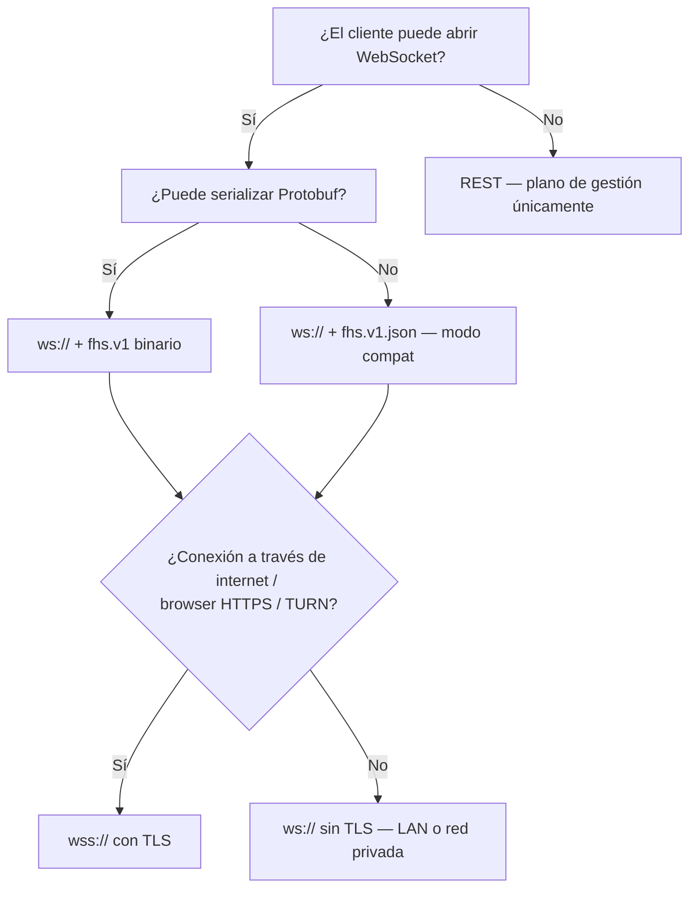

# Transporte — P2P + Protobuf

## Principio

> **El transporte canónico de FHS es WebSocket P2P con Protobuf binario.**
> Toda comunicación de protocolo va por esta vía por defecto.
> Usar WSS (TLS) o REST requiere justificación explícita documentada a continuación.

Este principio está establecido en **DEC-0086** y reforzado en **DEC-0087**.

## Capa de Transporte Primaria

```
WebSocket (ws://)
  └── Subprotocol: Sec-WebSocket-Protocol: fhs.v1
        └── Frames binarios
              └── LPP framing: [varint: longitud][Envelope bytes]
                    └── Envelope (Protobuf 3) → payload oneof
```

- **Conexión**: WebSocket estándar, persistente, bidireccional.
- **Encoding**: Protocol Buffers 3 (binario), serialización determinista para firmas.
- **Framing**: Length-Prefixed Protobuf (LPP) — ver `idl/framing.md`.
- **Autenticación**: firma Ed25519 en cada Envelope (`signature` field). No hay sesión HTTP, no hay token de sesión, no hay header de auth.

## Negociación de Subprotocolo

```
GET /register HTTP/1.1
Upgrade: websocket
Sec-WebSocket-Protocol: fhs.v1, fhs.v1.json
```

| Subprotocol | Frames | Uso |
| ----------- | ------ | --- |
| `fhs.v1` | Binario (Protobuf + LPP) | **Primario — producción, P2P** |
| `fhs.v1.json` | Texto (JSON) | Depuración, herramientas de desarrollo, compatibilidad con clientes que no tienen Protobuf |

Si el servidor acepta `fhs.v1`, la sesión **debe** ser binaria. `fhs.v1.json` es un modo compat — no una alternativa de producción.

## Cuándo usar WSS (WebSocket Secure / TLS)

WSS (`wss://`) es WebSocket sobre TLS. **No cambia el protocolo FHS** — los Envelopes proto viajan igual, la autenticación sigue siendo Ed25519 por Envelope. Solo añade cifrado de capa de transporte.

Se justifica WSS cuando:

| Escenario | Justificación |
| --------- | ------------- |
| Conexión a través de internet público | TLS es necesario para confidencialidad contra eavesdropping pasivo |
| Ephemeral Satellite desde un navegador web | Los navegadores requieren WSS cuando la página es HTTPS (`Mixed Content` bloqueado) |
| NAT traversal con TURN relay | Los servidores TURN suelen exponer solo WSS |
| Cluster con TLS interno obligatorio por política | Política de seguridad corporativa o compliance |

**En LAN local, cluster Docker/Podman, o red privada de confianza**: `ws://` (sin TLS) es aceptable — el cifrado de transporte es redundante con la autenticación por Envelope Ed25519.

## Cuándo está justificado REST

REST (HTTP request/response) **no es parte del protocolo FHS de mensajería**. Solo existe como **plano de gestión** para herramientas externas (scripts de monitoreo, dashboards, integraciones no-FHS). Definido en `idl/openapi.yaml`.

| Endpoint REST | Justificación |
| ------------- | ------------- |
| `GET /api/fhs/providers` | Consulta externa desde herramientas de monitoreo (sin WS persistente) |
| `GET /api/fhs/models` | Discovery de modelos disponibles desde UIs no-FHS |
| `POST /api/fhs/metrics/sample` | Ingestión de métricas desde agentes externos (Prometheus, etc.) |

**Regla**: si el cliente puede mantener una conexión WebSocket persistente y hablar FHS, **debe** usar el canal WS proto, no REST. La excepción es para integraciones con sistemas que no implementan el protocolo FHS (herramientas de terceros, CI/CD, dashboards).

## Diagrama de Decisión de Transporte



## LPP Framing (modo binario)

Cada frame binario en modo `fhs.v1` tiene la estructura:

```
[varint: N bytes del Envelope][N bytes del Envelope serializado en proto]
```

El varint usa la codificación estándar de Protobuf (base-128, little-endian de 7 bits). Ver `idl/framing.md` para la especificación completa y ejemplos de código.

## Por Qué No UDP ni QUIC (todavía)

FHS v1 usa WebSocket (TCP) porque:
1. Disponible en navegadores sin permisos especiales (Ephemeral Satellites en browser).
2. Confiable y ordenado por TCP — simplifica la correlación de `missionId`.
3. Compatible con proxies HTTP (necesario para NAT traversal básico).

QUIC/WebTransport queda para una versión futura cuando la penetración de navegadores sea suficiente y el caso de latencia ultra-baja justifique la complejidad (DEC pendiente).
