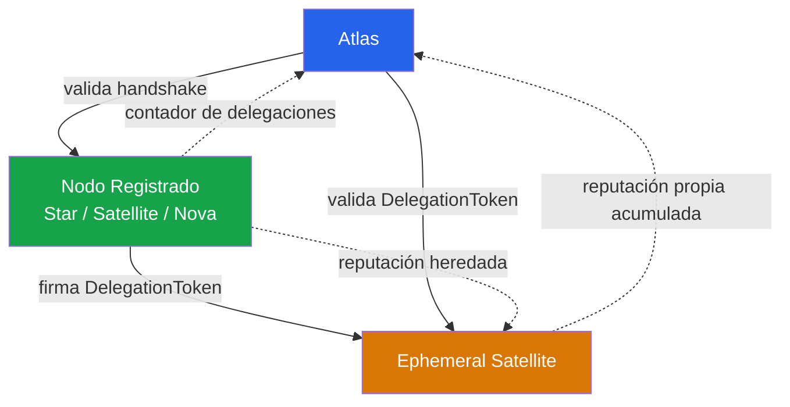
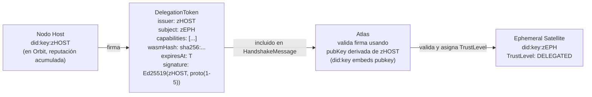

# Confianza — Niveles, Delegación y Reputación

## Modelo de Confianza de FHS

La confianza en FHS se basa en dos pilares:

1. **Identidad verificable** — `did:key:z...` + firma Ed25519 en cada Envelope.
   Todo nodo prueba ser quien dice ser en cada mensaje. No hay sesiones ni tokens de sesión.

2. **Reputación acumulada** — Atlas registra historial de Missions completadas por cada DID.
   La reputación se construye con el tiempo y se puede perder con errores.

## Jerarquía de Confianza



## Niveles de Confianza Asignados por Atlas

| TrustLevel | Valor proto | Condición de asignación |
| ---------- | ----------- | ----------------------- |
| `standard` | `"standard"` | Nodo registrado normal (no efímero) — Star, Satellite, Nova, Navigator |
| `delegated` | `"delegated"` | Ephemeral Satellite con DelegationToken válido, Host en Orbit, firma Ed25519 verificada |
| `community` | `"community"` | Ephemeral Satellite con Host conocido pero WASM no firmado directamente por él |
| `unverified` | `"unverified"` | Ephemeral Satellite sin DelegationToken (WASM local / desarrollo) |

## Cadena de Delegación



La propiedad central de `did:key`: la clave pública del Host está **embebida en el DID**. Atlas no necesita consultar ningún servicio externo para verificar la firma — deriva la clave del string `did:key:z...` en local.

## Reputación

La reputación se acumula en Atlas (extiende SPEC-SATRATING-0001):

```
Por cada mission.feedback recibido de Navigator:
  → Actualiza métricas del Ephemeral Satellite (latencyMs, success/fail count)
  → Si delegatedBy ≠ "": incrementa contador de delegaciones exitosas del Nodo Host

Por cada WASM_HASH_MISMATCH reportado:
  → Registra incidente en el Ephemeral Satellite
  → Notifica al Nodo Host (Atlas emite event interno)
```

El modelo de reputación completo (scoring, umbrales, ranking en routing) se define en SPEC-SATRATING-0001.

## Decisiones de Confianza en Navigator

Navigator usa el `trustLevel` recibido en `node.online` para decidir:

| TrustLevel | Navigator puede routear automáticamente | Requiere confirmación del usuario |
| ---------- | --------------------------------------- | --------------------------------- |
| `standard` | Sí | No |
| `delegated` | Sí | No |
| `community` | Sí (con alerta en Portal) | No |
| `unverified` | Solo si `allowUnverified: true` en config | Sí, primera vez |

## Revocación

En Fase 1, la revocación es implícita:
- El DelegationToken tiene `expiresAt` — expira solo.
- Si el Nodo Host sale del Orbit, todos sus Ephemeral Satellites son expulsados automáticamente.
- Un Ephemeral Satellite con múltiples `WASM_HASH_MISMATCH` puede ser expulsado por Atlas (implementación futura).

Revocación activa (Host → Atlas: "cancela este DID ahora") queda para Fase 2.
