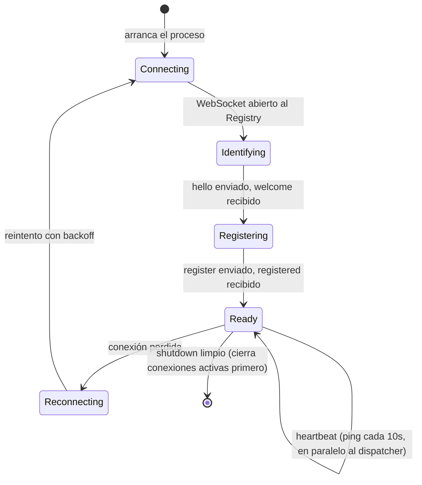
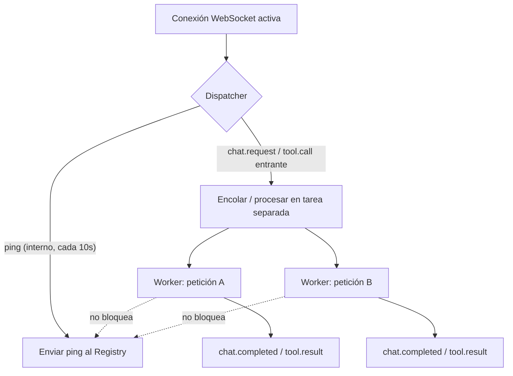

# Integra tu tool, servicio o LLM a la red

Cualquier computadora puede sumarse a la red FHS como un **provider**: algo
que se conecta al Registry, anuncia lo que ofrece, y queda disponible para
que el agente lo use cuando corresponda. No hace falta pedir permiso a un
operador central — solo implementar el contrato del protocolo.

Hay dos caminos, según qué quieras aportar:

  

    <h3>Ser un LLM provider</h3>
    
Expones un modelo de lenguaje (local o propio) compatible con el protocolo de chat de FHS.

  

  

    <h3>Integrar una tool o servicio</h3>
    
Expones una capacidad — OCR, búsqueda, un servicio interno — como provider tipo <code>mcp</code>.

  

En ambos casos el Agent Server **no necesita ningún cambio de código** para
reconocer tu provider — solo que cumpla el contrato de ciclo de vida y el
manifiesto correctos. A eso se le llama **plug and play** en este proyecto.

## El ciclo de vida obligatorio

Todo provider — LLM, OCR, o lo que sigue — pasa por los mismos cinco
estados:

Un detalle que rompe integraciones si se pasa por alto: el **heartbeat no
puede bloquearse** mientras el provider procesa una petición larga (por
ejemplo, OCR de un PDF de varias páginas). Debe correr en un timer o tarea
independiente del manejo de peticiones — si el `ping` se atrasa más de 30s,
el Registry marca el nodo como perdido aunque siga vivo.

## 1. Ser un LLM provider

Un LLM provider envuelve un modelo (local con `llama.cpp`, `Ollama`, `vLLM`,
o incluso un servicio propio) y lo expone hablando el protocolo de chat de
FHS: `chat.request` / `chat.delta` / `chat.completed` / `chat.error` por
WebSocket.

Pasos:

1. Conéctate al Registry y completa `hello` → `register` con
   `provider.type: "llm"` en el manifiesto.
2. Implementa el servidor WebSocket de tu provider, que reciba
   `chat.request { requestId, messages, tools }` y responda
   `chat.delta`/`chat.completed`.
3. Si tu motor soporta tool calling, **verifícalo con una llamada directa
   incluyendo un `tools` array** antes de asumir que funciona — algunos
   motores deciden llamar una tool pero no llenan el campo estructurado
   `tool_calls`, y hay que parsear la respuesta como fallback (así lo
   resuelve `examples/star-example/src/llm-bridge.ts`).
4. Declara en el manifiesto, sin excepción: `privacy.retention` y
   `privacy.trainingUse` (booleano — si tu modelo usa las conversaciones
   para entrenar, debe decirlo explícitamente).

El ejemplo de referencia completo está en
[`examples/star-example`](https://github.com/{{ site.repository }}/tree/main/examples/star-example)
— hoy envuelve `llama-server` (`llama.cpp`) sirviendo Qwen2.5-Coder con
tool calling.

## 2. Integrar una tool o servicio (provider tipo `mcp`)

Un provider de este tipo expone una o más **capacidades** (`document.ocr`,
o la que definas) mediante `tool.list` / `tool.call` / `tool.result` /
`tool.error`.

Pasos:

1. Conéctate al Registry con `provider.type: "mcp"` en el manifiesto,
   declarando la(s) capability(ies) que ofreces.
2. Responde `tool.list` con el `inputSchema` real de cada tool — el Agent
   Server lo usa para construir las definiciones que ve el LLM, sin conocer
   tu tool de antemano.
3. Procesa `tool.call { requestId, toolName, arguments }` y responde
   `tool.result` o `tool.error` — nunca cierres la conexión en silencio
   ante un fallo del servicio real que envuelves.
4. Declara `privacy.retention` en el manifiesto.

El ejemplo de referencia es
[`examples/satellite-ocr-example`](https://github.com/{{ site.repository }}/tree/main/examples/satellite-ocr-example),
que envuelve un servicio de OCR externo.

## Manifiesto — campos obligatorios

| Campo | Obligatorio | Motivo |
|---|---|---|
| `fhsVersion` | Sí | El Registry debe poder rechazar versiones incompatibles |
| `provider.id` | Sí | Identidad única (`did:key:<nombre>`) |
| `provider.type` | Sí | `llm` \| `mcp` \| `multi` |
| `provider.visibility` | Sí | Determina en qué `scope` puede resolverse tu provider |
| `endpoint` | Sí | Dónde conectarse para hablar el protocolo correspondiente |
| `privacy.retention` | Sí | Qué haces con los datos que recibes |
| `privacy.trainingUse` | Sí, si `type: "llm"` | Explícito, nunca implícito |

## Códigos de error estandarizados

Usa estos códigos en `chat.error`/`tool.error` en vez de inventar los
propios — así cualquier cliente FHS puede decidir (reintentar, buscar otro
provider, informar al usuario) sin parsear el mensaje humano:

| Código | Cuándo usarlo |
|---|---|
| `NOT_IDENTIFIED` | Se recibió un mensaje antes de completar `hello` |
| `INVALID_MANIFEST` | El manifiesto no cumple el schema mínimo |
| `UPSTREAM_UNAVAILABLE` | El servicio real detrás del provider no responde |
| `UPSTREAM_TIMEOUT` | El servicio real respondió más lento que el timeout configurado |
| `INVALID_ARGUMENTS` | Los argumentos no cumplen el schema de la tool/modelo |
| `UNSUPPORTED_CAPABILITY` | Se pidió una capability o modelo que no tienes registrado |
| `INTERNAL_ERROR` | Cualquier otro fallo no clasificado — la excepción, no la norma |

## Checklist "plug and play"

Tu provider puede conectarse sin ningún cambio en `apps/navigator` si:

- [ ] Implementa el ciclo de vida completo (`Connecting → Identifying → Registering → Ready`).
- [ ] El heartbeat corre en una tarea/timer independiente del procesamiento de peticiones.
- [ ] El manifiesto incluye todos los campos obligatorios, incluidos los de privacidad.
- [ ] Usa los códigos de error estandarizados, no códigos propios.
- [ ] Loggea metadata de trazabilidad por `requestId` (nunca contenido, salvo lo que permita `retention`).
- [ ] Responde `chat.error`/`tool.error` ante cualquier fallo — nunca cierra la conexión en silencio.
- [ ] Si es tipo `mcp`, responde `tool.list` con el `inputSchema` real de cada tool.
- [ ] **Se probó al menos una tool call o chat real de punta a punta** contra un cliente FHS real — el registro exitoso no implica que funcione. Ver las lecciones de integración abajo.

## Lecciones de integración (bugs reales, para no repetirlos)

Estos bugs aparecieron conectando el pipeline de OCR por primera vez contra
infraestructura real — ninguno se detectó con build/typecheck, solo
ejecutando una tool call real de punta a punta:

1. **El transporte debe coincidir con lo documentado.** `provider.type: "mcp"` en este protocolo significa "provider FHS que expone tools por WebSocket", no "servidor MCP estándar sobre HTTP" — un matiz fácil de pasar por alto si solo se lee el nombre del tipo.
2. **El matching de nombres entre catálogos independientes debe probarse con nombres reales**, no con ejemplos inventados — una heurística de substring que "se ve razonable" puede no matchear nunca en la práctica.
3. **"Registrado" y "funciona" son afirmaciones distintas.** Un provider puede aparecer `online` con su capability declarada y aun así fallar en la primera tool call real. Siempre verifica con una prueba end-to-end antes de dar una integración por completa.
4. **Que un motor de inferencia "soporte tool calling" no garantiza el formato de respuesta esperado.** Verifica con una llamada directa incluyendo un `tools` array; si el motor no llena `tool_calls` de forma confiable, implementa un parser de respaldo en tu provider — no es responsabilidad del Agent Server adivinar el formato.

## Idiomas / SDKs

FHS es JSON sobre WebSocket — no depende de TypeScript ni de Node.js.
Cualquier lenguaje con soporte de WebSocket y JSON puede implementar un
provider. Hoy la guía cubre **Python, Rust, Java y TypeScript/JavaScript**
en
[`docs/implementacion-multilenguaje.md`](https://github.com/{{ site.repository }}/blob/main/docs/implementacion-multilenguaje.md).
Aún no hay SDKs empaquetados para Python/Rust/Java — son trabajo pendiente,
ver [Pendientes]({{ '/pendientes/' | relative_url }}).

## Referencia completa

- [`docs/protocolo-provider.md`](https://github.com/{{ site.repository }}/blob/main/docs/protocolo-provider.md) — el contrato completo, con todos los detalles y ejemplos de mensajes.
- [`docs/manifiesto-llm.md`](https://github.com/{{ site.repository }}/blob/main/docs/manifiesto-llm.md) — schema completo del manifiesto de un provider `llm`.
- [`docs/manifiesto-mcp.md`](https://github.com/{{ site.repository }}/blob/main/docs/manifiesto-mcp.md) — schema completo del manifiesto de un provider `mcp`.
