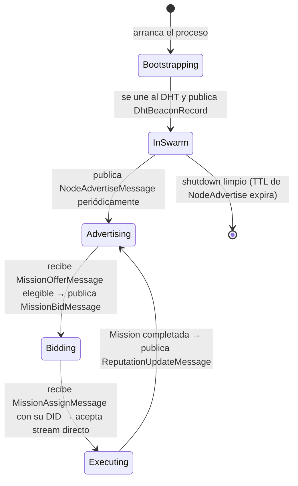

# Integra tu tool, servicio o LLM a la red

Cualquier computadora puede sumarse a la red FHS como un **provider**: un nodo
que se une al swarm P2P, anuncia lo que ofrece, y queda disponible para que
Navigator lo asigne cuando corresponda. No hace falta pedir permiso a un
operador central — solo implementar el contrato del protocolo.

Hay dos caminos, según qué quieras aportar:

  

    <h3>Ser un Star (LLM provider)</h3>
    
Expones un modelo de lenguaje (local o propio) compatible con el protocolo de chat de FHS.

  

  

    <h3>Ser un Satellite (tool provider)</h3>
    
Expones una capacidad — OCR, búsqueda, un servicio interno — invocable por el Navigator.

  

En ambos casos Navigator **no necesita ningún cambio de código** para
reconocer tu provider — solo que cumpla el contrato P2P y el Beacon
correctos. A eso se le llama **plug and play** en este proyecto.

## El ciclo de vida P2P obligatorio

Todo provider pasa por los mismos estados:

```mermaid
stateDiagram-v2
    [*] --> Bootstrapping: arranca el proceso
    Bootstrapping --> InSwarm: se une al DHT y publica DhtBeaconRecord
    InSwarm --> Advertising: publica NodeAdvertiseMessage periódicamente
    Advertising --> Bidding: recibe MissionOfferMessage elegible → publica MissionBidMessage
    Bidding --> Executing: recibe MissionAssignMessage con su DID → acepta stream directo
    Executing --> Advertising: Mission completada → publica ReputationUpdateMessage
    InSwarm --> [*]: shutdown limpio (TTL de NodeAdvertise expira)
```

Un detalle que rompe integraciones si se pasa por alto: el **Pulse (ping/pong)
no puede bloquearse** mientras el provider ejecuta una Mission larga. Debe
correr en un timer independiente del procesamiento — si el Pulse se
interrumpe antes de `leaseSeconds`, el peer cierra el stream aunque el
provider siga vivo.

## 1. Ser un Star (LLM provider)

Un Star envuelve un modelo (local con `llama.cpp`, `Ollama`, `vLLM`,
o cualquier servicio compatible) y lo expone hablando el protocolo de chat de
FHS: `chat.request` / `chat.delta` / `chat.completed` / `chat.error` en el
stream directo `/fhs/v1/0.1.0`.

Pasos:

1. Generar una clave Ed25519 persistente; derivar el DID y publicar el
   `DhtBeaconRecord` en la DHT con `provider.type: "star"`.
2. Publicar `NodeAdvertiseMessage` en `fhs/v1/nodes/advertise` cada 30s.
3. Suscribirse a `fhs/v1/missions/*`; responder `MissionBidMessage` cuando
   se puede satisfacer la oferta.
4. Aceptar el stream directo post-assign; completar el handshake; procesar
   `chat.request`.
5. Si tu motor soporta tool calling, **verificarlo con una llamada directa
   incluyendo un `tools` array** antes de asumir que funciona — algunos
   motores no llenan el campo estructurado `tool_calls`.
6. Declarar en el Beacon: `privacy.retention` y `privacy.trainingUse`.

El ejemplo de referencia (TypeScript) está en
[`galaxIA-Core: examples/star-example`](https://github.com/{{ site.repository | split: '/' | first }}/galaxIA-Core).

## 2. Ser un Satellite (tool provider)

Un Satellite expone una o más **capabilities** (`document.ocr`,
o la que definas) mediante `tool.list` / `tool.call` / `tool.result` /
`tool.error`.

Pasos:

1. Publicar `DhtBeaconRecord` con `provider.type: "satellite"` y la lista
   de capabilities.
2. Publicar `NodeAdvertiseMessage` periódicamente.
3. Responder `MissionBidMessage` cuando `requiredCapabilities` coincide.
4. Aceptar el stream directo; responder `tool.list` con el `inputSchema`
   real de cada tool — Navigator lo usa para construir las definiciones que
   ve el LLM.
5. Procesar `tool.call` y responder `tool.result` o `tool.error` — nunca
   cerrar el stream en silencio ante un fallo.
6. Declarar `privacy.retention` en el Beacon.

El ejemplo de referencia está en
[`galaxIA-Core: examples/satellite-ocr-example`](https://github.com/{{ site.repository | split: '/' | first }}/galaxIA-Core).

## Beacon — campos obligatorios

| Campo | Obligatorio | Motivo |
|---|---|---|
| `fhsVersion` | Sí | Compatibilidad de protocolo |
| `provider.id` | Sí | DID único (`did:key:z...` Ed25519 real) |
| `provider.type` | Sí | `"star"` \| `"satellite"` \| `"nova"` |
| `provider.visibility` | Sí | Acota en qué `scope` puede recibir bids |
| `endpoint.multiaddr` | Sí | Única dirección libp2p publicada en la DHT |
| `privacy.retention` | Sí | Qué hace el nodo con los datos recibidos |
| `privacy.trainingUse` | Sí, si `type: "star"` | Explícito, nunca implícito |

Ver ejemplos completos en
[`docs/beacon-star.md`](https://github.com/{{ site.repository }}/blob/main/docs/beacon-star.md)
y
[`docs/beacon-satellite.md`](https://github.com/{{ site.repository }}/blob/main/docs/beacon-satellite.md).

## Códigos de error estandarizados

Usa estos códigos en `chat.error`/`tool.error` — así cualquier cliente FHS
puede decidir sin parsear el mensaje humano:

| Código | Cuándo usarlo |
|---|---|
| `UPSTREAM_UNAVAILABLE` | El servicio real no responde |
| `UPSTREAM_TIMEOUT` | El servicio real respondió más lento que el timeout |
| `INVALID_ARGUMENTS` | Los argumentos no cumplen el schema |
| `UNSUPPORTED_CAPABILITY` | Se pidió algo que no está en el Beacon |
| `OVERLOADED` | Se superó `maxConcurrentRequests` |
| `CANCELLED` | La Mission fue cancelada por el Portal |
| `INTERNAL_ERROR` | Cualquier otro fallo no clasificado |

## Checklist "plug and play"

Tu provider puede integrarse sin ningún cambio en Navigator si:

- [ ] Genera y persiste un par de claves Ed25519 (clave privada nunca en Git).
- [ ] Se une al DHT swarm y publica `DhtBeaconRecord` correctamente firmado.
- [ ] Publica `NodeAdvertiseMessage` periódicamente.
- [ ] Responde `MissionBidMessage` solo cuando puede satisfacer la oferta.
- [ ] Acepta el stream directo post-assign y completa el handshake.
- [ ] El Pulse (ping/pong) corre en paralelo — no bloqueado por el procesamiento.
- [ ] Usa los códigos de error estandarizados.
- [ ] **Se probó al menos una Mission real de punta a punta** — el bid exitoso no garantiza que la ejecución funcione.

## Implementaciones en otros lenguajes

FHS usa libp2p (DHT + GossipSub + streams) — no depende de TypeScript ni
Node.js. Cualquier lenguaje con librería libp2p puede implementar un provider.
Guía detallada para Python, Rust, Go y TypeScript en
[`docs/implementacion-multilenguaje.md`](https://github.com/{{ site.repository }}/blob/main/docs/implementacion-multilenguaje.md).

## Referencia completa

- [`docs/protocolo-provider.md`](https://github.com/{{ site.repository }}/blob/main/docs/protocolo-provider.md) — el contrato completo.
- [`docs/beacon-star.md`](https://github.com/{{ site.repository }}/blob/main/docs/beacon-star.md) — Beacon de Star con ejemplo completo.
- [`docs/beacon-satellite.md`](https://github.com/{{ site.repository }}/blob/main/docs/beacon-satellite.md) — Beacon de Satellite con ejemplo completo.
