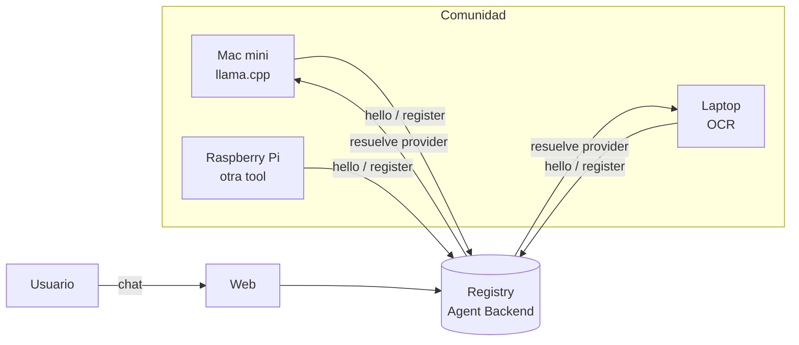
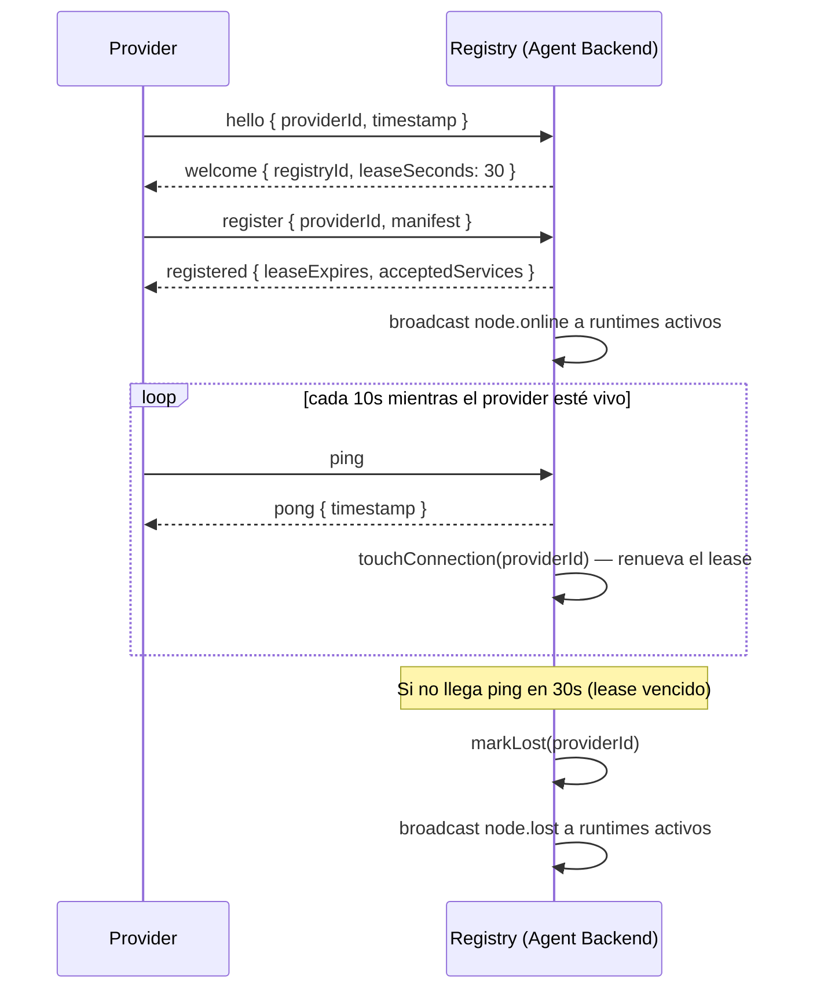
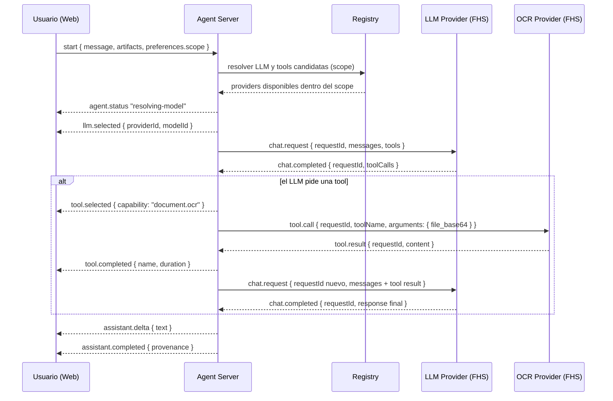

# Cómo funciona el protocolo

**FHS** significa **Federation of Sovereign Hosts** (Federación de Nodos
Soberanos). Es el protocolo que hace posible que computadoras de una
comunidad — una Mac mini con un modelo local, una laptop con OCR, una
Raspberry Pi con otra herramienta — se descubran entre sí y compartan
capacidades de IA sin depender de un servidor central de terceros.

## Por qué existe

La mayoría de asistentes de IA hoy implican mandar tus datos a la nube de
un proveedor, pagar una suscripción, y confiar en que ese proveedor
respeta lo que promete. **galaxIA busca lo contrario**: que una comunidad
— un equipo, un vecindario, un grupo de investigación — pueda armar su
propia red de IA con el hardware que ya tiene, sin ceder control de sus
datos ni depender de un dueño único.

El objetivo concreto de este protocolo es que:

- Cualquier persona con una computadora capaz de correr un modelo o una
  herramienta pueda **sumarla a la red** como un nodo más, sin pedirle
  permiso a un operador central.
- El chat (o cualquier cliente) pueda **descubrir qué hay disponible** y
  usarlo, sin necesitar saber de antemano qué máquina exacta responde.
- Cada nodo pueda **irse o fallar** sin tumbar el resto de la red — el
  Registry solo observa quién está disponible, no controla ni depende de
  ningún nodo en particular.
- **La privacidad sea parte del protocolo, no un aviso legal aparte**: cada
  petición declara su ámbito (`scope`), cada proveedor declara qué hace
  con los datos que recibe (`retention`), y cada respuesta trae su propia
  procedencia auditable.

## Las 10 reglas de FHS v0.1

1. **Identidad verificable** — todo nodo tiene un identificador único (`did:key:...`).
2. **Registro por arrendamiento (lease)** — un nodo debe renovar su registro cada 30s o se considera perdido.
3. **Heartbeat obligatorio** — cada nodo vivo envía un `ping` cada 10s, incluso mientras procesa otra petición.
4. **Servicios declarados** — un nodo dice explícitamente qué ofrece; nadie escanea puertos ni fuerza descubrimiento.
5. **Capacidades, no implementaciones** — se pide `document.ocr`, no "¿tienes Tesseract?"; la implementación es intercambiable.
6. **Resolución por ámbito (scope)** — `local` / `network` / `community` / `external` acotan quién puede resolver cada petición.
7. **Transparencia obligatoria** — cada respuesta declara qué modelo razonó, qué tool se usó y a dónde viajaron los datos.
8. **Proveedor rechazable** — el usuario puede vetar un proveedor específico; el sistema busca alternativas.
9. **Degradación graceful** — si no hay lo óptimo se usa lo siguiente disponible; si no hay nada, se informa. Nunca se inventa una respuesta.
10. **Registry observable, no controlador** — el Registry solo sabe qué nodos existen y qué ofrecen; no ejecuta tools ni ve datos del usuario.

Detalle completo, con todos los mensajes JSON, en
[`docs/protocolo.md`](https://github.com/{{ site.repository }}/blob/main/docs/protocolo.md).

## Ciclo de vida de un nodo

## Flujo de un mensaje de chat (con tool call)

Cuando el usuario adjunta un documento o hace una pregunta que requiere una
herramienta, el agente resuelve un LLM y, si hace falta, una tool federada,
todo dentro del `scope` de privacidad de la petición:

## Privacidad, en corto

- **`scope`** condiciona qué proveedores puede resolver el Registry
  (`local` < `network` < `community` < `external`) — nunca es solo una
  preferencia, es un techo.
- **`privacy.retention`** en el manifiesto de cada proveedor declara qué
  hace con los datos (`"none"`, `"session"`, u otro valor documentado
  explícitamente). El agente prefiere `"none"` cuando hay más de un
  candidato.
- **`provenance`** viaja en cada `assistant.completed`: qué modelo razonó,
  qué tool se ejecutó, y a dónde fueron los datos — para que el usuario
  pueda auditar cada respuesta.
- **Trazabilidad ≠ retención de contenido**: todo `requestId` debe poder
  seguirse extremo a extremo como metadata (proveedor, duración,
  éxito/error), sin que eso implique guardar el contenido de la
  conversación.

Detalle completo (tablas, checklist, y el gap conocido en trazabilidad —
DEC-0012) en
[`docs/protocolo.md`](https://github.com/{{ site.repository }}/blob/main/docs/protocolo.md).

## Siguiente paso

Si quieres sumar tu propia herramienta, servicio o modelo a la red, ve a
[**Integra tu tool o LLM**]({{ '/integrar/' | relative_url }}).
