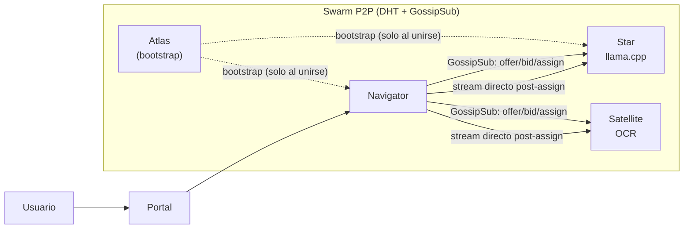
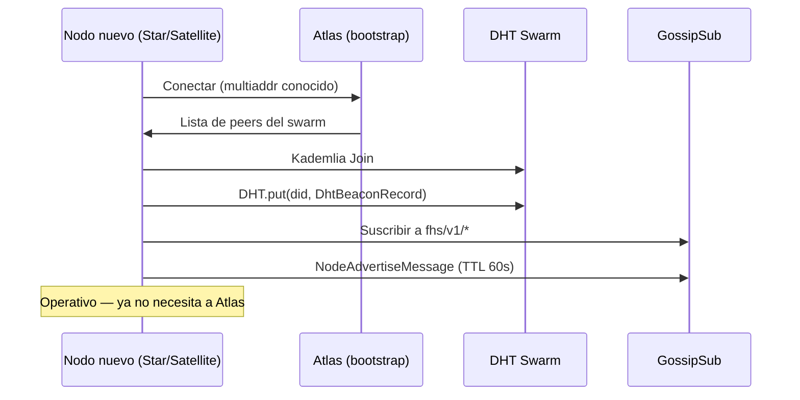
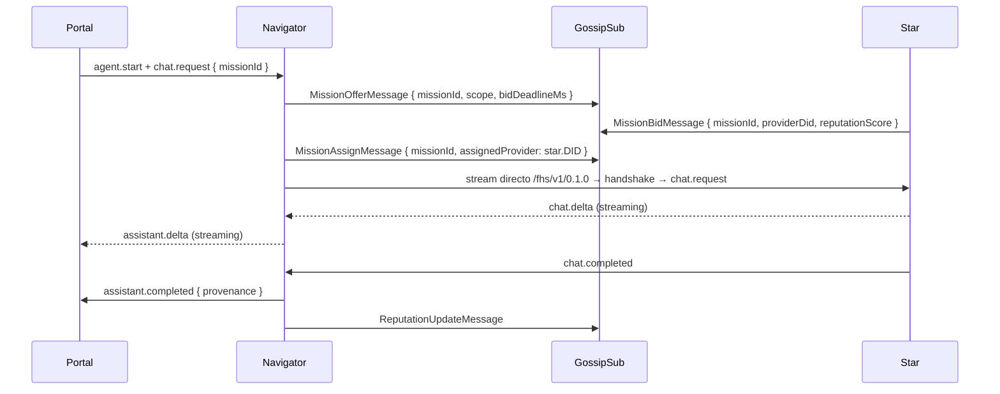

# Cómo funciona el protocolo

**FHS** significa **Federation of Sovereign Horizons** (Federación de
Horizontes Soberanos). Es el protocolo que hace posible que computadoras de una
comunidad — una Mac mini con un modelo local, una laptop con OCR, una
Raspberry Pi con otra herramienta — se descubran entre sí y compartan
capacidades de IA **sin ningún servidor central obligatorio**.

```mermaid
flowchart LR
    subgraph "Swarm P2P (DHT + GossipSub)"
        AT["Atlas\n(bootstrap)"]
        S1["Star\nllama.cpp"]
        S2["Satellite\nOCR"]
        NAV["Navigator"]
    end
    U["Usuario"] --> PORT["Portal"]
    PORT --> NAV
    NAV -->|"GossipSub: offer/bid/assign"| S1
    NAV -->|"stream directo post-assign"| S1
    NAV -->|"GossipSub: offer/bid/assign"| S2
    NAV -->|"stream directo post-assign"| S2
    AT -.->|"bootstrap (solo al unirse)"| S1
    AT -.->|"bootstrap (solo al unirse)"| NAV
```

No hay un Registry central que todos deban consultar. **Atlas es solo el punto
de entrada inicial** — una vez en el swarm, los nodos operan entre sí sin
intermediarios.

## Por qué existe

La mayoría de asistentes de IA hoy implican mandar tus datos a la nube de
un proveedor, pagar una suscripción, y confiar en que ese proveedor
respeta lo que promete. **galaxIA busca lo contrario**: que una comunidad
— un equipo, un vecindario, un grupo de investigación — pueda armar su
propia red de IA con el hardware que ya tiene, sin ceder control de sus
datos ni depender de un dueño único.

El objetivo concreto de este protocolo es que:

- Cualquier persona con una computadora capaz de correr un modelo o una
  herramienta pueda **sumarla a la red** como un nodo más, sin pedirle
  permiso a un operador central.
- El chat (o cualquier cliente) pueda **descubrir qué hay disponible** sin
  necesitar saber de antemano qué máquina exacta responde.
- Cada nodo pueda **irse o fallar** sin tumbar el resto de la red.
- **La privacidad sea parte del protocolo, no un aviso legal aparte**: cada
  petición declara su ámbito (`scope`), cada proveedor declara qué hace
  con los datos (`retention`), y cada respuesta trae su propia
  procedencia auditable.

## Las 10 reglas de FHS

1. **Identidad verificable** — todo nodo tiene un `did:key` Ed25519; la clave pública está embebida en el DID.
2. **Presencia por TTL** — un nodo activo publica `NodeAdvertiseMessage` cada 30s con TTL 60s; el silencio es la señal de que se fue.
3. **Pulse en streams directos** — mientras hay un stream activo, ping/pong cada 10s; si se interrumpe, el peer cierra el stream.
4. **Capacidades declaradas en el Beacon** — un nodo dice explícitamente qué ofrece; nadie escanea puertos ni fuerza descubrimiento.
5. **Capacidades, no implementaciones** — se pide `document.ocr`, no "¿tienes Tesseract?"; la implementación es privada al nodo.
6. **Dispatch descentralizado por GossipSub** — Navigator publica `MissionOfferMessage`, recibe bids, asigna al mejor; no consulta ningún Registry.
7. **Resolución por scope** — `local` / `network` / `community` / `external` acotan qué providers pueden responder; es un filtro del protocolo, no una preferencia.
8. **Transparencia obligatoria** — cada `AssistantCompletedMessage` incluye `ProvenanceInfo`: qué modelo razonó, qué Satellite se usó, si los datos salieron de la comunidad.
9. **Proveedor rechazable** — Navigator puede reemplazar un provider mid-Mission; GossipSub permite re-publicar la oferta y asignar a otro.
10. **Reputación distribuida** — `ReputationUpdateMessage` en GossipSub y `DhtReputationRecord` en la DHT; no hay servidor central de rating.

Detalle completo, con todos los mensajes Protobuf y schemas, en
[`docs/protocolo.md`](https://github.com/{{ site.repository }}/blob/main/docs/protocolo.md).

## Ciclo de vida de un nodo

```mermaid
sequenceDiagram
    participant N as Nodo nuevo (Star/Satellite)
    participant A as Atlas (bootstrap)
    participant D as DHT Swarm
    participant G as GossipSub

    N->>A: Conectar (multiaddr conocido)
    A->>N: Lista de peers del swarm

    N->>D: Kademlia Join
    N->>D: DHT.put(did, DhtBeaconRecord)

    N->>G: Suscribir a fhs/v1/*
    N->>G: NodeAdvertiseMessage (TTL 60s)

    Note over N: Operativo — ya no necesita a Atlas
```

## Flujo de una Mission de chat

```mermaid
sequenceDiagram
    participant Po as Portal
    participant NAV as Navigator
    participant G as GossipSub
    participant S as Star

    Po->>NAV: agent.start + chat.request { missionId }
    NAV->>G: MissionOfferMessage { missionId, scope, bidDeadlineMs }
    S->>G: MissionBidMessage { missionId, providerDid, reputationScore }
    NAV->>G: MissionAssignMessage { missionId, assignedProvider: star.DID }
    NAV->>S: stream directo /fhs/v1/0.1.0 → handshake → chat.request
    S-->>NAV: chat.delta (streaming)
    NAV-->>Po: assistant.delta (streaming)
    S->>NAV: chat.completed
    NAV->>Po: assistant.completed { provenance }
    NAV->>G: ReputationUpdateMessage
```

## Privacidad, en corto

- **`scope`** condiciona qué providers puede resolver Navigator — es un techo, no una preferencia.
- **`privacy.retention`** en el Beacon declara qué hace el nodo con los datos recibidos.
- **`ProvenanceInfo`** viaja en cada `AssistantCompletedMessage`: qué modelo razonó, qué tool se ejecutó, y a dónde fueron los datos — auditable por el usuario.
- **Trazabilidad ≠ retención de contenido**: cada `missionId` puede seguirse de extremo a extremo como metadata sin guardar el contenido de la conversación.

Detalle completo en
[`docs/protocolo.md`](https://github.com/{{ site.repository }}/blob/main/docs/protocolo.md).

## Siguiente paso

Si quieres sumar tu propia herramienta, servicio o modelo a la red, ve a
[**Integra tu tool o LLM**]({{ '/integrar/' | relative_url }}).
