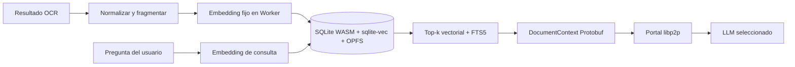

+++
artifact_type = "spec"
id = "SPEC-BROWSER-RAG-0001"
state = "active"
owner = "rafex"
created_at = "2026-08-05"
updated_at = "2026-08-05"
replaces = "none"
related_tasks = ["TASK-BROWSER-RAG-0001", "TASK-BROWSER-RAG-0002", "TASK-BROWSER-RAG-0003", "TASK-BROWSER-RAG-0004", "TASK-BROWSER-RAG-0005"]
related_decisions = ["DEC-0093"]
+++

# RAG local en el cliente navegador

## Resumen

El Portal Chat debe conservar temporalmente los documentos y sus fragmentos
semánticos en el navegador del usuario. La recuperación no dependerá de un
proveedor RAG remoto ni del LLM actualmente seleccionado. El cliente generará
embeddings con un modelo fijo, almacenará los fragmentos en SQLite WASM con
`sqlite-vec` sobre OPFS y construirá el `DocumentContext` que viaja al nodo
seleccionado mediante el protocolo FHS Protobuf.

## Problema

Si el RAG vive en un nodo remoto, el contexto puede perderse o variar al
cambiar de Atlas/Navigator/LLM. Además, trasladar documentos privados a un
servicio RAG central contradice el modelo local-first de GalaxIA.

## Objetivo

Después de procesar un documento, el navegador debe poder indexarlo, recuperar
los fragmentos relevantes para preguntas posteriores y enviar solamente el
contexto recuperado en `DocumentContext`, aunque la siguiente pregunta sea
atendida por otro LLM disponible.

## Alcance

Incluye:

- SQLite WASM ejecutado dentro de un Web Worker.
- Persistencia local mediante OPFS.
- Búsqueda vectorial con `sqlite-vec` y búsqueda textual auxiliar con SQLite
  FTS5 cuando esté disponible.
- Almacenamiento aislado por `conversationId` y `documentId`.
- Indexado automático después de recibir OCR y `DocumentContext` válido.
- Recuperación automática antes de enviar cada pregunta posterior con documento.
- Modelo de embeddings fijo y versionado; cambiarlo requiere otro índice o
  reindexado explícito.
- Mensaje Protobuf estructurado `DocumentContext`; no JSON como wire format.
- Fallback controlado a IndexedDB + similitud coseno para navegadores donde
  `sqlite-vec`/OPFS no esté disponible.

Fuera de alcance:

- Implementar un servidor RAG remoto.
- Sincronizar el índice privado con otros navegadores o nodos.
- Compartir índices entre conversaciones.
- Sustituir la base de conocimiento curada (`KB`) por este índice temporal.
- Implementar mTLS; permanece en backlog.

## Requisitos funcionales

- **RF-1 — Indexado**: dado un resultado OCR válido, el cliente fragmenta el
  texto, calcula embeddings y guarda texto, vector, metadatos y versión del
  modelo de embeddings.
- **RF-2 — Aislamiento**: una consulta solo puede recuperar fragmentos cuyo
  `conversationId` y `documentId` coincidan con el contexto activo.
- **RF-3 — Recuperación**: cada pregunta posterior calcula su embedding y
  recupera los `top-k` fragmentos más relevantes, combinando similitud vectorial
  y texto completo cuando ambos índices estén disponibles.
- **RF-4 — Cambio de LLM**: cambiar de modelo generativo no elimina el índice;
  el cliente reutiliza el mismo contexto recuperado.
- **RF-5 — DocumentContext**: los resultados recuperados se convierten al
  campo estructurado `DocumentContext` del IDL antes de crear el mensaje FHS.
- **RF-6 — Resiliencia**: la búsqueda no debe bloquear la interfaz; todo acceso
  a SQLite, embeddings e indexado ocurre fuera del hilo principal.
- **RF-7 — Retención local**: el cliente puede eliminar el índice de una
  conversación y debe aplicar la política de retención temporal del chat.

## Requisitos no funcionales

- **RNF-1 — Privacidad**: el contenido y embeddings permanecen en el storage
  del origen del Portal; no se transmiten al indexar.
- **RNF-2 — Compatibilidad**: WebGPU es una optimización; WASM/CPU es el
  fallback obligatorio para generar embeddings.
- **RNF-3 — Consistencia vectorial**: ninguna consulta debe mezclar vectores de
  distinta dimensión o modelo de embeddings.
- **RNF-4 — Interoperabilidad**: solo `DocumentContext` Protobuf cruza la
  frontera FHS; SQLite, OPFS y el índice son detalles internos del cliente.
- **RNF-5 — UX**: el indexado y la recuperación muestran estado de progreso sin
  mostrar metadatos internos ni bloquear la escritura del usuario.

## Diseño

La tabla lógica mínima debe contener `id`, `conversationId`, `documentId`,
`chunkIndex`, `content`, `embeddingModel`, `embeddingDimensions`,
`contentHash`, `metadata` y `createdAt`. El vector se almacena en la tabla
`vec0` de `sqlite-vec` y se relaciona por el mismo identificador.

El modelo generativo es intercambiable; el modelo de embeddings no lo es dentro
de un índice existente. Cada índice debe conservar `embeddingModel` y
`embeddingDimensions` para impedir consultas incompatibles.

## Criterios de aceptación

1. Dado un PDF con OCR válido, cuando termina el indexado, el navegador conserva
   los fragmentos y vectores en almacenamiento local sin una llamada de red de
   indexado.
2. Dada una pregunta sobre el documento, cuando se envía a cualquier LLM
   disponible, el `DocumentContext` contiene los fragmentos recuperados y el
   mensaje cruza la red únicamente como Envelope Protobuf/libp2p.
3. Dadas dos conversaciones con documentos iguales, una consulta de una no
   recupera fragmentos de la otra.
4. Dado un cambio de LLM entre dos preguntas, el segundo LLM recibe el contexto
   recuperado sin tener que reindexar el documento.
5. Dado un navegador sin WebGPU, el flujo funciona mediante WASM/CPU.
6. Dado un navegador sin `sqlite-vec`/OPFS compatible, se utiliza el fallback
   IndexedDB y la búsqueda coseno para el volumen MVP.
7. La prueba E2E ejecuta PDF + pregunta inicial + pregunta de seguimiento y
   verifica el contenido del `DocumentContext` y la separación por conversación.

## Riesgos y decisiones

- `sqlite-vec` está en versión pre-1.0; se encapsula detrás de una interfaz
  propia para conservar un fallback y permitir sustituir el motor.
- El storage del navegador está sujeto a cuota y puede limpiarse si el usuario
  borra los datos del sitio; la UI debe informar que el RAG es temporal.
- La primera carga del modelo de embeddings puede ser pesada; se descarga una
  sola vez y se reutiliza desde Cache Storage/Worker sin convertirlo en parte
  del protocolo.

## Validación

- Unit tests del repositorio Core para chunking, aislamiento, dimensiones y
  recuperación.
- Prueba de Worker con SQLite WASM/OPFS y fallback IndexedDB.
- Validación Protobuf del `DocumentContext` generado.
- E2E en `galaxIA-E2E` con el flujo PDF, pregunta inicial, seguimiento y dos
  conversaciones aisladas.
