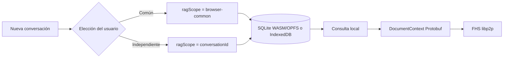

+++
artifact_type = "spec"
id = "SPEC-CONVERSATION-RAG-0001"
state = "active"
owner = "rafex"
created_at = "2026-08-05"
updated_at = "2026-08-05"
replaces = "none"
related_tasks = ["TASK-CONVERSATION-RAG-0001", "TASK-CONVERSATION-RAG-0002", "TASK-CONVERSATION-RAG-0003", "TASK-CONVERSATION-RAG-0004"]
related_decisions = ["DEC-0094"]
+++

# Ámbito del RAG elegido por conversación

## Resumen

Cuando el usuario crea una conversación, el Portal debe permitirle elegir si
esa conversación usa el RAG común del navegador o un RAG independiente. La
elección se guarda junto con el historial local y determina el ámbito de las
claves del índice vectorial.

## Problema

El RAG local ya conserva el contexto en el navegador, pero el usuario no puede
decidir si los documentos deben estar disponibles para otras conversaciones o
quedar aislados. Esa ambigüedad puede causar tanto pérdida de contexto como
exposición accidental de documentos entre conversaciones.

## Objetivo

El usuario selecciona el ámbito antes de empezar una nueva conversación:

- **RAG común**: comparte documentos indexados por conversaciones que también
  eligieron RAG común dentro del mismo origen del navegador.
- **RAG independiente**: limita documentos y recuperación a una sola
  conversación.

La selección es visible, persistente y no modifica el transporte FHS: solo el
`DocumentContext` Protobuf recuperado cruza la frontera libp2p.

## Alcance

Incluye:

- Modal accesible al pulsar `＋ Nueva conversación`.
- Persistencia de `ragMode` en `ChatConversation`.
- Migración de conversaciones históricas sin `ragMode` a RAG común.
- Claves de SQLite WASM/OPFS e IndexedDB separadas por ámbito.
- Recuperación de documentos comunes desde cualquier conversación común.
- Recuperación independiente limitada a la conversación actual.
- Indicador del modo en la lista de conversaciones.
- Limpieza de ambos ámbitos al borrar el historial local.

Fuera de alcance:

- Sincronizar el RAG común entre navegadores, nodos o usuarios.
- Cambiar el modo de una conversación ya creada.
- Añadir campos o mensajes al protocolo FHS.
- Sustituir la base de conocimiento curada o el `DocumentContext` Protobuf.

## Requisitos funcionales

- **RF-1 — Elección inicial**: al crear una conversación, el usuario debe
  seleccionar RAG común o independiente antes de iniciar el chat.
- **RF-2 — Persistencia**: el modo elegido debe sobrevivir a recargar el
  navegador y reabrir la conversación.
- **RF-3 — Aislamiento independiente**: una consulta independiente no puede
  recuperar fragmentos de otra conversación.
- **RF-4 — Compartición común**: una consulta común puede recuperar fragmentos
  indexados por cualquier conversación común del mismo origen.
- **RF-5 — Indexado OCR**: el texto OCR se indexa en el ámbito de la
  conversación que adjuntó el documento.
- **RF-6 — Inmutabilidad**: una conversación conserva su modo durante toda su
  vida; para cambiarlo se crea otra conversación.
- **RF-7 — Limpieza**: borrar el historial local elimina índices comunes e
  independientes del navegador.

## Requisitos no funcionales

- **RNF-1 — Privacidad**: el RAG común permanece local al origen del Portal y
  nunca se transmite al indexar.
- **RNF-2 — Interoperabilidad**: `ragMode` es metadato local de UI; no viaja en
  JSON ni en el wire FHS. El contexto recuperado sigue siendo Protobuf.
- **RNF-3 — Determinismo**: la clave de ámbito debe ser estable y explícita,
  sin depender de orden de conversaciones o del LLM seleccionado.
- **RNF-4 — Resiliencia**: ambos modos funcionan con SQLite WASM/OPFS y con el
  fallback IndexedDB ya definido en `SPEC-BROWSER-RAG-0001`.

## Criterios de aceptación

1. Dado que el usuario pulsa `＋`, cuando elige RAG común y empieza a adjuntar
   documentos, otra conversación nueva configurada como común puede recuperar
   esos fragmentos.
2. Dado que una conversación independiente indexó un documento, cuando otra
   conversación pregunta por ese contenido, no recupera sus fragmentos.
3. Dado que se recarga el navegador, cuando se abre una conversación existente,
   se conserva y muestra el modo previamente elegido.
4. Dado un historial creado antes de esta funcionalidad, cuando se carga,
   todas sus conversaciones se interpretan como RAG común sin perder mensajes.
5. Dado que se borra el historial local, cuando se vuelve a indexar, no quedan
   fragmentos recuperables de ningún ámbito anterior.
6. El flujo PDF + pregunta inicial + seguimiento continúa enviando únicamente
   `DocumentContext` Protobuf por la conexión FHS existente.

## Diseño

El modo no se puede cambiar después de crear la conversación. La base de
datos conserva `conversationId` como metadato del documento, pero la consulta
usa `ragScope`: `browser-common` para el modo común o el ID de conversación
para el modo independiente. Así se puede compartir el índice común sin perder
la procedencia del documento.

## Plan de ejecución

1. Extender tipos e historial local con `RagMode` y migración segura.
2. Añadir modal de selección y etiqueta visible en la lista.
3. Propagar el ámbito al Worker RAG y a las operaciones de limpieza.
4. Añadir pruebas unitarias, smoke de Worker y escenario E2E con ambos modos.

## Plan de validación

- Tests Vitest de persistencia/migración y claves de ámbito.
- Typecheck, lint y build del Portal.
- Smoke de navegador comprobando indexación común e independiente.
- E2E funcional con dos conversaciones y documentos aislados/compartidos.
