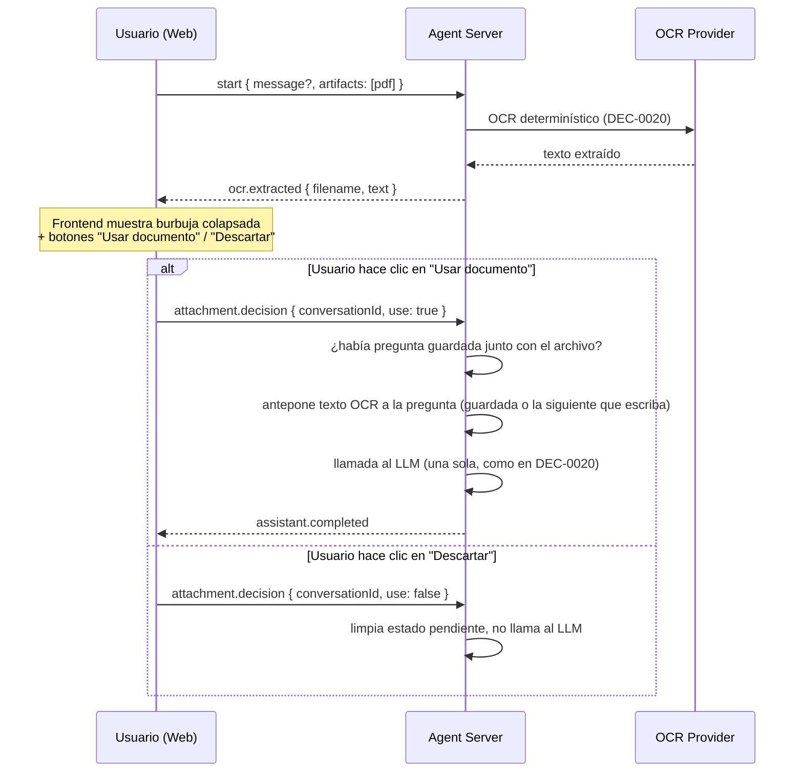

# SPEC-OCRCONFIRM-0001 — Confirmación de uso de OCR antes de responder

## Estado

`done`

## Owner

Raúl Fletes (rafex)

## Problema

Desde DEC-0020, al adjuntar un archivo el OCR se ejecuta de forma determinística y su texto se antepone **en silencio** al mensaje del usuario antes de llamar al LLM. Esto es rápido y confiable, pero tiene dos costos:

1. **El usuario no ve qué extrajo el OCR** hasta que ya recibió la respuesta del LLM — si el OCR extrajo texto irrelevante o basura (ya observado en pruebas con documentos de baja calidad de texto), el usuario descubre el problema solo después de esperar una respuesta lenta (30–300s en este hardware).
2. **No hay forma de evitar gastar una llamada al LLM** cuando el usuario solo quería confirmar que el archivo se cargó, sin necesariamente querer una respuesta basada en él todavía.

## Alcance

### Dentro del alcance

- Al adjuntar un archivo, el OCR se ejecuta igual que hoy (determinístico, DEC-0020), pero el resultado se muestra en el chat como una **burbuja colapsada/expandible** con el texto extraído, en vez de enviarse directo al LLM.
- Dos botones de decisión explícitos: **"Usar documento"** y **"Descartar"** — sin interpretar texto libre ("sí"/"no") para evitar el mismo problema de ambigüedad que ya resolvimos para tool-calling (DEC-0020).
- Si el usuario escribió una pregunta junto con el archivo, se conserva y se reutiliza automáticamente al confirmar "Usar documento" (no se pierde ni hay que volver a escribirla).
- Si no escribió nada, tras confirmar "Usar documento" el usuario escribe su pregunta normalmente y el texto OCR se antepone a esa siguiente pregunta.
- "Descartar" limpia el estado pendiente sin llamar al LLM en absoluto.

- **Adenda (implementada el mismo día):** el modo de confirmación es **configurable**, no obligatorio. `preferences.ocrMode` acepta `"confirm"` (default, este flujo) o `"auto"` (comportamiento original de DEC-0020 — OCR + respuesta del LLM en una sola llamada, sin pedir confirmación). Selector visible en la barra de configuración del chat web (`apps/web/src/components/chat-view.ts`). Verificado end-to-end: en modo `auto`, `tool.completed` y `assistant.delta` llegan en la misma respuesta, sin evento `ocr.extracted` ni pausa.

### Fuera del alcance (para esta iteración)

- Reutilizar el mismo documento confirmado para **múltiples** preguntas de seguimiento (uso único: una vez usado en una respuesta, el estado pendiente se limpia). Reutilización multi-turno es exactamente lo que resuelve `rag-provider` (SPEC-RAG-0001) — este spec sienta las bases de estado por conversación que RAG también necesita, pero no implementa recuperación por similitud.
- Edición del texto extraído por el usuario antes de confirmar (solo ver/usar/descartar, no corregir errores de OCR).
- Persistencia del estado pendiente más allá de la conexión WebSocket activa.

## Diseño

### Por qué botones, no texto libre

Ya vimos con DEC-0016/DEC-0017 que depender de que un modelo (o código propio) interprete intención en lenguaje natural es poco confiable. Preguntar "¿usar el documento? (sí/no)" e interpretar la respuesta del usuario tendría el mismo problema en miniatura. Botones explícitos eliminan la ambigüedad por completo — la decisión es un evento estructurado, no texto a clasificar.

### Flujo



### Estado pendiente por conversación

`apps/agent-server/src/api/chat-ws.ts` ya mantiene un `Map<conversationId, AgentRuntime>` (`runtimes`) por conexión. Se agrega un segundo `Map<conversationId, { text: string; filename: string; question?: string }>` (`pendingAttachments`) en el mismo scope — vive mientras dure la conexión WebSocket, se limpia al confirmar, descartar, o cerrar la conexión. Esta es la misma pieza de infraestructura que necesita `rag-provider` (TASK-RAG-0001) — construirla aquí primero reduce el trabajo pendiente de esa iniciativa.

### Cambios en el protocolo (eventos nuevos)

Nuevo evento `ocr.extracted`:

```json
{ "type": "ocr.extracted", "data": { "conversationId": "...", "filename": "documento.pdf", "text": "..." } }
```

Nuevo mensaje entrante (frontend → agent-server) `attachment.decision`:

```json
{ "type": "attachment.decision", "conversationId": "...", "use": true }
```

### Cambios de código

- `apps/agent-server/src/agent/runtime.ts`: nuevo método público `extractOcrText(artifacts)` que resuelve el provider `document.ocr` y ejecuta `runOcrDeterministically` (ya existe, se reutiliza), sin llamar al LLM. `run()` gana un parámetro opcional `preExtractedText` para saltarse la resolución de OCR cuando el texto ya se extrajo en un turno anterior.
- `apps/agent-server/src/api/chat-ws.ts`: si el mensaje `start` trae `artifacts`, no se llama a `runtime.run()` directamente — se llama a `extractOcrText`, se guarda en `pendingAttachments`, y se emite `ocr.extracted`. Nuevo manejo del mensaje `attachment.decision`.
- `packages/fhs-protocol/src/sse.ts`: nuevo tipo `OcrExtractedEvent`.
- `apps/web/src/services/api.ts`: nuevo método en `ChatConnection` para enviar `attachment.decision`.
- `apps/web/src/components/chat-view.ts`: renderizar burbuja colapsada + botones al recibir `ocr.extracted`; wiring de los botones.

## Criterios de aceptación

1. Al subir un PDF, aparece una burbuja colapsada con el texto OCR antes de cualquier respuesta del LLM.
2. Expandir/colapsar la burbuja no dispara ninguna llamada de red.
3. "Descartar" no genera ninguna llamada al LLM (verificable: cero eventos `llm.selected` tras descartar).
4. "Usar documento" con una pregunta ya escrita responde a esa pregunta sin pedir que se reescriba.
5. "Usar documento" sin pregunta previa espera el siguiente mensaje del usuario y antepone el texto OCR a esa pregunta.
6. Verificado end-to-end contra el bastion real (lección de `docs/protocolo-provider.md`, "Lecciones de integración").

## Riesgos y mitigaciones

| Riesgo | Impacto | Mitigación |
|---|---|---|
| Usuario sube un segundo archivo mientras el primero sigue pendiente de confirmación | Bajo | El nuevo sobrescribe la entrada en `pendingAttachments` para ese `conversationId` — comportamiento "el último gana", simple y predecible |
| Conexión se cierra con una decisión pendiente | Bajo | `pendingAttachments.delete(conversationId)` en el handler de `close`, igual que ya se hace con `runtimes` |
| Texto OCR muy largo satura el payload del evento `ocr.extracted` | Medio | Fuera de alcance para esta iteración (documentos cortos en la PoC); si aparece, truncar la vista previa en el evento mientras se guarda el texto completo en `pendingAttachments` para el LLM |

## Enlaces y decisiones relacionadas

- DEC-0020 — Ejecución determinística de OCR (base de este spec).
- SPEC-RAG-0001 (`spec-native/specs/rag-provider/SPEC.md`) — comparte la necesidad de estado por conversación; este spec la resuelve primero a menor escala.

## Tareas relacionadas

- Ver `spec-native/tasks/ocr-confirmacion/TASKS.md`.
