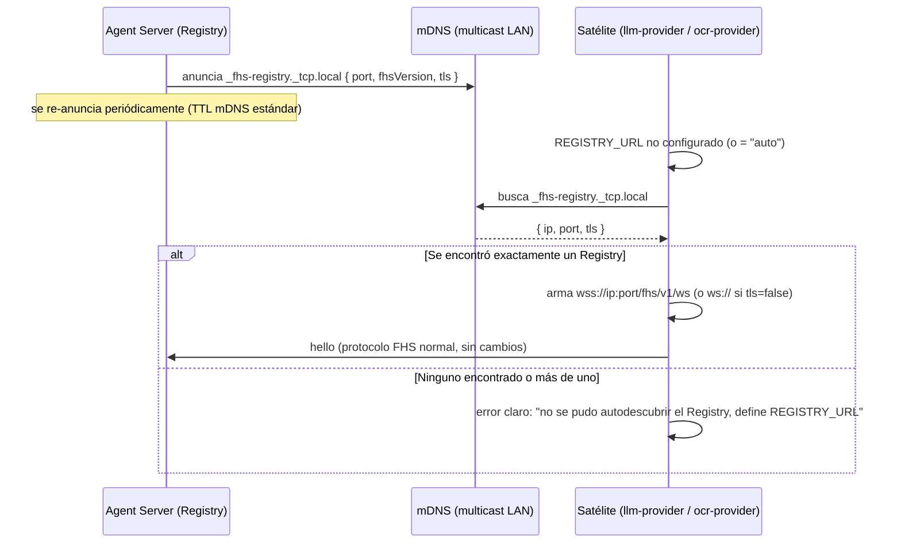

# SPEC-P2P-0001 — Descubrimiento local por mDNS (fase 1 de "descubrimiento descentralizado")

## Estado

`draft`

## Owner

Raúl Fletes (rafex)

## Problema

DEC-0001 evaluó y descartó deliberadamente un Registry por DHT + mDNS
libp2p para v0.1 — demasiado complejo para una PoC de ponencia frente a
un Registry centralizado con WebSocket. Esa decisión sigue siendo correcta
para lo que existe hoy. Pero dos cosas cambiaron desde entonces:

1. **La topología ya es multi-host real** (DEC-0022): laptop, bastion y
   Raspberry Pi, cada uno en su propia máquina física, con IPs que ya
   hemos tenido que actualizar a mano varias veces en esta misma sesión
   (cambios de red, cambios de bastion, redes de sitio distintas). Cada
   satélite necesita saber la IP:puerto exacta del Registry vía
   `PROVIDER_REGISTRY_URL`/`REGISTRY_URL` — configuración manual, frágil,
   y el primer punto de fricción real que hemos tropezado repetidas veces
   en despliegues reales (no en teoría).
2. **El pitch central de galaxIA es "cualquiera suma un nodo sin pedir
   permiso a un operador central"** (`ROADMAP.md`, portal web). Hoy eso es
   parcialmente cierto: un satélite nuevo no requiere cambios de código en
   el Agent Server, pero **sí requiere que alguien le diga a mano la
   dirección exacta del Registry**. Eso es fricción de operador central
   disfrazada de configuración.

El Registry centralizado (DEC-0001, DEC-0005) resuelve bien el *catálogo*
de capacidades — quién existe, qué ofrece, si sigue vivo. Lo que falta es
resolver *cómo un satélite encuentra la dirección del Registry* (y,
opcionalmente, cómo dos satélites en la misma LAN se enteran de que el
otro existe) sin tener que escribir una IP a mano cada vez que cambia la
red — que es exactamente lo que nos pasó esta semana tres veces distintas.

## Decisión de alcance: esto NO reemplaza el Registry

Esta spec es deliberadamente **fase 1, acotada**: resuelve *descubrimiento
de dirección* en la LAN local vía mDNS, como complemento **opcional** al
Registry centralizado que ya existe — no lo sustituye, no cambia el
modelo de confianza, no cambia el protocolo de `hello`/`register`/
heartbeat. Reemplazar el Registry por una DHT completa (la "alternativa 3"
que DEC-0001 descartó) sigue siendo una decisión mayor de arquitectura,
con implicaciones de seguridad que esta spec señala pero no resuelve (ver
"Fuera de alcance" y "Riesgos"). Proponerla como fase 2 requeriría su
propia spec, con su propia decisión explícita — no es lo que se pide
resolver aquí.

## Alcance

### Dentro del alcance

- **Anuncio mDNS del Registry**: el `agent-server` anuncia un servicio
  `_fhs-registry._tcp.local` (puerto, versión FHS, si usa TLS) en la LAN
  vía mDNS (biblioteca candidata: `bonjour-service` o `multicast-dns` en
  Node — decisión de implementación, no de esta spec).
- **Descubrimiento mDNS en satélites**: `examples/llm-provider` y
  `examples/ocr-provider` ganan un modo `REGISTRY_URL=auto` (o variable
  nueva, ej. `REGISTRY_DISCOVERY=mdns`) que busca el servicio anunciado en
  la LAN y arma `wss://<ip-encontrada>:<puerto>/fhs/v1/ws` automáticamente,
  en vez de requerir la URL exacta por variable de entorno.
- **Coexistencia explícita con configuración manual**: si `REGISTRY_URL`
  viene definido con una URL concreta, tiene prioridad — mDNS es
  *fallback/conveniencia*, no obligatorio. Ningún despliegue existente
  (multi-host actual, TLS) se rompe si mDNS falla o no está disponible
  (ej. redes que bloquean multicast, común en wifis de eventos/hoteles —
  relevante justo por el "dispositivo que da red remota en sitio" de esta
  semana).
- **Documentar la limitación de red**: mDNS solo funciona dentro del mismo
  segmento de broadcast/multicast (misma LAN, sin routers intermedios que
  lo bloqueen). Esto es una limitación conocida y aceptada para esta fase,
  no un bug — exactamente el mismo alcance de "red local o comunidad de
  confianza" que ya declara `spec-native/ARCHITECTURE.md`.

### Fuera del alcance (para esta iteración)

- **DHT/libp2p** para descubrimiento fuera de la LAN local o a través de
  NAT — la "fase 2" mencionada en `ROADMAP.md`. Mucho mayor alcance
  (routing, bootstrap nodes, resistencia a nodos maliciosos en una red
  pública) y requiere su propia spec y decisión explícita antes de
  iniciar.
- **Eliminar el Registry centralizado.** El Registry sigue siendo la
  única fuente de verdad de qué nodos están `online`/`lost` — mDNS solo
  ayuda a *encontrar su dirección*, no reemplaza `hello`/`register`/
  heartbeat ni el estado que ya mantiene `apps/agent-server/src/registry/registry.ts`.
- **Descubrimiento satélite-a-satélite sin Registry** (ej. que
  `llm-provider` y `ocr-provider` se hablen directo sin pasar por
  `agent-server`). El protocolo FHS asume que el Agent Runtime media toda
  interacción (`spec-native/ARCHITECTURE.md`, "Restricciones") — esta spec
  no cambia eso.
- **Autenticación/verificación de que el servicio anunciado por mDNS es
  el Registry legítimo y no un impostor en la misma LAN.** Ver "Riesgos"
  — depende de identidad criptográfica real (DEC-0004, Ed25519), que sigue
  sin implementarse. Documentado como limitación aceptada para esta fase,
  igual que ya se acepta hoy que cualquiera en la LAN puede intentar
  `hello` contra el Registry (DEC-0009, aún `proposed`).
- **UI/CLI para elegir entre varios Registries anunciados** si hubiera más
  de uno en la misma LAN (ej. dos comunidades distintas compartiendo wifi
  de un evento). Para esta fase, si mDNS encuentra más de un anuncio, el
  satélite debe fallar con un error claro pidiendo `REGISTRY_URL` manual,
  no elegir uno arbitrariamente.

## Diseño

### Por qué mDNS y no DHT/libp2p para esta fase

mDNS resuelve exactamente el dolor real observado esta semana
(direcciones IP que cambian entre redes: `192.168.3.x` → `192.168.1.x` →
bastion en `192.168.0.195`) con una tecnología estándar, sin dependencias
nuevas pesadas, sin bootstrap nodes, sin necesidad de que el Registry
tenga una dirección pública. DHT/libp2p resuelve un problema distinto
(descubrimiento *a través de* redes/NAT, sin ningún nodo central) que
esta PoC no tiene todavía — su complejidad no se justifica para el dolor
actual. Este es el mismo criterio que ya usó DEC-0001 para descartar la
alternativa 3 en v0.1; esta spec no lo contradice, lo reafirma para una
fase acotada del problema.

### Flujo

### Qué NO cambia

El protocolo FHS después de que el satélite arma la URL es **exactamente
el mismo** de siempre: `hello` → `welcome` → `register` → `registered` →
heartbeat (`docs/protocolo.md`). mDNS solo reemplaza el paso "¿cómo sé la
IP:puerto?" — todo lo demás (lease de 30s, heartbeat de 10s, manifiesto,
scope, retention, provenance) sigue idéntico. Ningún archivo de
`packages/fhs-protocol` cambia.

## Riesgos y mitigaciones

| Riesgo | Impacto | Mitigación |
|---|---|---|
| Cualquier equipo en la misma LAN puede anunciarse como `_fhs-registry._tcp.local` falso y atraer satélites (sin identidad criptográfica real, DEC-0004 sigue simplificada) | Alto en redes no confiables, bajo en la LAN doméstica/comunidad actual | Documentar explícitamente que mDNS asume la misma "LAN de confianza" que ya declara `spec-native/ARCHITECTURE.md` — no usar en redes compartidas con desconocidos (ej. wifi pública de un evento) hasta que exista identidad Ed25519 real |
| Redes de eventos/hoteles bloquean tráfico multicast (mDNS no llega) | Medio — justo el escenario de "dispositivo con red remota en sitio" de esta semana | mDNS es fallback, nunca obligatorio — `REGISTRY_URL` manual sigue siendo el camino garantizado, documentado como primera opción para sitio con red desconocida |
| Más de un Registry anunciado en la misma LAN (dos comunidades, mismo evento) causa ambigüedad | Medio | Fase 1 falla explícito en vez de adivinar (ver "Fuera de alcance") — resolver selección multi-Registry es una iteración futura, no de esta spec |
| Nueva dependencia de librería mDNS en Node introduce superficie de mantenimiento | Bajo | Elegir una librería madura y ampliamente usada (evaluar `bonjour-service` vs `multicast-dns` en la fase de implementación); el fallback a configuración manual limita el radio de daño si la librería falla |
| Falsa sensación de "ya no depende de un operador central" cuando el Registry en sí sigue siendo un punto único de fallo (mismo riesgo ya documentado en DEC-0022: "si la laptop se apaga, el Registry desaparece") | Medio | Esta spec no resuelve ese riesgo — solo facilita *encontrar* el Registry, no lo hace más resiliente. Dejar explícito en la documentación de usuario que esto sigue pendiente ("Separar Registry del Agent Backend", `ROADMAP.md`) |

## Criterios de aceptación

- [ ] `agent-server` anuncia su Registry vía mDNS al arrancar, configurable
      (poder desactivarlo por variable de entorno para despliegues que no
      lo quieran).
- [ ] `examples/llm-provider` y `examples/ocr-provider` pueden arrancar
      sin `REGISTRY_URL` configurado y encontrar el Registry por mDNS en
      una LAN real de una sola comunidad.
- [ ] Si `REGISTRY_URL` sí está configurado, mDNS ni se intenta —
      compatibilidad total con los tres despliegues ya verificados esta
      semana (multi-host, TLS, topología de 3 equipos).
- [ ] Si mDNS no encuentra nada o encuentra más de un Registry, el
      satélite falla con un mensaje claro (no un timeout silencioso ni una
      conexión a un Registry arbitrario).
- [ ] Verificado con una prueba real: apagar el `REGISTRY_URL` explícito en
      uno de los tres satélites de la demo (laptop/bastion/raspi4b) y
      confirmar que igual se registra correctamente vía mDNS en esa misma
      LAN.
- [ ] Documentado en `docs/despliegue-multi-host.md` y/o un documento
      nuevo, incluyendo la limitación explícita de que no cruza redes ni
      resuelve el caso de un dispositivo de red remota en sitio (ese caso
      sigue requiriendo `REGISTRY_URL` manual, como ya ocurrió esta
      semana).

## Enlaces relacionados

- `spec-native/DECISIONS.md` DEC-0001 — decisión original que evaluó y
  descartó DHT/mDNS libp2p para v0.1; esta spec la reafirma para una fase
  acotada, no la revierte.
- `spec-native/DECISIONS.md` DEC-0004 — identidad Ed25519 pendiente,
  prerequisito real para que mDNS (o cualquier descubrimiento) sea seguro
  fuera de una LAN totalmente confiable.
- `spec-native/DECISIONS.md` DEC-0009 — validar identidad en `hello`,
  mismo tipo de gap de confianza que esta spec hereda sin resolver.
- `spec-native/DECISIONS.md` DEC-0022 — topología multi-host real, origen
  concreto del dolor de direcciones IP que motiva esta spec.
- `spec-native/ARCHITECTURE.md` — límite ya declarado de "red local o
  comunidad de confianza", que esta spec no amplía.
- `spec-native/ROADMAP.md` — "Descubrimiento descentralizado" en "Más
  adelante", del cual esta spec es la fase 1 acotada.
