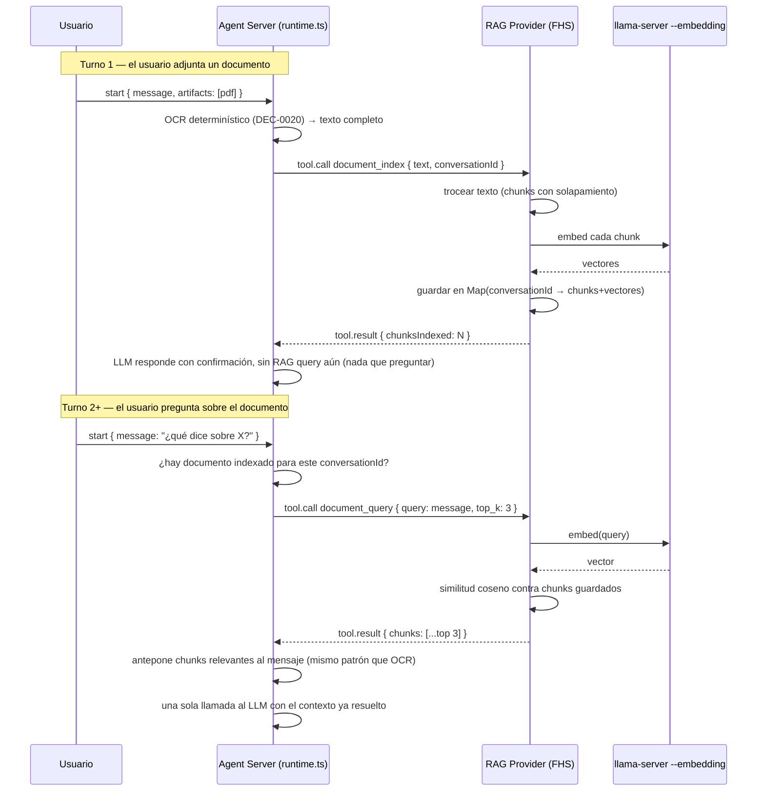

# SPEC-RAG-0001 — RAG provider: indexado y recuperación de documentos

## Estado

`draft`

## Owner

Raúl Fletes (rafex)

## Problema

Hoy el OCR extrae el texto completo de un documento y lo antepone entero al mensaje del usuario como contexto (ver `spec-native/DECISIONS.md` DEC-0020). Esto funciona para documentos cortos, pero no escala: un documento de varias páginas satura la ventana de contexto del modelo (4096 tokens en `qwen2.5-coder-3b-instruct`, ver `containers/compose.yaml` `MODEL_CONTEXT_WINDOW`), aumenta la latencia (ya alta en este hardware, 30s–300s por llamada) y desperdicia contexto en partes del documento irrelevantes para la pregunta del usuario.

Se necesita indexar el documento una vez (trocear + generar embeddings) y, en cada pregunta, recuperar solo los fragmentos relevantes — el patrón RAG (Retrieval-Augmented Generation).

## Alcance

### Dentro del alcance

- Un nuevo provider FHS de tipo `mcp` (`examples/rag-provider/`), siguiendo el mismo contrato que `examples/ocr-provider/` (`docs/protocolo-provider.md`).
- Dos tools expuestas: `document_index` (trocear + embeber + guardar) y `document_query` (embeber pregunta + buscar por similitud + devolver top-k fragmentos).
- Modelo de embeddings servido por `llama-server --embedding` (reusa la misma infraestructura que el LLM de chat, en otro puerto o como segundo proceso). Candidatos ya disponibles en el catálogo del bastion: `nomic-embed-v1.5-q4`, `bge-small-en-q4` (ver mensaje del usuario con el análisis de hardware).
- Almacenamiento en memoria del proceso `rag-provider` (`Map<chunkId, {vector, text, documentId}>`), sin persistencia — consistente con `MemoryRegistryStore` actual del Registry, mismo nivel de ambición para la PoC.
- **Indexado y recuperación determinísticos**, no delegados a una decisión del LLM vía tool calling — mismo principio que DEC-0020 para OCR. Ver sección "Diseño" para el detalle de cuándo se dispara cada paso.

### Fuera del alcance (para esta iteración)

- Persistencia de embeddings entre reinicios del provider (viven solo mientras el proceso está arriba).
- Base de datos vectorial dedicada (SQLite+vec, Qdrant, etc.) — un `Map` en memoria con similitud coseno alcanza para el volumen de la PoC.
- Multi-documento por conversación con selección explícita de cuál consultar (se asume 1 documento activo por conversación, el último indexado).
- Chunking semántico avanzado (por oraciones/párrafos con NLP) — se usa chunking por tamaño fijo con solapamiento.
- Reindexado incremental o actualización de un documento ya indexado.

## Diseño

### Por qué determinístico, no una tool que el LLM decide usar

DEC-0020 estableció el precedente: cuando la intención del usuario ya es inequívoca por la *acción* que tomó (adjuntar un archivo), no hace falta que el LLM decida nada — se ejecuta directamente. Para RAG, esto se extiende en dos puntos del ciclo de vida:

1. **Indexado**: se dispara automáticamente cuando el usuario adjunta un documento (mismo trigger que OCR hoy). En vez de (o además de) anteponer el texto completo al mensaje, se trocea y embebe.
2. **Recuperación**: se dispara automáticamente en **cada** mensaje de una conversación que ya tiene un documento indexado — no se le pregunta al LLM si quiere "buscar en el documento". Esto es coherente con cómo funciona RAG en la práctica: la recuperación es un paso del pipeline de la aplicación, no una decisión del modelo. Depender de tool calling para esto reintroduciría exactamente el problema de confiabilidad que DEC-0020 resolvió para OCR.

### Flujo



### Tools expuestas

| Tool | Parámetros | Devuelve |
|---|---|---|
| `document_index` | `text` (string), `conversationId` (string), `chunkSize` (opcional, default 512 tokens aprox.), `overlap` (opcional, default 64) | `{ chunksIndexed: number }` |
| `document_query` | `query` (string), `conversationId` (string), `top_k` (opcional, default 3) | `{ chunks: Array<{ text: string, score: number }> }` |

### Manifiesto (borrador)

```json
{
  "fhsVersion": "0.1",
  "provider": {
    "id": "did:key:rag-provider-01",
    "name": "RAG FHS Provider",
    "type": "mcp",
    "visibility": "community"
  },
  "endpoint": {
    "protocol": "fhs",
    "url": "ws://rag-provider:43113/fhs/v1/tools"
  },
  "capabilities": [
    {
      "id": "document.index",
      "name": "Indexado de documento para búsqueda semántica",
      "languages": ["es", "en"]
    },
    {
      "id": "document.retrieve",
      "name": "Recuperación de fragmentos relevantes",
      "languages": ["es", "en"]
    }
  ],
  "privacy": {
    "retention": "session"
  }
}
```

`privacy.retention: "session"` — a diferencia de OCR (`"none"`), el RAG provider necesariamente retiene los embeddings mientras dura la conversación. Esto debe quedar visible al usuario según la sección Privacidad de `docs/protocolo.md`.

### Cambios necesarios en `apps/agent-server/src/agent/runtime.ts`

Siguiendo el mismo patrón que `runOcrDeterministically`:

1. Después del OCR determinístico, si hay texto extraído, llamar a `document_index` en vez de (o antes de) anteponer el texto completo al primer mensaje.
2. En cada `run()` de una conversación con un documento ya indexado (requiere que `AgentRuntime` o el `Registry`/`EventBus` recuerden qué `conversationId` tiene documento indexado — hoy `AgentRuntime` se crea nuevo por cada `run()`, ver `apps/agent-server/src/api/chat-ws.ts`; esto requiere revisar el ciclo de vida del runtime por conversación, no solo por mensaje), llamar a `document_query` con el mensaje del usuario como query, antes de la llamada al LLM.

### Riesgo de diseño a resolver antes de implementar

`chat-ws.ts` crea un `AgentRuntime` nuevo en cada mensaje (`const runtime = new AgentRuntime(...)` dentro de `handleMessage`), no uno persistente por conversación. El estado de "qué documento está indexado para esta conversación" no puede vivir en la instancia de `AgentRuntime` como hoy vive `this.artifacts` (que se resetea en cada `run()`). Debe vivir en el `rag-provider` mismo (keyed por `conversationId`, que ya se pasa en cada tool call) o en un store compartido en `agent-server`. Se recomienda lo primero — mantiene el Agent Server sin estado por conversación, consistente con DEC-0005 (Registry embebido pero simple).

## Criterios de aceptación

1. Un usuario adjunta un documento largo (varias páginas); el sistema lo indexa automáticamente sin exponer esa complejidad en el chat.
2. En preguntas posteriores sobre el documento, la respuesta del LLM se basa en fragmentos relevantes, no en el documento completo — verificable comparando tokens de prompt entre esta versión y la actual (OCR completo antepuesto).
3. El indexado y la recuperación ocurren sin que el LLM tenga que "decidir" invocarlos — se disparan por el pipeline determinístico, igual que OCR (DEC-0020).
4. `privacy.retention: "session"` se declara explícitamente y es visible en la procedencia (`provenance`) de cada respuesta que usó RAG.
5. Verificado end-to-end contra el bastion real, no solo build/typecheck (lección de `docs/protocolo-provider.md`, sección "Lecciones de integración").

## Riesgos y mitigaciones

| Riesgo | Impacto | Mitigación |
|---|---|---|
| `llama-server --embedding` no está corriendo simultáneamente con el modelo de chat en el mismo proceso (llama-server sirve un modelo por instancia) | Alto | Requiere un segundo `llama-server` en otro puerto sirviendo el modelo de embeddings, o alternar — a decidir en la fase de implementación |
| Ciclo de vida del `AgentRuntime` no persiste estado por conversación | Alto | Ver "Riesgo de diseño a resolver antes de implementar" arriba — mover el estado al `rag-provider` |
| Chunking por tamaño fijo corta oraciones a la mitad, degradando la calidad de los embeddings | Medio | Aceptable para la PoC; documentar como mejora futura (chunking semántico) |
| Con el modelo de chat actual (3B, lento), sumar una llamada de embedding por mensaje incrementa la latencia total | Medio | Los modelos de embedding candidatos son mucho más chicos (~0.03–0.08 GB) que el LLM de chat (2 GB) — la llamada de embedding debería ser rápida en comparación |

## Enlaces y decisiones relacionadas

- DEC-0020 — Ejecución determinística de OCR (precedente de diseño para este spec).
- `docs/protocolo-provider.md` — contrato que debe cumplir `rag-provider` para ser plug-and-play.
- `docs/protocolo.md` — sección Privacidad, aplica a `privacy.retention: "session"`.

## Tareas relacionadas

- Ver `spec-native/tasks/rag-provider/TASKS.md`.

## Notas

- No implementar todavía — este documento es la especificación para cuando se decida iniciar la iniciativa. Ver conversación del 2026-07-02: se prioriza primero cerrar la confiabilidad de OCR (DEC-0020) antes de sumar una segunda capability con el mismo tipo de riesgo.
