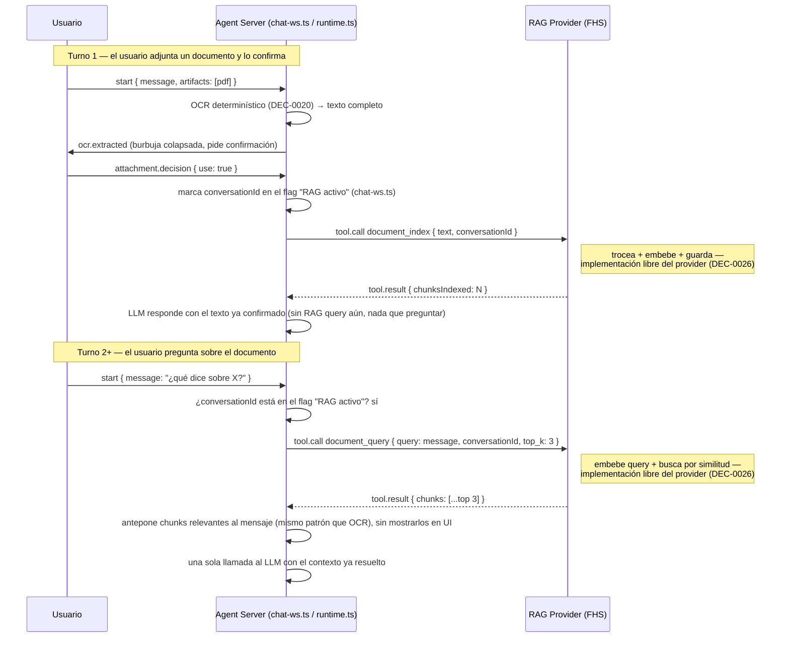

# SPEC-RAG-0001 — RAG provider: indexado y recuperación de documentos por conversación

## Estado

`done (local)` — implementado y verificado con procesos reales en local (2026-07-06). Pendiente verificación contra hardware real (mismo bloqueo que issue #1). El motor de recuperación interno del nodo de referencia es intencionalmente mínimo (Jaccard/solapamiento de palabras) — no una recomendación, ver DEC-0026 y TASK-RAG-0002.

## Owner

Raúl Fletes (rafex)

## Problema

Hoy el OCR extrae el texto completo de un documento y lo antepone entero al mensaje del usuario como contexto (ver `spec-native/DECISIONS.md` DEC-0020). Esto funciona para documentos cortos, pero no escala: un documento de varias páginas satura la ventana de contexto del modelo (4096 tokens en `qwen2.5-coder-3b-instruct`, ver `containers/compose.yaml` `MODEL_CONTEXT_WINDOW`), aumenta la latencia (ya alta en este hardware, 30s–300s por llamada) y desperdicia contexto en partes del documento irrelevantes para la pregunta del usuario.

Se necesita indexar el documento una vez (trocear + generar embeddings) y, en cada pregunta, recuperar solo los fragmentos relevantes — el patrón RAG (Retrieval-Augmented Generation).

## Relación con memoria de conversación y KB (DEC-0025)

Este spec cubre **solo** RAG: contenido aportado por el usuario, privado por defecto, con retención acotada a la conversación. No cubre:

- **Memoria de conversación** — capability opcional de un nodo para recordar turnos previos; no es responsabilidad de `rag-provider`.
- **Bases de conocimiento (KB)** — contenido curado por el operador, de solo lectura, persistente y compartido entre conversaciones (ej. un documento público reutilizado por muchos usuarios). Ver `spec-native/specs/kb-provider/SPEC.md` (SPEC-KB-0001) — es un provider distinto, no una extensión de este.

Un documento de RAG **nunca se comparte ni se deduplica entre `conversationId`**, ni siquiera si el contenido es idéntico (mismo hash) — si un documento se repite mucho entre usuarios, la respuesta correcta es promoverlo a KB (decisión manual del operador), no compartir el índice de RAG.

## Alcance

### Dentro del alcance

- Un nuevo provider FHS de tipo `mcp` (`examples/rag-provider/`), siguiendo el mismo contrato que `examples/ocr-provider/` (`docs/protocolo-provider.md`).
- Dos tools expuestas: `document_index` (trocear + embeber + guardar) y `document_query` (embeber pregunta + buscar por similitud + devolver top-k fragmentos). El protocolo define **el contrato de estas tools** (nombre, parámetros, forma de la respuesta) — nunca cómo se implementa el trocea+embebe+guarda por dentro (DEC-0026). El operador del nodo es libre de usar `llama-server --embedding`, un script Python con cualquier librería de embeddings, un wrapper a una API de terceros, o lo que prefiera — ver "Guía de implementación sugerida" más abajo, no vinculante.
- Almacenamiento y estrategia de persistencia: decisión del operador del nodo. El nivel de ambición sugerido para un nodo de referencia de esta PoC es en memoria, sin persistencia entre reinicios (mismo nivel que `MemoryRegistryStore` actual del Registry) — pero esto no es un requisito de protocolo.
- **Indexado y recuperación determinísticos** desde el punto de vista del Agent Server: no delegados a una decisión del LLM vía tool calling — mismo principio que DEC-0020 para OCR. Ver "Diseño" para el detalle de cuándo se dispara cada paso.
- `privacy.retention` generalizado (DEC-0025) y `privacy.warning` obligatorio en el manifiesto — esto sí es parte del contrato de protocolo, no una sugerencia, porque es lo que le permite a cualquier consumidor confiar en un nodo sin conocer su implementación interna.

### Fuera del alcance (para esta iteración)

- Persistencia de embeddings entre reinicios del provider.
- Base de datos vectorial dedicada (SQLite+vec, Qdrant, etc.) — un `Map` en memoria con similitud coseno alcanza para el volumen de la PoC.
- Multi-documento por conversación con selección explícita de cuál consultar (se asume 1 documento activo por conversación, el último indexado).
- Chunking semántico avanzado (por oraciones/párrafos con NLP) — se usa chunking por tamaño fijo con solapamiento.
- Reindexado incremental o actualización de un documento ya indexado.
- Compartir o deduplicar contenido entre conversaciones o usuarios (ver KB, arriba).
- Detección automática de "este documento se repite mucho, promuévanlo a KB" — la promoción es curaduría manual del operador.
- Websearch como fuente de indexado — el diseño lo deja agnóstico a la fuente (ver abajo), pero implementar ese servicio es una iniciativa aparte.

## Diseño

### Por qué determinístico, no una tool que el LLM decide usar

DEC-0020 estableció el precedente: cuando la intención del usuario ya es inequívoca por la *acción* que tomó, no hace falta que el LLM decida nada — se ejecuta directamente. Para RAG:

1. **Indexado**: se dispara **solo** cuando ocurre un evento explícito y ya confirmado — hoy, la confirmación de adjunto que ya existe en `ocr-confirmacion` (SPEC-OCRCONFIRM-0001, botón "Usar documento"); a futuro, un resultado de websearch. Nunca antes de ese evento, nunca de forma especulativa.
2. **Recuperación**: se dispara en cada mensaje de una conversación que el propio pipeline ya marcó como "con RAG activo" (ver más abajo dónde vive esa marca) — no se le pregunta al LLM si quiere "buscar en el documento".

Esto hace que `rag-provider` sea **agnóstico a la fuente del texto**: el contrato `document_index(text, conversationId)` no le importa si `text` vino de OCR o de un futuro servicio de websearch — solo indexa lo que se le confirma.

### Dónde vive el estado "esta conversación tiene RAG activo" (resuelto en DEC-0025)

`chat-ws.ts` crea un `AgentRuntime` nuevo en cada mensaje, no uno persistente por conversación — por lo tanto el estado no puede vivir en la instancia de `AgentRuntime`. Se resuelve así:

- Un flag ligero en `apps/agent-server/src/api/chat-ws.ts`, en el mismo lugar y con el mismo patrón que `pendingAttachments` (ya introducido por `ocr-confirmacion`) — ej. `Set<conversationId>` o un mapa equivalente.
- Se marca en el momento exacto del evento de indexado confirmado (mismo punto donde hoy se resuelve la confirmación del adjunto).
- `runtime.ts` solo llama a `document_query` para conversaciones presentes en ese flag — evita tanto preguntar siempre a un `rag-provider` vacío (costo de cómputo innecesario en conversaciones sin documento) como mover ese estado al propio `rag-provider` (que habría requerido un endpoint adicional de "¿tienes algo indexado para X?").

### Transparencia: qué se muestra al usuario

- La confirmación de adjunto (burbuja + "Usar documento"/"Descartar") se mantiene exactamente como está — ahora cumple doble función: aprobación del usuario y disparo de indexado.
- La recuperación en turnos 2+ es **silenciosa** — no se agrega UI nueva que muestre los fragmentos recuperados turno a turno. Si más adelante hace falta trazabilidad de qué se usó para responder, se resuelve vía DEC-0012 (loggear `requestId`↔`conversationId` en el backend), no en la interfaz de chat.

### Flujo



Nótese que el diagrama ya no nombra un motor de embeddings específico dentro del contrato — desde la perspectiva del Agent Server, `rag-provider` es una caja negra que cumple `document.index`/`document.query`; cómo resuelve "trocear + embeber + guardar" por dentro es decisión exclusiva de quien lo opera (DEC-0026).

### Tools expuestas

| Tool | Parámetros | Devuelve |
|---|---|---|
| `document_index` | `text` (string), `conversationId` (string), `chunkSize` (opcional, default 512 tokens aprox.), `overlap` (opcional, default 64) | `{ chunksIndexed: number }` |
| `document_query` | `query` (string), `conversationId` (string), `top_k` (opcional, default 3) | `{ chunks: Array<{ text: string, score: number }> }` |

### Manifiesto (borrador)

```json
{
  "fhsVersion": "0.1",
  "provider": {
    "id": "did:key:rag-provider-01",
    "name": "RAG FHS Provider",
    "type": "mcp",
    "visibility": "community"
  },
  "endpoint": {
    "protocol": "fhs",
    "url": "ws://rag-provider:43113/fhs/v1/tools"
  },
  "capabilities": [
    {
      "id": "document.index",
      "name": "Indexado de documento para búsqueda semántica",
      "languages": ["es", "en"]
    },
    {
      "id": "document.query",
      "name": "Recuperación de fragmentos relevantes",
      "languages": ["es", "en"]
    }
  ],
  "privacy": {
    "retention": { "ttl": "PT4H" },
    "warning": "El contenido de los documentos que subas se guarda solo mientras dura tu conversación (hasta 4 horas) y nunca se comparte con otros usuarios. No subas información sensible o confidencial."
  }
}
```

`privacy.retention` usa el formato generalizado de DEC-0025 (`"none" | "session" | { ttl: <ISO 8601 duration> } | "permanent-readonly"`) — aquí un TTL explícito de ejemplo, configurable por el operador del nodo. `privacy.warning` es obligatorio para cualquier retención distinta de `"none"` (DEC-0025) y el `Portal` (web) debe mostrarlo antes de aceptar el primer adjunto.

### Guía de implementación sugerida (no vinculante — DEC-0026)

Lo siguiente es una referencia para quien construya un `rag-provider` de ejemplo (`examples/rag-provider/`), **no un requisito del protocolo**. Cualquier nodo que cumpla el contrato de tools/manifiesto de arriba es válido, sin importar cómo resuelva "trocear + embeber + guardar" por dentro:

- **Motor de embeddings**: puede ser un `llama-server --embedding` aparte (mismo patrón que `llm-provider`/`ocr-provider` hablan con su propio motor vía bridge HTTP), un script Python con `sentence-transformers` o similar, un wrapper a una API de embeddings de terceros, o cualquier otra cosa. Candidatos livianos si se usa `llama-server`: `nomic-embed-v1.5-q4`, `bge-small-en-q4` (~0.03–0.08 GB, mucho más chicos que un LLM de chat).
- **Almacenamiento**: un `Map` en memoria (`Map<conversationId, {chunks: [{vector, text}]}>`) alcanza para el volumen de esta PoC; un operador con más escala podría usar SQLite+vec u otra cosa, siempre que respete `privacy.retention`.
- **Chunking**: tamaño fijo con solapamiento (ej. 512 tokens, solapamiento 64) es la sugerencia más simple; nada impide un provider más sofisticado con chunking semántico.

Igual que el precedente ya establecido para providers LLM (`docs/protocolo-provider.md`, "Lecciones de integración", sobre `llama.cpp`/`Ollama`/`vLLM`), lo único que el protocolo verifica es que la tool responda con la forma esperada — no cómo se llegó a esa respuesta.

### Cambios necesarios en `apps/agent-server`

Siguiendo el mismo patrón que `runOcrDeterministically`:

1. En `chat-ws.ts`, en el mismo punto donde se resuelve `attachment.decision { use: true }`, además de continuar con el flujo de OCR existente: llamar a `document_index` y marcar `conversationId` en el flag de "RAG activo" (mismo patrón que `pendingAttachments`).
2. En `runtime.ts`, antes de cada llamada al LLM, si `conversationId` está marcado como "RAG activo": llamar a `document_query` con el mensaje del usuario como query y anteponer los chunks devueltos — sin exponerlos en la UI.

## Criterios de aceptación

1. Un usuario adjunta un documento largo (varias páginas) y lo confirma; el sistema lo indexa automáticamente sin exponer esa complejidad en el chat.
2. En preguntas posteriores sobre el documento, la respuesta del LLM se basa en fragmentos relevantes, no en el documento completo — verificable comparando tokens de prompt entre esta versión y la actual (OCR completo antepuesto).
3. El indexado y la recuperación ocurren sin que el LLM tenga que "decidir" invocarlos — se disparan por el pipeline determinístico, igual que OCR (DEC-0020), y el indexado nunca ocurre antes de la confirmación del usuario.
4. `privacy.retention` y `privacy.warning` se declaran explícitamente en el manifiesto, y `privacy.warning` es visible en el `Portal` antes de aceptar el primer adjunto.
5. Dos usuarios distintos que suben el mismo documento (mismo contenido) generan índices independientes — no hay ninguna forma de que una conversación vea chunks de otra.
6. Verificado end-to-end contra el bastion real, no solo build/typecheck (lección de `docs/protocolo-provider.md`, sección "Lecciones de integración").

## Riesgos y mitigaciones

| Riesgo | Impacto | Mitigación |
|---|---|---|
| Si el nodo de referencia usa un motor de embeddings aparte (ej. `llama-server --embedding`), requiere un segundo proceso/puerto además del modelo de chat | Alto (solo si aplica a la implementación elegida) | Decisión del operador del nodo, no del protocolo (DEC-0026); documentado como sugerencia de despliegue para el nodo de referencia (TASK-RAG-0002), no como requisito |
| Chunking por tamaño fijo corta oraciones a la mitad, degradando la calidad de los embeddings | Medio | Aceptable para la implementación de referencia de esta PoC; documentar como mejora futura (chunking semántico) — otros providers pueden implementar algo mejor |
| Con el modelo de chat actual (3B, lento), sumar una llamada de embedding por mensaje puede incrementar la latencia total | Medio | Depende de la implementación elegida por el operador del nodo RAG — modelos de embedding livianos (ej. ~0.03–0.08 GB) son mucho más rápidos que un LLM de chat (2 GB), pero el protocolo no lo garantiza |
| Los embeddings no garantizan anonimato — ataques de inversión de embeddings pueden reconstruir parte del texto original | Medio | Riesgo conocido y no resuelto en esta PoC; se mitiga con `privacy.warning` obligatorio (DEC-0025), no con una técnica de anonimización — documentar como limitación explícita, no ocultarla |

## Enlaces y decisiones relacionadas

- DEC-0020 — Ejecución determinística de OCR (precedente de diseño para este spec).
- DEC-0025 — Separación memoria de conversación / RAG / KB, retención generalizada, disparo determinístico, ubicación del estado por conversación.
- DEC-0026 — El protocolo nunca mandata el motor detrás de una capability; solo define el contrato. Aplica a la elección del motor de embeddings de este spec.
- `spec-native/specs/kb-provider/SPEC.md` (SPEC-KB-0001) — capability hermana para contenido compartido de solo lectura.
- `docs/protocolo-provider.md` — contrato que debe cumplir `rag-provider` para ser plug-and-play.
- `docs/protocolo.md` — sección Privacidad, aplica a `privacy.retention` y `privacy.warning`.

## Tareas relacionadas

- Ver `spec-native/tasks/rag-provider/TASKS.md`.

## Notas

- No implementar todavía — este documento es la especificación para cuando se decida iniciar la iniciativa. El diseño quedó cerrado el 2026-07-05 (DEC-0025); ya no hay riesgos de diseño abiertos, solo falta la decisión de prioridad frente al resto del backlog (`spec-native/ROADMAP.md`).
