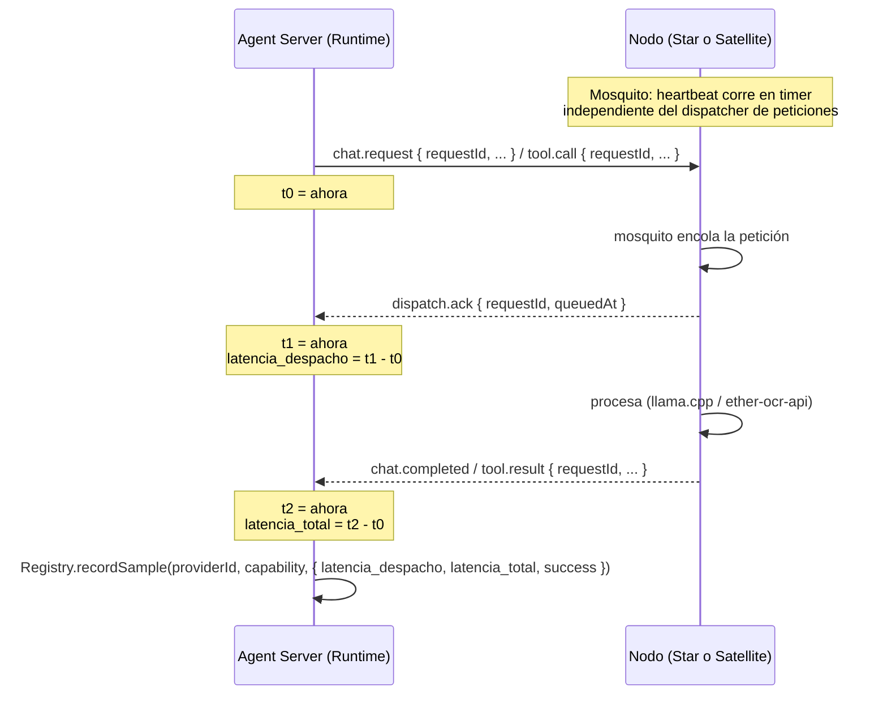

# SPEC-SATRATING-0001 — Mosquito obligatorio en nodos + fiabilidad del Registry

## Estado

`done` — implementado y verificado end-to-end localmente (2026-07-05). Pendiente (no bloqueante) repetir la verificación contra los 3 equipos reales de la demo (laptop + bastion + Raspberry Pi) cuando la red del sitio esté disponible — mismo código, sin cambios esperados.

## Owner

Raúl Fletes (rafex)

## Vocabulario: "nodo", "estrella" y "satélite"

Decisión tomada en `spec-native/specs/vocabulario-espacial/SPEC.md`
(TASK-VOCAB-0001, Opción B): **"estrella" (Star)** nombra un nodo de
razonamiento/generación (LLM) y **"satélite" (Satellite)** nombra un nodo
de herramientas (OCR, búsqueda, etc.) — no son sinónimos. Cuando algo
aplica a cualquier tipo de nodo por igual (como todo lo que describe esta
spec: el mosquito y el rating aplican igual a estrellas y satélites), se
usa **"nodo"** como término neutro, no "satélite" como paraguas.

Ninguno de estos tres términos cambia el protocolo FHS a nivel de mensaje
(`providerId`, `provider.type`, etc. — **sin cambios de campo**, para no
romper compatibilidad con `examples/llm-provider` y `examples/ocr-provider`
tal como existen hoy). Son vocabulario de documentación/UI; el código y el
protocolo siguen usando `provider`/`Provider*` salvo que una decisión
futura diga lo contrario.

## Problema

Dos huecos encontrados al validar la demo de 3 equipos (laptop + bastion +
Raspberry Pi):

1. **El "mosquito" (dispatcher concurrente) está documentado pero no
   implementado como pieza obligatoria y verificable.** `docs/protocolo-provider.md`
   ("Regla central: el dispatcher concurrente") ya exige que el heartbeat
   corra independiente del procesamiento de peticiones, pero:
   - No hay una señal explícita de que una petición (`chat.request` /
     `tool.call`) **ya fue tomada por el dispatcher** del nodo. Hoy
     solo hay dos eventos: la petición sale, y en algún momento (segundos
     o minutos después, según el hardware) llega la respuesta final. Si el
     nodo tarda, no hay forma de distinguir "está formando la cola y
     va a responder" de "se colgó y nunca va a responder" hasta que
     vence un timeout genérico.
   - `examples/llm-provider` y `examples/ocr-provider` no comparten código
     de dispatcher — cada uno lo reimplementó a su manera (deuda técnica ya
     anotada en `docs/protocolo-provider.md`).

2. **El Registry no sabe qué tan rápido o confiable es cada nodo.**
   `apps/agent-server/src/agent/runtime.ts` ya calcula `duration` por
   llamada (`tool.completed`/`chat.completed` lo incluyen), pero ese dato
   se emite al chat y se descarta — no se guarda historial en el Registry.
   Resolver un LLM o una tool hoy es "el primero disponible que declare la
   capability", sin ninguna noción de qué tan rápido o confiable ha sido
   ese nodo en el pasado.

## Alcance

### Dentro del alcance

- **Protocolo**: nuevo mensaje `dispatch.ack` que el nodo envía
  inmediatamente al aceptar un `chat.request` o `tool.call` en su
  dispatcher — antes de empezar el trabajo real, no después. Marca el
  momento en que la petición "ya está formada" (encolada/aceptada) y
  distingue **latencia de despacho** (tiempo hasta el ack) de **latencia
  de procesamiento** (tiempo hasta el resultado final).
- **Contrato de provider actualizado**: `docs/protocolo-provider.md` pasa
  de "el heartbeat no debe bloquearse" (regla implícita) a un requisito
  verificable con un mensaje concreto en el protocolo — el checklist
  "plug and play" agrega el envío de `dispatch.ack` como paso obligatorio.
- **Registry con historial de métricas por nodo**: un store en memoria
  (mismo patrón que `MemoryRegistryStore`, sin persistencia entre
  reinicios — ver Fuera de alcance) que guarda, por `providerId` +
  capability/modelo, una ventana de las últimas N muestras de:
  - latencia de despacho (`dispatch.ack` - envío de la petición),
  - latencia total (resultado final - envío de la petición),
  - éxito/error.
- **Rating derivado**: una función simple y documentada que combina éxito
  histórico + latencia típica en un valor expuesto por la API del Registry
  (`/api/fhs/providers` gana un campo `metrics`/`rating` por servicio).
- **Solo lectura**: el rating se **expone**, no se **usa** todavía para
  decidir qué nodo resolver ante varios candidatos — eso es la
  siguiente iteración natural (ver Fuera de alcance).

### Fuera del alcance (para esta iteración)

- **Usar el rating para resolución de providers** (preferir el más rápido/confiable
  entre varios candidatos para la misma capability). Esta spec solo
  expone el dato; una spec futura decide cómo influye en `resolveLlm`/
  `resolveToolProviders` (`apps/agent-server/src/agent/runtime.ts`).
- **Persistencia del historial entre reinicios del Registry.** Igual que
  el resto del estado del Registry hoy (`MemoryRegistryStore`), las
  métricas viven solo mientras el proceso está arriba. Persistir en disco
  o SQLite es trabajo aparte, no bloqueante para esta spec.
- **Renombrar campos del protocolo o del código** (`provider`, `Provider*`,
  `providerId`) a "nodo"/"estrella"/"satélite". Es un cambio de vocabulario
  en documentación/UI únicamente en esta iteración — ver "Vocabulario" arriba.
- **Dispatcher compartido como librería** (`packages/fhs-protocol` o un
  paquete nuevo) que `examples/llm-provider`/`examples/ocr-provider`
  importen en vez de reimplementar. Deseable, pero esta spec solo exige
  el *comportamiento* (heartbeat no bloqueante + `dispatch.ack`), no obliga
  a resolver la duplicación de código entre los dos providers de
  referencia todavía.
- **Rating visible en el chat web** (`apps/web`). Esta spec termina en la
  API del Registry; mostrarlo en la interfaz de usuario es un consumo
  posterior, no parte de esta iteración.

## Diseño

### Por qué un ack explícito y no inferir del heartbeat

Ya sabíamos (DEC-0009, `docs/protocolo-provider.md`) que el heartbeat no
debe bloquearse mientras se procesa una petición larga. Pero un heartbeat
sano **no prueba que la petición específica esté siendo atendida** — solo
prueba que la conexión sigue viva. Sin un ack por petición, el Registry no
puede medir "cuánto tarda este nodo en *empezar* a trabajar" por
separado de "cuánto tarda en *terminar*" — y esa distinción importa: un
nodo con cola llena (mosquito saturado) puede tardar mucho en aceptar
una petición nueva aunque su heartbeat siga respondiendo perfecto.

### Flujo con `dispatch.ack`



### Mensaje nuevo: `dispatch.ack`

```json
{ "type": "dispatch.ack", "requestId": "...", "queuedAt": 1719700000123 }
```

- Obligatorio para **todo** `chat.request` y `tool.call` que el nodo
  acepte — enviarlo es parte del contrato de `docs/protocolo-provider.md`,
  no opcional.
- Si el nodo rechaza la petición de inmediato (`UNSUPPORTED_CAPABILITY`,
  etc.), no envía `dispatch.ack` — va directo a `chat.error`/`tool.error`.
  El ack solo confirma "la tomé y la voy a procesar", no "la acepté sin
  validar".
- `requestId` debe coincidir exactamente con el de la petición — mismo
  principio de trazabilidad ya establecido para el resto del protocolo.

### Checklist "plug and play" — adición

`docs/protocolo-provider.md` gana un ítem nuevo al checklist existente:

- [x] Envía `dispatch.ack` inmediatamente al encolar cada `chat.request`/
      `tool.call` en su dispatcher, antes de empezar a procesar.

### Historial y rating en el Registry

Nuevo módulo `apps/agent-server/src/registry/metrics.ts` (nombre tentativo),
con una estructura tipo:

```ts
interface LatencySample {
  dispatchMs: number | null; // null si nunca llegó dispatch.ack (timeout/caída)
  totalMs: number;
  success: boolean;
  at: number; // epoch ms
}

interface NodeMetrics {
  providerId: string;
  capability: string; // modelId para llm, capability.id para mcp
  samples: LatencySample[]; // ventana acotada, ej. últimas 50 o última 1h
  rating: number; // derivado, 0–5
}
```

**Fórmula del rating (v1, deliberadamente simple):**

```
successRate = éxitos / total (ventana)
latencyScore = clamp(1 - (avgTotalMs / P_MAX), 0, 1)   // P_MAX configurable, ej. 60000ms
rating = round((0.6 * successRate + 0.4 * latencyScore) * 5, 1)  // escala 0.0–5.0
```

Documentar explícitamente que es una v1 ajustable — el objetivo de esta
iteración es que el dato **exista y se exponga**, no que la fórmula sea
definitiva. Cualquier ajuste futuro a la fórmula no debería requerir
cambios de protocolo, solo del cálculo interno.

**Dónde se registra la muestra:** en `apps/agent-server/src/agent/runtime.ts`,
en los mismos puntos donde hoy se calcula `duration` para `tool.completed`/
`chat.completed` (líneas ~303, ~372, ~385) — se agrega una llamada a
`registry.recordSample(...)` con los tres tiempos.

**Dónde se expone:** `GET /api/fhs/providers` (`apps/agent-server/src/api/...`)
agrega `metrics: { rating, avgDispatchMs, avgTotalMs, successRate, samples }`
dentro de cada `service`. Se evalúa si conviene también un endpoint dedicado
`GET /api/fhs/providers/:providerId/metrics` para no inflar la respuesta
principal si la ventana de muestras crece — decisión a tomar en la fase de
implementación, no bloqueante para esta spec.

### Qué pasa si el nodo nunca manda `dispatch.ack`

Un nodo construido antes de esta spec (o que no implementa el
requisito) simplemente nunca envía `dispatch.ack`. El Agent Runtime no debe
bloquearse esperándolo — sigue esperando el resultado final con el mismo
timeout de siempre (`CALL_TIMEOUT_MS`, 300s). La ausencia de ack se
registra como `dispatchMs: null` en la muestra, y afecta el rating vía
`successRate`/`latencyScore` como cualquier otro dato incompleto — no como
error del protocolo. Esto mantiene compatibilidad hacia atrás con
cualquier nodo existente que no se actualice de inmediato.

## Riesgos y mitigaciones

| Riesgo | Impacto | Mitigación |
|---|---|---|
| Confundir "rating bajo" con "nodo roto" cuando en realidad el hardware es simplemente lento (ej. Raspberry Pi haciendo OCR de un PDF grande) | Medio | El rating mide velocidad relativa, no correctitud — documentar explícitamente que un rating bajo no descalifica al nodo, solo informa. Ninguna resolución automática depende de él en esta iteración (ver Fuera de alcance) |
| Ventana de muestras crece sin límite y consume memoria | Bajo | Ventana acotada desde el diseño inicial (tamaño fijo o por tiempo, a definir en implementación) — no una lista que crece indefinidamente |
| Un nodo mal implementado envía `dispatch.ack` con `requestId` que no corresponde | Medio | Mismo tratamiento que cualquier mensaje con `requestId` inválido hoy — se ignora si no hay una petición pendiente con ese id (ya es el comportamiento de `sendAndWait` en `mcp-host.ts`) |
| Cambiar el checklist de `protocolo-provider.md` puede parecer que rompe providers existentes | Bajo | Es aditivo y con degradación graceful (ver sección de arriba) — `examples/llm-provider`/`examples/ocr-provider` actuales siguen funcionando sin `dispatch.ack`, solo no acumulan latencia de despacho hasta que se actualicen |

## Criterios de aceptación

- [x] `dispatch.ack` documentado en `docs/protocolo.md` y `docs/protocolo-provider.md`
      con su formato exacto y cuándo se envía (y cuándo no).
- [x] `examples/llm-provider` y `examples/ocr-provider` (los dos providers
      de referencia) envían `dispatch.ack` al encolar cada petición.
- [x] El Registry acumula muestras de latencia de despacho/total/éxito por
      nodo + capability, con ventana acotada (50 muestras, no crece sin límite).
- [x] `GET /api/fhs/providers` expone el rating y las métricas agregadas
      por servicio.
- [x] Verificado con una prueba real end-to-end (no solo build/typecheck):
      stack local real (agent-server + llm-provider + ocr-provider reales,
      hablando FHS WebSocket real contra mocks HTTP del LLM/OCR) —
      `avgDispatchMs`/`avgTotalMs`/`rating` correctos para ambos flujos
      (chat y OCR con confirmación). Pendiente repetir contra los 3
      equipos reales de la demo cuando la red del sitio esté disponible.
- [x] Un nodo que no envía `dispatch.ack` sigue funcionando sin errores
      (`dispatchMs: null` en la muestra) — verificado por diseño en
      `mcp-host.ts`/`llm-gateway.ts` (el flujo no depende del ack para
      resolver la promesa, solo lo usa si llega).

## Enlaces relacionados

- `docs/protocolo-provider.md` — contrato de provider, sección "dispatcher
  concurrente (mosquito)" que esta spec formaliza con un mensaje concreto.
- `docs/protocolo.md` — mensajes del protocolo FHS, donde se documenta
  `dispatch.ack`.
- `spec-native/DECISIONS.md` DEC-0009 — origen de la regla del dispatcher
  concurrente que esta spec hace verificable.
- `spec-native/specs/rag-provider/SPEC.md` — otra iniciativa en draft que
  también depende del comportamiento de providers/nodos; sin relación
  directa de datos, pero mismo nivel de madurez (spec sin implementar).
